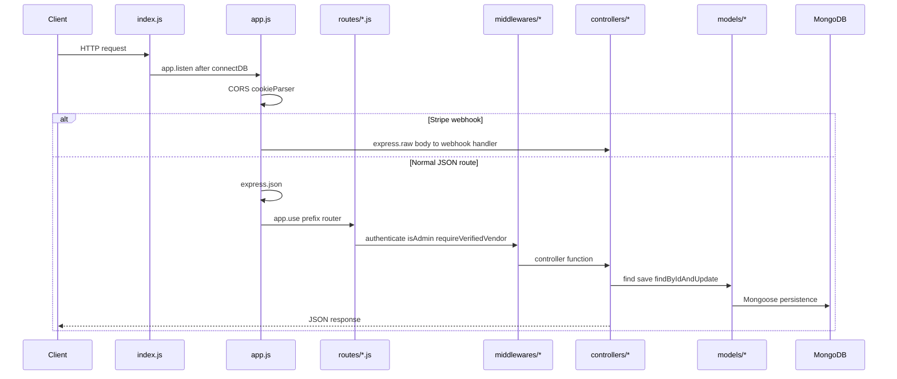
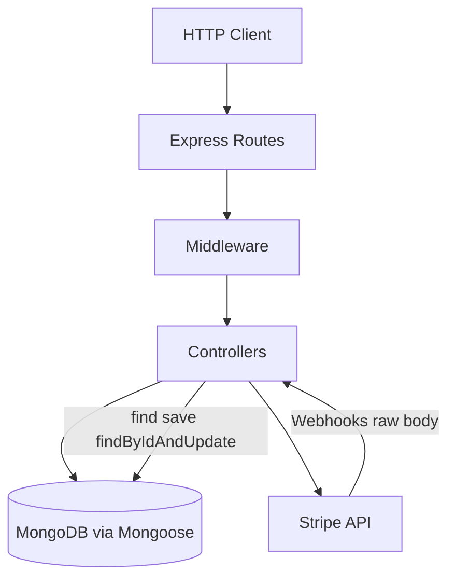

# Mosaic Backend Architecture

Backend architecture map for developers and LLM coding assistants. Read this first before making changes.

**Stack:** Node.js, Express 5, MongoDB (Mongoose). Not Supabase/Postgres — schemas live in `models/` as Mongoose documents.

---

## Quick start

This API powers Mosaic Biz Hub: a marketplace with vendor onboarding, Stripe payments (orders, subscriptions, Connect), admin CMS, and customer commerce (cart, orders, bookings).

| Item | Detail |
|------|--------|
| Entry | `npm start` or `npm run dev` → [`index.js`](../index.js) → [`app.js`](../app.js) |
| Port | `PORT` env var, default `3001` |
| Health check | `GET /` returns a JSON status message |
| Local setup | See [SETUP.md](../SETUP.md) and [`.env.example`](../.env.example) |

---

## Repo directory map

```
mosaic-backend/
├── index.js                 # Bootstrap: dotenv, MongoDB connect, HTTP listener
├── app.js                   # Express app: middleware + all route mounts
├── package.json
├── .env.example             # Authoritative env var template
│
├── config/
│   └── Db.js                # mongoose.connect(MONGODB_URI)
│
├── routes/                  # Express routers (URL namespaces)
│   ├── admin/               # Admin-only routes (users, CMS, categories, blogs)
│   ├── customer/            # Cart, wishlist
│   ├── cms/                 # Unmounted duplicate (see caveats below)
│   └── *.js                 # Feature routes (auth, business, orders, stripe, etc.)
│
├── controllers/             # Request handlers (no separate handlers/ folder)
│   ├── admin/               # Admin handlers
│   ├── customer/            # Cart, wishlist, enquiries
│   └── pubic/               # Public CMS reads (folder name typo)
│
├── models/                  # 38 Mongoose schemas — this is the schema layer
├── middlewares/             # Auth, role gates, vendor verification, upload
├── services/                # Domain logic (invoice, listing, review)
├── utils/                   # Mail, cookies, DTOs, onboarding sync, tax/shipping
├── helpers/                 # stripePlan.js (Stripe product/price sync)
├── validators/              # express-validator helpers (products)
├── lib/listing/             # Search ranking, vendorMeta
├── jobs/                    # cleanupImages.js (currently commented out in app.js)
├── seed/                    # migrate.js, category seeds, dummy data
├── scripts/                 # verify-auth-check-smoke.js (manual smoke)
└── tests/                   # Node built-in test runner (auth, admin, vendor, stripe)
```

### Non-obvious caveats

- [`routes/cms/cmsRoutes.js`](../routes/cms/cmsRoutes.js) exists but is **not mounted** in [`app.js`](../app.js). Active CMS routes use [`routes/admin/cmsRoutes.js`](../routes/admin/cmsRoutes.js).
- [`vendorOnboarding.routes.js`](../routes/vendorOnboarding.routes.js) is mounted **twice**: `/api/vendor-onboarding` and `/admin/vendor-onboard-verify-stage1` (same router, two prefixes).
- `express-mongo-sanitize` and `xss-clean` are mounted in [`app.js`](../app.js) after `express.json()` and after the raw Stripe webhook routes.
- There is **no central router file** beyond `app.js`. Each feature exports `express.Router()` and is mounted with `app.use(prefix, router)`.

---

## Main request lifecycle



### Step-by-step

1. **Bootstrap** — [`index.js`](../index.js) loads `dotenv`, connects MongoDB via [`config/Db.js`](../config/Db.js), then calls `app.listen()`.
2. **Global middleware** — [`app.js`](../app.js) sets `trust proxy`, CORS (allowed origins include `FRONTEND_URL`), and `cookieParser`.
3. **Webhook routes (before JSON)** — Stripe webhooks mount with `express.raw({ type: 'application/json' })` **before** `express.json()`. Stripe signature verification requires the raw body. See [Webhook endpoints](#webhook-endpoints).
4. **JSON parsing** — `express.json()` applies to all routes registered after it.
5. **Payload sanitizing** — `express-mongo-sanitize` and `xss-clean` sanitize body/query/params for normal JSON routes without touching raw webhook bodies.
6. **Route matching** — `app.use(prefix, router)` dispatches to a feature router in `routes/`.
7. **Per-route middleware** — Applied inside route files: `authenticate`, role gates (`isAdmin`, `isCustomer`, `isBusinessOwner`), `requireVerifiedVendor`, `upload`, validators.
8. **Controller** — Handler in `controllers/` orchestrates validation, Stripe/AWS/mail calls, and persistence.
9. **Model / database** — Mongoose models in `models/` perform `find`, `save`, `findByIdAndUpdate` against MongoDB.
10. **Response** — Controller returns JSON (or streams files for invoices/PDFs).

There is **no global auth middleware**. Protection is applied per-route or via `router.use(authenticate, isAdmin)` inside admin routers.

---

## Route registry

All mounts are defined in [`app.js`](../app.js). Below: prefix → route file → primary controller(s).

### Auth and users

| Prefix | Route file | Controller(s) |
|--------|------------|-----------------|
| `/api/users` | [`routes/userRoutes.js`](../routes/userRoutes.js) | [`userController.js`](../controllers/userController.js) |
| `/api/auth` | [`routes/authRoutes.js`](../routes/authRoutes.js) | [`authController.js`](../controllers/authController.js) |

Covers register, login, logout, OTP, password reset, `/auth/check`, and Google OAuth.

### Vendor and business

| Prefix | Route file | Controller(s) |
|--------|------------|-----------------|
| `/api/business` | [`routes/businessRoutes.js`](../routes/businessRoutes.js) | [`businessController.js`](../controllers/businessController.js) |
| `/api/vendor-onboarding` | [`routes/vendorOnboarding.routes.js`](../routes/vendorOnboarding.routes.js) | [`vendorOnboarding.controller.js`](../controllers/vendorOnboarding.controller.js), [`vendorOnboardingUpload.controller.js`](../controllers/vendorOnboardingUpload.controller.js) |
| `/admin/vendor-onboard-verify-stage1` | same as above | [`admin/vendorOnboardVerifyStage1.js`](../controllers/admin/vendorOnboardVerifyStage1.js) |
| `/api/business-profile` | [`routes/businessProfileRoutes.js`](../routes/businessProfileRoutes.js) | [`businessProfileController.js`](../controllers/businessProfileController.js) |
| `/admin/business-profile-verify` | [`routes/admin/businessProfileVerifyRoutes.js`](../routes/admin/businessProfileVerifyRoutes.js) | [`admin/businessProfileVerifyController.js`](../controllers/admin/businessProfileVerifyController.js) |
| `/api/connect` | [`routes/connectRoutes.js`](../routes/connectRoutes.js) | [`connectController.js`](../controllers/connectController.js) |

### Catalog (products, services, food, listings)

| Prefix | Route file | Controller(s) |
|--------|------------|-----------------|
| `/api/product` | [`routes/productRoutes.js`](../routes/productRoutes.js) | [`productController.js`](../controllers/productController.js), [`productVariantController.js`](../controllers/productVariantController.js), [`s3Controller.js`](../controllers/s3Controller.js) |
| `/api/service` | [`routes/serviceRoutes.js`](../routes/serviceRoutes.js) | [`serviceController.js`](../controllers/serviceController.js) |
| `/api/food` | [`routes/foodRoutes.js`](../routes/foodRoutes.js) | [`foodController.js`](../controllers/foodController.js) |
| `/api` | [`routes/publicListing.js`](../routes/publicListing.js) | [`publicListing.js`](../controllers/publicListing.js), [`productListingController.js`](../controllers/productListingController.js) |
| `/api/private` | [`routes/privateListing.js`](../routes/privateListing.js) | [`privateListing.js`](../controllers/privateListing.js) |
| `/api` | [`routes/categoryRoutes.js`](../routes/categoryRoutes.js), [`routes/subcategoryRoutes.js`](../routes/subcategoryRoutes.js) | [`categoryController.js`](../controllers/categoryController.js), [`subcategoryController.js`](../controllers/subcategoryController.js) |
| `/api/minority-types` | [`routes/minorityTypeRoutes.js`](../routes/minorityTypeRoutes.js) | [`minorityTypeController.js`](../controllers/minorityTypeController.js) |
| `/api` | [`routes/featuredProductRoutes.js`](../routes/featuredProductRoutes.js), [`routes/uploadImage.js`](../routes/uploadImage.js) | [`featuredProducts.controller.js`](../controllers/featuredProducts.controller.js) |

### Customer commerce

| Prefix | Route file | Controller(s) |
|--------|------------|-----------------|
| `/api/cart` | [`routes/customer/cartRoutes.js`](../routes/customer/cartRoutes.js) | [`customer/cartController.js`](../controllers/customer/cartController.js) |
| `/api/wishlist` | [`routes/customer/wishlistRoutes.js`](../routes/customer/wishlistRoutes.js) | [`customer/wishlist.controller.js`](../controllers/customer/wishlist.controller.js) |
| `/api/enquiries` | [`routes/enquiryRoutes.js`](../routes/enquiryRoutes.js) | [`customer/enquiry.js`](../controllers/customer/enquiry.js) |
| `/api/orders` | [`routes/orderRoutes.js`](../routes/orderRoutes.js) | [`orderController.js`](../controllers/orderController.js), [`invoiceController.js`](../controllers/invoiceController.js) |
| `/api/bookings` | [`routes/bookingRoutes.js`](../routes/bookingRoutes.js) | [`bookingController.js`](../controllers/bookingController.js) |
| `/api/discounts` | [`routes/discounts.js`](../routes/discounts.js) | [`discountController.js`](../controllers/discountController.js) |

### Payments and Stripe

| Prefix | Route file | Controller(s) |
|--------|------------|-----------------|
| `/api/payments` | [`routes/paymentRoutes.js`](../routes/paymentRoutes.js) | [`paymentController.js`](../controllers/paymentController.js) |
| `/api/stripe` | [`routes/stripeRoutes.js`](../routes/stripeRoutes.js) | [`stripeController.js`](../controllers/stripeController.js), [`stripePaymentController.js`](../controllers/stripePaymentController.js) |
| `/stripe` | [`routes/stripe.routes.js`](../routes/stripe.routes.js) | [`stripe.controller.js`](../controllers/stripe.controller.js) |
| `/api/subscriptions` | [`routes/subscriptionRoutes.js`](../routes/subscriptionRoutes.js) | [`subscriptionController.js`](../controllers/subscriptionController.js) |
| `/api/subscription-plans` | [`routes/subscriptionPlanRoutes.js`](../routes/subscriptionPlanRoutes.js) | [`subscriptionPlanController.js`](../controllers/subscriptionPlanController.js) |
| `/api` | [`routes/api.routes.js`](../routes/api.routes.js) | [`billing.controller.js`](../controllers/billing.controller.js), [`subscriptions.controller.js`](../controllers/subscriptions.controller.js) |

### Admin

| Prefix | Route file | Controller(s) |
|--------|------------|-----------------|
| `/admin/users` | [`routes/admin/userRoutes.js`](../routes/admin/userRoutes.js) | [`admin/user.controller.js`](../controllers/admin/user.controller.js) |
| `/admin/faqs` | [`routes/admin/faqRoutes.js`](../routes/admin/faqRoutes.js) | [`admin/faq.controller.js`](../controllers/admin/faq.controller.js) |
| `/api/admin/testimonials` | [`routes/admin/testimonialRoutes.js`](../routes/admin/testimonialRoutes.js) | [`admin/testimonial.controller.js`](../controllers/admin/testimonial.controller.js) |
| `/admin/api/blogs` | [`routes/admin/Blog/blogRoutes.js`](../routes/admin/Blog/blogRoutes.js) | [`admin/Blog/blog.Controller.js`](../controllers/admin/Blog/blog.Controller.js) |
| `/admin/api/business` | [`routes/admin/businessRoutes.js`](../routes/admin/businessRoutes.js) | [`admin/business.Controller.js`](../controllers/admin/business.Controller.js) |
| `/admin/api/products` | [`routes/admin/adminProductRoutes.js`](../routes/admin/adminProductRoutes.js) | [`admin/adminProduct.controller.js`](../controllers/admin/adminProduct.controller.js) |
| `/api/admin/category/product` | [`routes/admin/productCategoryRoutes.js`](../routes/admin/productCategoryRoutes.js) | [`admin/productCategoryController.js`](../controllers/admin/productCategoryController.js) |
| `/api/admin/category/product-subcategory` | [`routes/admin/productSubcategoryRoutes.js`](../routes/admin/productSubcategoryRoutes.js) | [`admin/productSubcategoryController.js`](../controllers/admin/productSubcategoryController.js) |
| `/api/admin/category/service` | [`routes/admin/categoryRoutes.js`](../routes/admin/categoryRoutes.js) | [`admin/serviceCategoryController.js`](../controllers/admin/serviceCategoryController.js) |
| `/api/admin/category/service-subcategory` | [`routes/admin/serviceSubcategoryRoutes.js`](../routes/admin/serviceSubcategoryRoutes.js) | [`admin/serviceSubcategoryController.js`](../controllers/admin/serviceSubcategoryController.js) |
| `/api/admin/category/food` | [`routes/admin/foodCategoryRoutes.js`](../routes/admin/foodCategoryRoutes.js) | [`admin/foodCategoryController.js`](../controllers/admin/foodCategoryController.js) |
| `/api/admin/category/food-subcategory` | [`routes/admin/foodSubcategoryRoutes.js`](../routes/admin/foodSubcategoryRoutes.js) | [`admin/foodSubcategoryController.js`](../controllers/admin/foodSubcategoryController.js) |
| `/api/admin/category-requests` | [`routes/admin/categoryRequestRoutes.js`](../routes/admin/categoryRequestRoutes.js) | category request handlers |
| `/api/cms`, `/cms` | [`routes/admin/cmsRoutes.js`](../routes/admin/cmsRoutes.js) | [`admin/cms.controller.js`](../controllers/admin/cms.controller.js), [`pubic/cms.controller.js`](../controllers/pubic/cms.controller.js) |

### Public misc

| Prefix | Route file | Controller(s) |
|--------|------------|-----------------|
| `/api/google-places` | [`routes/googlePlace.js`](../routes/googlePlace.js) | Google Places proxy |
| `/api/contact-inquiry` | [`routes/contactInquiryRoutes.js`](../routes/contactInquiryRoutes.js) | [`contactInquiry.controller.js`](../controllers/contactInquiry.controller.js) |

---

## Where major systems live

### Auth

| Concern | Location |
|---------|----------|
| Routes | [`routes/userRoutes.js`](../routes/userRoutes.js), [`routes/authRoutes.js`](../routes/authRoutes.js) |
| Handlers | [`controllers/userController.js`](../controllers/userController.js), [`controllers/authController.js`](../controllers/authController.js) |
| JWT middleware | [`middlewares/authenticate.js`](../middlewares/authenticate.js) — Bearer header or `token` cookie; validates `sessionVersion` |
| Role gates | [`isAdmin.js`](../middlewares/isAdmin.js), [`isCustomer.js`](../middlewares/isCustomer.js), [`isBusinessOwner.js`](../middlewares/isBusinessOwner.js), [`isBusinessOwnerOrAdmin.js`](../middlewares/isBusinessOwnerOrAdmin.js) |
| Cookie config | [`utils/cookieHelper.js`](../utils/cookieHelper.js) |
| Safe user DTOs | [`utils/toPublicAuthUser.js`](../utils/toPublicAuthUser.js), [`utils/toAdminUser.js`](../utils/toAdminUser.js) |
| User schema | [`models/User.js`](../models/User.js) |

**Deep dive:** [auth.md](auth.md)

**Flow:** HTTP → controller validates input → `User.findOne` / `save` → JWT signed with `JWT_SECRET` → cookies set via `cookieHelper`.

### Vendor

| Concern | Location |
|---------|----------|
| Onboarding routes | [`routes/vendorOnboarding.routes.js`](../routes/vendorOnboarding.routes.js) |
| Onboarding handler | [`controllers/vendorOnboarding.controller.js`](../controllers/vendorOnboarding.controller.js) |
| S3 upload URLs | [`controllers/vendorOnboardingUpload.controller.js`](../controllers/vendorOnboardingUpload.controller.js) |
| Onboarding model | [`models/VendorOnboardingStage1.js`](../models/VendorOnboardingStage1.js) |
| Verified-vendor gate | [`middlewares/requireVerifiedVendor.js`](../middlewares/requireVerifiedVendor.js) |
| Business sync on approval | [`utils/syncBusinessFromOnboarding.js`](../utils/syncBusinessFromOnboarding.js) |
| Profile field allowlist | [`utils/vendorOnboardingProfileFields.js`](../utils/vendorOnboardingProfileFields.js) |
| Admin review | [`controllers/admin/vendorOnboardVerifyStage1.js`](../controllers/admin/vendorOnboardVerifyStage1.js) |
| Business model | [`models/Business.js`](../models/Business.js) |

**Deep dive:** [vendor-field-protection.md](vendor-field-protection.md), [business-sync.md](business-sync.md), [admin-pending-applications-statuses.md](admin-pending-applications-statuses.md)

**Flow:** Vendor submits Stage 1 → optional verification payment (Stripe PI) → admin verify/finalize → `syncBusinessFromOnboarding` creates/updates `Business`.

### Admin

| Concern | Location |
|---------|----------|
| Route guard pattern | `router.use(authenticate, isAdmin)` at top of admin route files |
| User management | [`routes/admin/userRoutes.js`](../routes/admin/userRoutes.js) |
| Vendor applications | [`controllers/admin/vendorOnboardVerifyStage1.js`](../controllers/admin/vendorOnboardVerifyStage1.js) |
| CMS | [`routes/admin/cmsRoutes.js`](../routes/admin/cmsRoutes.js) |
| Categories | [`routes/admin/`](../routes/admin/) category route files |
| Business profile verify | [`routes/admin/businessProfileVerifyRoutes.js`](../routes/admin/businessProfileVerifyRoutes.js) |

**Deep dive:** [admin-read-mutation.md](admin-read-mutation.md)

### Payments and Stripe

| Concern | Location |
|---------|----------|
| Payment intents | [`routes/paymentRoutes.js`](../routes/paymentRoutes.js) → [`paymentController.js`](../controllers/paymentController.js) |
| Order + Connect checkout | [`orderController.js`](../controllers/orderController.js) — PaymentIntent with `transfer_data.destination` |
| Order model | [`models/Order.js`](../models/Order.js) |
| Stripe Connect onboarding | [`connectController.js`](../controllers/connectController.js) → `Business.stripeConnectAccountId` |
| Connect dashboard | [`stripe.controller.js`](../controllers/stripe.controller.js) via [`routes/stripe.routes.js`](../routes/stripe.routes.js) |
| Subscriptions | [`subscriptionController.js`](../controllers/subscriptionController.js), [`subscriptions.controller.js`](../controllers/subscriptions.controller.js) |
| Subscription plans | [`subscriptionPlanController.js`](../controllers/subscriptionPlanController.js), [`helpers/stripePlan.js`](../helpers/stripePlan.js) |
| Billing portal | [`billing.controller.js`](../controllers/billing.controller.js) |
| Business draft checkout | [`stripeController.js`](../controllers/stripeController.js) |
| Invoice PDF | [`services/invoiceService.js`](../services/invoiceService.js), [`invoiceController.js`](../controllers/invoiceController.js) |

**PayPal:** [`utils/paypalVerification.js`](../utils/paypalVerification.js) exists; env vars in `.env.example` but active paths are Stripe-first.

### Webhook endpoints

Five Stripe webhook endpoints, each with its own signing secret. All mount **before** `express.json()` in [`app.js`](../app.js).

| Path | Handler | Env secret | Models updated |
|------|---------|------------|----------------|
| `POST /api/webhooks/stripe` | `webhookController.handleStripeWebhook` | `STRIPE_ORDER_WEBHOOK_SECRET` | `Order` (payment status) |
| `POST /api/stripe/webhook` | `stripeController.handleStripeWebhook` | `STRIPE_BUSINESS_DRAFT_WEBHOOK_SECRET` | `Business`, `Subscription`, `BusinessDraft` |
| `POST /api/stripe/payment/webhook` | `stripePaymentController.stripePaymentWebhook` | `STRIPE_ORDER_POST_PAYMENT_WEBHOOK_SECRET` | `Order` + confirmation emails |
| `POST /api/subscription/webhook` | `webhookController.handleSubscriptionWebhook` | `STRIPE_SUBSCRIPTION_WEBHOOK_SECRET` | `Subscription` |
| `POST /api/vendor-onboarding/webhook/payment` | `vendorOnboarding.controller.handleVendorPaymentWebhook` | `STRIPE_VENDOR_VERIFICATION_WEBHOOK_SECRET` | `VendorOnboardingStage1` |

**Registration guide:** [stripe-webhook-registration.md](stripe-webhook-registration.md)

---

## Models / schemas index

All schemas are Mongoose models in [`models/`](../models/). Open the file for field definitions.

### Users and identity

- `User.js` — accounts, roles, OTP, `sessionVersion`
- `Address.js`

### Business and onboarding

- `Business.js` — vendor business, Stripe Connect IDs
- `BusinessDraft.js` — pre-checkout business draft
- `BusinessProfile.js` — extended profile data
- `VendorOnboardingStage1.js` — Stage 1 onboarding application
- `BusinessEnquiry.js`
- `MinorityType.js`

### Catalog

- `Product.js`, `ProductVariant.js`, `ProductCategory.js`, `ProductSubcategory.js`
- `Service.js`, `ServiceCategory.js`, `ServiceSubcategory.js`
- `Food.js`, `FoodCategory.js`, `FoodSubcategory.js`
- `CategoryRequest.js`
- `Review.js`
- `PendingImage.js`

### Commerce

- `Cart.js`, `CartItem.js`
- `Wishlist.js`
- `Order.js`, `Refund.js`
- `Booking.js`
- `Discounts.js`, `Offer.js`, `OfferRedemption.js`, `OfferAttempt.js`

### Subscriptions

- `Subscription.js`
- `SubscriptionPlan.js`

### CMS and content

- `CMS.js`, `Blog.js`, `FAQ.js`, `Testimonial.js`, `ContactInquiry.js`

### Key relationships

- `User` → owns → `Business`
- `VendorOnboardingStage1` → on admin finalize → `Business` (via `syncBusinessFromOnboarding`)
- `Order` → references `Business` (Stripe Connect destination); built from `Cart` / `CartItem`
- `Subscription` → `SubscriptionPlan` + `Business`

---

## Middleware

| File | Purpose |
|------|---------|
| [`authenticate.js`](../middlewares/authenticate.js) | JWT from `Authorization: Bearer` or `token` cookie; loads user; checks `sessionVersion` |
| [`isAdmin.js`](../middlewares/isAdmin.js) | Requires `role === 'admin'` |
| [`isCustomer.js`](../middlewares/isCustomer.js) | Requires `role === 'customer'` |
| [`isBusinessOwner.js`](../middlewares/isBusinessOwner.js) | Requires `role === 'business_owner'` |
| [`isBusinessOwnerOrAdmin.js`](../middlewares/isBusinessOwnerOrAdmin.js) | Business owner or admin |
| [`requireVerifiedVendor.js`](../middlewares/requireVerifiedVendor.js) | Vendor gate: OTP verified, not blocked; optional Stage 1 verified |
| [`upload.js`](../middlewares/upload.js) | Multer memory upload (images, 5MB) |
| [`attachSimilarQuery.js`](../middlewares/attachSimilarQuery.js) | Loads product taxonomy for similar-product listings |

---

## Services, utils, and supporting layers

### Services (`services/`)

| File | Purpose |
|------|---------|
| `invoiceService.js` | PDF invoice generation from `Order` |
| `productListingService.js` | Product listing queries |
| `productListingDebugService.js` | Listing debug helpers |
| `reviewService.js` | Review aggregation logic |

### Utils (`utils/`)

Cross-cutting helpers: mail (`mailer.js`, `OrderMail.js`, `bookingMailer.js`, etc.), cookies (`cookieHelper.js`), tax/shipping (`vendorTax.js`, `vendorShipping.js`), onboarding sync (`syncBusinessFromOnboarding.js`), upload (`uploadFile.js`), DTOs (`toPublicAuthUser.js`, `toAdminUser.js`), PDF (`pdfFromHtml.js`, `invoiceHtml.js`).

### Validators (`validators/`)

- `productValidators.js` — `express-validator` rules for products
- `parseRequestBody.js` — request body parsing helper

### Lib (`lib/listing/`)

- `ranking.js` — search/listing ranking
- `vendorMeta.js` — vendor metadata for listings

---

## Config and environment

Authoritative template: [`.env.example`](../.env.example). Never commit real values.

| Group | Variables | Purpose |
|-------|-----------|---------|
| Core | `PORT`, `NODE_ENV`, `MONGODB_URI`, `FRONTEND_URL`, `API_BASE_URL` | Runtime and URLs |
| Auth | `JWT_SECRET`, `GOOGLE_CLIENT_ID`, `GOOGLE_CLIENT_SECRET`, `COOKIE_DOMAIN`, `COOKIE_SECURE`, `COOKIE_SAMESITE` | JWT and OAuth |
| Stripe | `STRIPE_SECRET_KEY`, `STRIPE_ORDER_WEBHOOK_SECRET`, `STRIPE_BUSINESS_DRAFT_WEBHOOK_SECRET`, `STRIPE_SUBSCRIPTION_WEBHOOK_SECRET`, `STRIPE_VENDOR_VERIFICATION_WEBHOOK_SECRET`, `STRIPE_ORDER_POST_PAYMENT_WEBHOOK_SECRET`, `PLATFORM_FEE_CENTS`, `BILLING_PORTAL_RETURN_URL`, `CONNECT_*` | Payments, webhooks, Connect |
| AWS S3 | `AWS_REGION`, `AWS_ACCESS_KEY_ID`, `AWS_SECRET_ACCESS_KEY`, `AWS_S3_BUCKET` | File uploads |
| Email | `MAIL_USER`, `MAIL_PASSWORD`, `ADMIN_EMAIL`, `SUPPORT_EMAIL`, `APP_NAME`, `APP_URL` | Nodemailer notifications |
| Optional | `PAYPAL_*`, `CLOUDINARY_*`, `GOOGLE_GEOCODING_API_KEY`, `PUPPETEER_EXECUTABLE_PATH`, `LISTING_DEBUG` | Legacy or feature-specific |

Database connection: [`config/Db.js`](../config/Db.js) reads `MONGODB_URI` (falls back to `mongodb://localhost:27017/mbh`).

**Production checklist:** [production-env-checklist.md](production-env-checklist.md)

---

## Tests

| Item | Detail |
|------|--------|
| Runner | Node.js built-in (`node:test`, `node:assert/strict`) |
| Command | `npm test` runs `scripts/run-unit-tests.js`; CI also runs `npm run test:contract` and `npm run test:integration` |
| Pattern | Unit/module tests with mocks plus isolated integration tests using `mongodb-memory-server` |

### Layout

```
tests/
├── auth/
│   ├── auth-check-payload.test.js
│   ├── google-oauth-security.test.js
│   ├── password-reset-abuse-protection.test.js
│   └── password-reset-session-invalidation.test.js
├── admin/
│   ├── admin-users-response.test.js
│   └── vendorOnboardVerifyStage1.pending-applications.test.js
├── vendor/
│   ├── vendor-profile-field-allowlist.test.js
│   ├── require-verified-vendor.test.js
│   ├── vendor-onboarding-upload-mime.test.js
│   ├── vendor-onboarding-business-sync.test.js
│   └── rejected-application-resubmit.test.js
└── stripe/
    └── stripe-webhook-routing-signature.test.js
```

**Manual smoke:** [`scripts/verify-auth-check-smoke.js`](../scripts/verify-auth-check-smoke.js) — hits live/local API + MongoDB.

When adding tests, mirror the domain folder under `tests/` and follow existing mock patterns.

---

## Deployment and proof-pack

| Item | Detail |
|------|--------|
| Platform | AWS Elastic Beanstalk |
| Production API | `https://api.mosaicbizhub.com` |
| Deploy flow | `feature/*` → `staging` → `main` → GitHub Actions EB deploy; manual workflow dispatch remains available |
| CI/CD | `.github/workflows/ci.yml` validates PRs/pushes to `staging`/`main`; `.github/workflows/deploy-eb-production.yml` deploys `main` to EB |
| Docker | None in-repo |
| Database migrations | MongoDB via Mongoose; `seed/migrate.js` for data migration only |

**Deploy process:** [DEPLOYMENT.md](../DEPLOYMENT.md)

**Post-deploy smoke:** [production-smoke-checklist.md](production-smoke-checklist.md)

**Proof pack:** Copy [production-proof-pack-template.md](production-proof-pack-template.md) per release. Example evidence: [wave2-auth-verification-evidence.md](wave2-auth-verification-evidence.md), [wave2-stripe-webhook-verification-evidence.md](wave2-stripe-webhook-verification-evidence.md).

---

## Existing docs index

Link to these instead of duplicating their content.

| Doc | When to read |
|-----|--------------|
| [README.md](README.md) | **Documentation home** — start here for full doc index |
| [API_SURFACE.md](API_SURFACE.md) | Full HTTP route map, auth boundaries, smoke notes |
| [README.md](../README.md) | Stack, commands, release workflow |
| [SETUP.md](../SETUP.md) | Local dev bootstrap |
| [STAGING.md](../STAGING.md) | Staging branch integration |
| [DEPLOYMENT.md](../DEPLOYMENT.md) | Elastic Beanstalk deploy process |
| [auth.md](auth.md) | Auth flows in detail |
| [stripe-webhook-registration.md](stripe-webhook-registration.md) | Register Stripe webhook endpoints |
| [production-env-checklist.md](production-env-checklist.md) | Production env var audit |
| [production-smoke-checklist.md](production-smoke-checklist.md) | Tiered post-deploy smoke (P0–P6) |
| [production-proof-pack-template.md](production-proof-pack-template.md) | Release evidence template |
| [deploy-verification.md](deploy-verification.md) | Deploy verification log |
| [launch-readiness-report.md](launch-readiness-report.md) | Full route audit and blockers |
| [security-remediation-notes.md](security-remediation-notes.md) | Security remediation tracking |
| [vendor-field-protection.md](vendor-field-protection.md) | Vendor field allowlists |
| [business-sync.md](business-sync.md) | Onboarding → business sync |
| [admin-read-mutation.md](admin-read-mutation.md) | Admin API behavior |
| [admin-pending-applications-statuses.md](admin-pending-applications-statuses.md) | Application status definitions |
| [hosted-staging-decision.md](hosted-staging-decision.md) | Staging hosting decision |
| [integration-gate-asana-evidence.md](integration-gate-asana-evidence.md) | Integration gate evidence |

---

## Where to look first

Task-oriented guide for common changes. Start here before searching the whole repo.

| If you are changing… | Start here |
|----------------------|------------|
| Login, JWT, OAuth, password reset | `routes/userRoutes.js`, `routes/authRoutes.js`, `middlewares/authenticate.js`, [auth.md](auth.md) |
| Vendor onboarding or verification fee | `routes/vendorOnboarding.routes.js`, `controllers/vendorOnboarding.controller.js`, `models/VendorOnboardingStage1.js` |
| Admin vendor approval | `controllers/admin/vendorOnboardVerifyStage1.js`, `utils/syncBusinessFromOnboarding.js`, [business-sync.md](business-sync.md) |
| Vendor field protection on profile patch | `utils/vendorOnboardingProfileFields.js`, [vendor-field-protection.md](vendor-field-protection.md) |
| Product / service / food CRUD | `routes/productRoutes.js` (or service/food equivalent), matching `controllers/*Controller.js`, `models/*` |
| Public or private listings / search | `routes/publicListing.js`, `routes/privateListing.js`, `services/productListingService.js`, `lib/listing/` |
| Cart, wishlist, enquiries | `routes/customer/`, `controllers/customer/` |
| Orders or checkout | `routes/orderRoutes.js`, `controllers/orderController.js`, `models/Order.js` |
| Stripe Connect payouts | `routes/connectRoutes.js`, `controllers/connectController.js`, `models/Business.js` |
| Subscriptions or billing portal | `routes/subscriptionRoutes.js`, `routes/api.routes.js`, `helpers/stripePlan.js`, `models/Subscription.js` |
| Any Stripe webhook | `app.js` (raw-body mount order first), handler in `controllers/webhookController.js` or stripe controllers, [stripe-webhook-registration.md](stripe-webhook-registration.md) |
| Admin CMS, blogs, FAQs, testimonials | `routes/admin/`, `controllers/admin/` |
| Admin categories | `routes/admin/*Category*Routes.js`, `controllers/admin/*CategoryController.js` |
| Uploads (S3) | `controllers/s3Controller.js`, `utils/uploadFile.js`, `middlewares/upload.js` |
| Email notifications | `utils/mailer.js`, domain-specific mailers (`OrderMail.js`, `bookingMailer.js`, etc.) |
| Adding a new API route | 1) Create route file in `routes/` 2) Add controller in `controllers/` 3) Add/update model in `models/` if needed 4) Register `app.use(prefix, router)` in `app.js` |
| Tests for your change | Mirror domain under `tests/`; run `npm test` |

---

## Data flow summary



**Orders:** `POST /api/orders/initiate` → validate cart/stock → save `Order` (pending) → Stripe PaymentIntent with Connect destination → webhooks update `Order.paymentStatus`.

**Subscriptions:** `POST /api/subscriptions/create` → save `Subscription` + Stripe subscription → `/api/subscription/webhook` updates status.

**Vendor verification:** Stage 1 payment PI → webhook sets `VendorOnboardingStage1.verificationPayment.status = paid` → admin finalize → `Business` created/updated.
