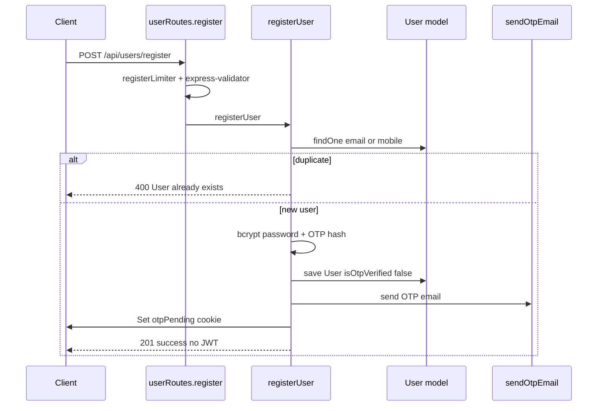
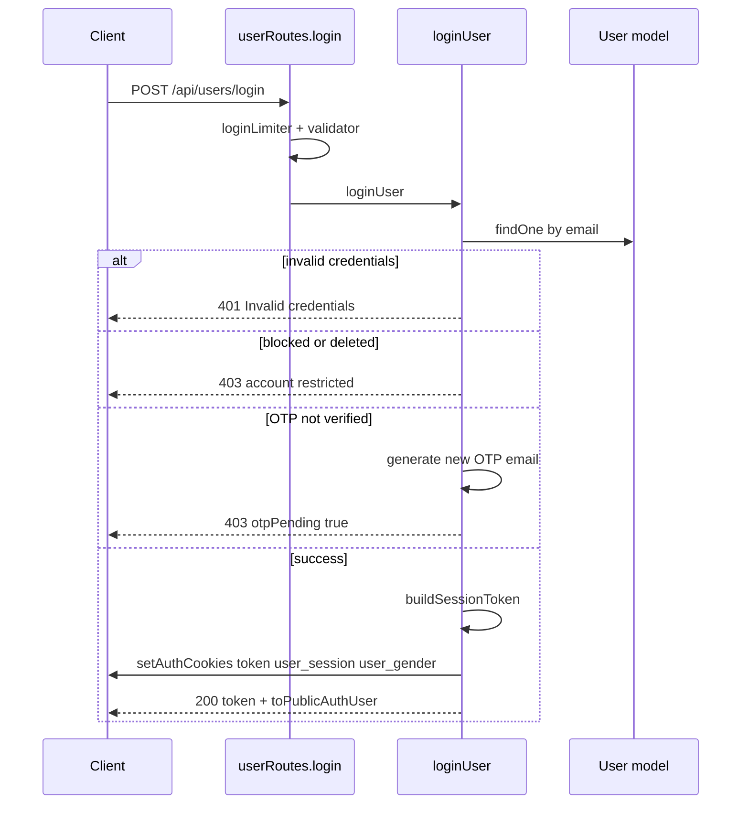
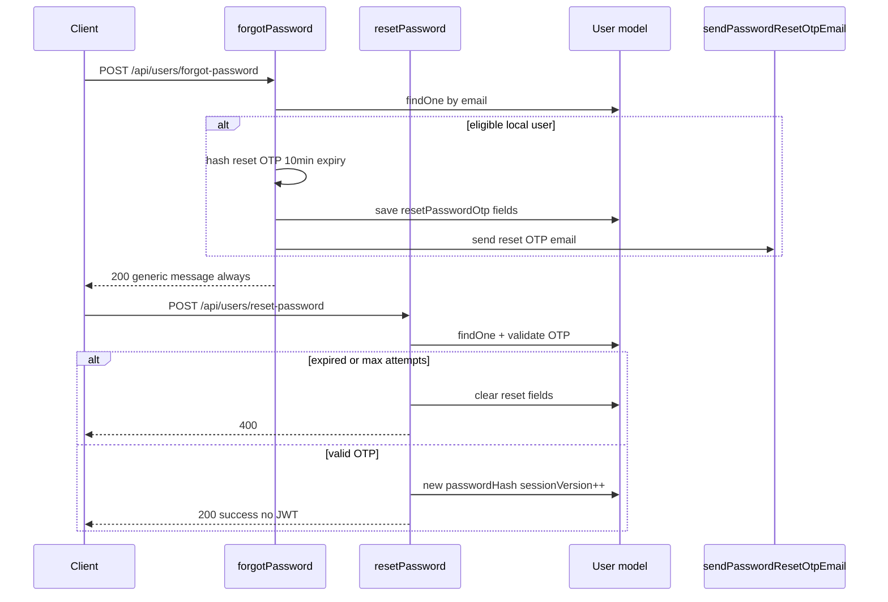
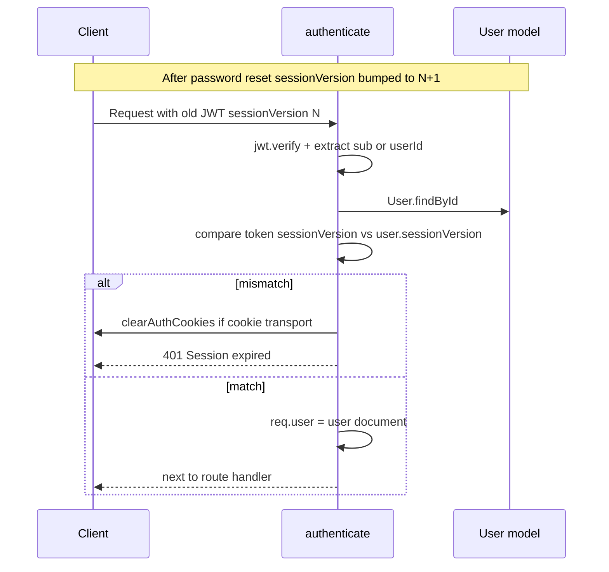
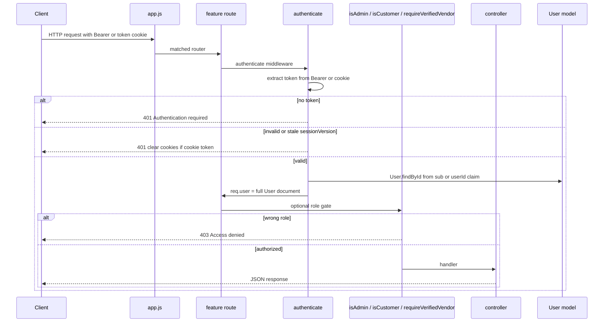

# Authentication and Session Flow

Implementation reference for Mosaic Biz Hub backend auth. Documents **actual code behavior** as of the current codebase.

**Related docs:** [auth.md](auth.md) (detailed JWT/cookie reference), [ARCHITECTURE.md](ARCHITECTURE.md) (repo map), [LLM_CONTEXT.md](LLM_CONTEXT.md) (safe-edit guide).

**Source files:**

| Layer | Files |
|-------|-------|
| Routes | [`routes/userRoutes.js`](../routes/userRoutes.js), [`routes/authRoutes.js`](../routes/authRoutes.js) |
| Controllers | [`controllers/userController.js`](../controllers/userController.js), [`controllers/authController.js`](../controllers/authController.js) |
| Middleware | [`middlewares/authenticate.js`](../middlewares/authenticate.js), role gates in [`middlewares/`](../middlewares/) |
| Model | [`models/User.js`](../models/User.js) |
| Helpers | [`utils/cookieHelper.js`](../utils/cookieHelper.js), [`utils/toPublicAuthUser.js`](../utils/toPublicAuthUser.js) |
| Tests | [`tests/auth/`](../tests/auth/) |

---

## Overview

Auth is **stateless JWT** with optional **HTTP-only cookies**. There is no server-side session store and no refresh-token rotation.

| Mechanism | Detail |
|-----------|--------|
| Token transport | `token` cookie (web) or `Authorization: Bearer` header (API/mobile) |
| Token TTL | 7 days (`expiresIn: '7d'`) |
| Session invalidation | `User.sessionVersion` incremented on password reset; `authenticate` rejects stale tokens |
| Role authority | Always `req.user.role` from MongoDB — never trust raw JWT `role` claim for authorization |
| Providers | `local` (email/password) and `google` OAuth; `facebook` exists in schema enum only |

---

## Registration flow

**Route:** `POST /api/users/register`  
**Handler:** `userController.registerUser`  
**Rate limit:** 5 requests / 15 min (`registerLimiter` in `userRoutes.js`)

### Steps

1. `express-validator` checks `name`, `email`, `password` (min 6), `mobile`, optional `role` (`customer` | `business_owner` only).
2. `getSafePublicRole(role)` forces role to `customer` or `business_owner` — **`admin` cannot be self-assigned**.
3. Duplicate check: `User.findOne({ $or: [{ email }, { mobile }] })`.
4. `bcrypt.hash(password, 12)` → `passwordHash`.
5. 6-digit OTP generated, `bcrypt.hash(otp, 10)` stored in `user.otp` with `otpExpiry` = now + 10 minutes.
6. User saved with `isOtpVerified: false`, `provider: 'local'` (default).
7. `sendOtpEmail(email, otp)` — OTP delivered by **email** (response message says "mobile" but mailer sends to email).
8. `otpPending` cookie set (10 min, via `getCookieOptions`).
9. Returns `201` — no JWT issued until OTP verified.

### Diagram



---

## OTP behavior (registration)

OTP is used for **email verification after registration** and for **re-verification on login** if `isOtpVerified` is false.

| Field | Purpose |
|-------|---------|
| `user.otp` | bcrypt hash of 6-digit OTP |
| `user.otpExpiry` | 10-minute window |
| `user.isOtpVerified` | `true` after successful verify |

### Verify OTP

**Route:** `POST /api/users/verify-otp` → `userController.verifyOtp`  
**Rate limit:** 10 / 15 min

1. Load user by email; reject if no OTP, expired, deleted, or blocked.
2. `bcrypt.compare(otp, user.otp)`.
3. Set `isOtpVerified: true`; clear `otp` and `otpExpiry`.
4. `buildSessionToken(user)` → JWT with claims `{ sub, role, sessionVersion }`.
5. `setAuthCookies(res, token, user, 7d)`; clear `otpPending` cookie.
6. Return `200` with `token` and `toPublicAuthUser(user)`.

### Resend OTP

**Route:** `POST /api/users/resend-otp` → `userController.resendOtp`  
**Rate limit:** 5 / 15 min

- Rejects if user not found, deleted, blocked, or already verified.
- Generates new OTP, updates hash/expiry, emails OTP, sets `otpPending` cookie.

### Login-triggered OTP

If `loginUser` finds valid credentials but `!user.isOtpVerified`, it generates a **new** OTP, emails it, sets `otpPending`, and returns `403` with `otpPending: true` (no JWT).

---

## Login flow

**Route:** `POST /api/users/login`  
**Handler:** `userController.loginUser`  
**Rate limit:** 15 / 15 min

### Steps

1. Validate `email` + `password`.
2. Load user; reject with `401 Invalid credentials` if missing or no `passwordHash` (includes Google-only accounts).
3. Reject `403` if `isDeleted` or `isBlocked`.
4. `bcrypt.compare(password, passwordHash)` — generic `401` on mismatch.
5. If `!isOtpVerified` → new OTP emailed, `403 otpPending: true` (see above).
6. `buildSessionToken(user)` → JWT (`sub`, `role`, `sessionVersion`, 7d).
7. `setAuthCookies(res, token, user, 7d)`.
8. Return `200` with `token` and `toPublicAuthUser(user)`.

### Diagram



### Session token shape (`buildSessionToken`)

```javascript
// controllers/userController.js — buildSessionToken
jwt.sign(
  { sub: user._id.toString(), role: user.role, sessionVersion: user.sessionVersion || 0 },
  process.env.JWT_SECRET,
  { expiresIn: '7d' }
);
```

Google OAuth uses the same shape via `mintSessionJWT` in `authController.js`.

---

## Password reset flow

Separate OTP fields from registration — no JWT issued during reset.

| Field | Purpose |
|-------|---------|
| `resetPasswordOtp` | bcrypt hash of reset OTP |
| `resetPasswordOtpExpiry` | 10-minute window |
| `resetPasswordOtpAttempts` | failed guess counter (max 5) |

### Forgot password

**Route:** `POST /api/users/forgot-password` → `userController.forgotPassword`  
**Rate limit:** 5 / 15 min

- Always returns the same generic `200` message (`FORGOT_PASSWORD_RESPONSE`) — **no email enumeration**.
- OTP email sent only when user exists, is not deleted/blocked, and has `passwordHash` (local accounts).
- On send failure returns `500`; otherwise generic success even for unknown emails.

### Reset password

**Route:** `POST /api/users/reset-password` → `userController.resetPassword`  
**Rate limit:** 10 / 15 min

1. Validate `email`, `otp` (6 digits), `newPassword` (min 6).
2. Load user; reject if no reset OTP fields.
3. Reject `403` if deleted/blocked.
4. If OTP expired → clear reset fields, `400 Reset OTP has expired`.
5. On wrong OTP → increment `resetPasswordOtpAttempts`; at **5 failures** clear reset state and return generic `400 Invalid or expired reset request`.
6. On success → `bcrypt.hash(newPassword, 12)`, clear reset fields, **`sessionVersion += 1`**, save.
7. Returns `200` — **no new JWT**; user must log in again.

### Diagram



---

## Session / JWT behavior

### Cookies set on login (`setAuthCookies`)

| Cookie | httpOnly | Purpose |
|--------|----------|---------|
| `token` | yes | JWT session token |
| `user_session` | no | Client hint `"true"` |
| `user_gender` | no | Client hint for UI |

Flags from [`utils/cookieHelper.js`](../utils/cookieHelper.js): `COOKIE_SECURE`, `COOKIE_SAMESITE`, `COOKIE_DOMAIN` (prod default `.mosaicbizhub.com`).

### Auth check endpoint

**Route:** `GET /api/users/auth/check`  
**Middleware:** `authenticate`  
**Handler:** inline in `userRoutes.js` — returns `{ loggedIn: true, user: toPublicAuthUser(req.user) }`.

### Logout

**Route:** `POST /api/users/logout` → `userController.logout`  
**Auth required:** No

- `clearAuthCookies(res)` + `clearCookie('otpPending')`.
- Does **not** increment `sessionVersion` — see [Session invalidation](#session-invalidation).

### `toPublicAuthUser` whitelist

Only these fields appear in auth JSON responses: `id`, `name`, `email`, `role`, `gender`, `mobile`, `isOtpVerified`.  
Excludes `passwordHash`, OTP fields, `sessionVersion`, `providerId`, etc. (enforced by [`tests/auth/auth-check-payload.test.js`](../tests/auth/auth-check-payload.test.js)).

---

## Session invalidation

Invalidation is **partial** — two mechanisms exist:

| Trigger | Mechanism | Effect |
|---------|-----------|--------|
| Password reset | `sessionVersion++` in `resetPassword` | All JWTs with older `sessionVersion` rejected by `authenticate` |
| Logout | Clears cookies only | Stolen Bearer tokens remain valid until JWT `exp` unless `sessionVersion` was bumped |

### `authenticate` session check

```javascript
// middlewares/authenticate.js
const tokenSessionVersion = Number.isInteger(decoded.sessionVersion) ? decoded.sessionVersion : 0;
const currentSessionVersion = user.sessionVersion || 0;
if (tokenSessionVersion !== currentSessionVersion) {
  return deny(res, 'Session expired. Please log in again.', { clearCookies: Boolean(cookieToken) });
}
```

On mismatch with a cookie token, `clearAuthCookies` runs before `401`.

### Diagram



**Tests:** [`tests/auth/password-reset-session-invalidation.test.js`](../tests/auth/password-reset-session-invalidation.test.js)

---

## Google OAuth

**Routes:** mounted at `/api/auth` in [`app.js`](../app.js)

| Route | Handler | Rate limit |
|-------|---------|------------|
| `GET /api/auth/google` | `authController.startGoogleAuth` | 20 / 15 min |
| `GET /api/auth/google/callback` | `authController.handleGoogleCallback` | 20 / 15 min |
| `POST /api/auth/google/complete` | `authController.completeGoogleProfile` | 10 / 15 min |

**Boot requirement:** `authController.js` throws at load if `GOOGLE_CLIENT_ID`, `GOOGLE_CLIENT_SECRET`, `API_BASE_URL`, `FRONTEND_URL`, or `JWT_SECRET` are missing.

### Redirect flow (`startGoogleAuth` → `handleGoogleCallback`)

1. `startGoogleAuth` encodes `redirect` URL in base64 `state`, redirects to Google consent URL.
2. Callback exchanges `code` for tokens, verifies `id_token` via `OAuth2Client.verifyIdToken` with audience check.
3. Upsert user by `provider: 'google'` + `providerId` or `email`.
4. New Google users: `isOtpVerified: true` (no registration OTP), role from `getServerAssignedOAuthRole` (defaults `customer`; preserves existing `admin`/`business_owner`).
5. Blocked/deleted users → redirect `?error=account_restricted`.
6. If `REQUIRE_PROFILE_COMPLETION=true` and missing `mobile` or `minorityType` → temporary JWT in `mbh_tmp` cookie (default 15 min), redirect to `/complete-profile`.
7. Otherwise `mintSessionJWT` + `setAuthCookies`, redirect to `redirect` or `FRONTEND_URL`.

### Profile completion (`completeGoogleProfile`)

- Reads `mbh_tmp` cookie, verifies JWT, updates `mobile` / `minorityType`, clears temp cookie, issues full session JWT + auth cookies.
- Default: `REQUIRE_PROFILE_COMPLETION=false` — most deployments skip this path.

### OAuth vs local accounts

- Google users have no `passwordHash` — `loginUser` returns `401` for password login.
- `authController.logout` exists but is **not mounted**; clients use `POST /api/users/logout`.

**Tests:** [`tests/auth/google-oauth-security.test.js`](../tests/auth/google-oauth-security.test.js)

---

## Authenticated request flow



There is **no global auth middleware** in `app.js`. Each route file applies `authenticate` and role gates explicitly.

---

## Auth middleware responsibilities

### `authenticate` ([`middlewares/authenticate.js`](../middlewares/authenticate.js))

| Responsibility | Behavior |
|----------------|----------|
| Token extraction | `Authorization: Bearer` first, else `cookies.token` |
| Verification | `jwt.verify(token, JWT_SECRET)` |
| User ID | `decoded.sub` (canonical) or legacy `decoded.userId` fallback |
| User load | `User.findById(userId)` — full document on `req.user` |
| Session version | Reject if JWT `sessionVersion` ≠ `user.sessionVersion` |
| Error handling | Always `401` JSON; clears auth cookies on cookie-based stale/invalid tokens |

### Role gates (all require `authenticate` first)

| Middleware | File | Check |
|------------|------|-------|
| `isAdmin` | [`isAdmin.js`](../middlewares/isAdmin.js) | `req.user.role === 'admin'` |
| `isCustomer` | [`isCustomer.js`](../middlewares/isCustomer.js) | `req.user.role === 'customer'` |
| `isBusinessOwner` | [`isBusinessOwner.js`](../middlewares/isBusinessOwner.js) | `req.user.role === 'business_owner'` |
| `isBusinessOwnerOrAdmin` | [`isBusinessOwnerOrAdmin.js`](../middlewares/isBusinessOwnerOrAdmin.js) | owner or admin |
| `requireVerifiedVendor` | [`requireVerifiedVendor.js`](../middlewares/requireVerifiedVendor.js) | `business_owner` + `isOtpVerified` + not blocked/deleted; optional `requireStage1Verified` checks `VendorOnboardingStage1.status === 'verified'` |

**Rule:** Authorization decisions use `req.user` from the database. JWT `role` claim is informational only.

---

## Rate limiting locations

All use `express-rate-limit`, **15-minute window**, defined in route files.

### `routes/userRoutes.js`

| Route | Max / 15 min | Limiter variable |
|-------|--------------|------------------|
| `POST /register` | 5 | `registerLimiter` |
| `POST /login` | 15 | `loginLimiter` |
| `POST /verify-otp` | 10 | `otpVerifyLimiter` |
| `POST /resend-otp` | 5 | `otpResendLimiter` |
| `POST /forgot-password` | 5 | `forgotPasswordLimiter` |
| `POST /reset-password` | 10 | `resetPasswordLimiter` |

### `routes/authRoutes.js`

| Route | Max / 15 min | Limiter variable |
|-------|--------------|------------------|
| `GET /google` | 20 | `googleStartLimiter` |
| `GET /google/callback` | 20 | `googleCallbackLimiter` |
| `POST /google/complete` | 10 | `googleCompleteLimiter` |

**Tests:** rate-limit middleware ordering verified in `password-reset-abuse-protection.test.js` and `google-oauth-security.test.js`.

---

## Security boundaries

### What is protected

| Boundary | Implementation |
|----------|----------------|
| Password storage | bcrypt cost 12; never returned in API responses |
| OTP storage | bcrypt cost 10; cleared after use |
| Email enumeration | `forgotPassword` generic response always |
| Credential guessing | Rate limits on login, register, OTP, reset |
| Account state | `isBlocked`, `isDeleted` checked before token issue in login/OTP/reset |
| Session hijack after password change | `sessionVersion` bump invalidates old JWTs |
| Response leakage | `toPublicAuthUser` whitelist on auth endpoints |
| Google token trust | `verifyIdToken` with `GOOGLE_CLIENT_ID` audience |
| Role escalation at register | `getSafePublicRole` — no self-service `admin` |
| Vendor routes | `requireVerifiedVendor` enforces OTP + role |

### What is NOT protected (known gaps)

| Gap | Detail |
|-----|--------|
| Logout invalidation | Logout clears cookies only; Bearer tokens work until `exp` |
| No token blacklist | Stateless JWT — no server-side revocation list |
| No refresh tokens | Single 7-day token; no rotation |
| Legacy JWT claim | `authenticate` accepts `decoded.userId` for older tokens |
| Input sanitization | `express-mongo-sanitize` and `xss-clean` imported in `app.js` but **not applied** as middleware |
| Facebook OAuth | `provider: 'facebook'` in schema; **no routes implemented** |
| Passport package | Listed in `package.json`; **not used** by current auth routes |
| `resendOtp` | Returns `404` for unknown email (differs from forgot-password anti-enumeration) |

### CORS and cookies

- CORS allowlist resolved by [`utils/corsOrigins.js`](../utils/corsOrigins.js): `CORS_ORIGINS` (comma-separated) when set, otherwise `FRONTEND_URL` plus legacy production defaults. [`app.js`](../app.js) mounts `cors` with `credentials: true` (no wildcard `*`).
- Production cookies: `secure` + `sameSite` from env; domain `.mosaicbizhub.com` when `NODE_ENV=production`.
- Frontend authenticated requests must use `credentials: 'include'` (fetch) or `withCredentials: true` (axios).

---

## User model auth fields

From [`models/User.js`](../models/User.js):

| Field | Used by |
|-------|---------|
| `passwordHash` | Local login, forgot/reset eligibility |
| `otp`, `otpExpiry` | Registration OTP |
| `resetPasswordOtp`, `resetPasswordOtpExpiry`, `resetPasswordOtpAttempts` | Password reset |
| `sessionVersion` | JWT invalidation after password reset |
| `isOtpVerified` | Login gate, `requireVerifiedVendor` |
| `isBlocked`, `isDeleted` | Account restriction checks |
| `role` | `admin`, `customer`, `business_owner` |
| `provider`, `providerId` | Google OAuth linkage |

Unique indexes: `email`; `mobile` (when non-empty); `provider` + `providerId` (when present).

---

## Known deferred items and limitations

Tracked in [auth.md](auth.md) §10 and codebase comments:

| Item | Status |
|------|--------|
| Remove legacy `decoded.userId` fallback in `authenticate.js` | Deferred until old tokens expire |
| Admin `GET /admin/users` field redaction (OTP/reset metadata) | Deferred hardening |
| Full server-side session revocation on logout | Not implemented (MVP stateless model) |
| Refresh token / rotation | Not implemented |
| Facebook OAuth routes | Schema ready; routes not built |
| Apply `mongo-sanitize` / `xss-clean` middleware in `app.js` | Imported but not wired |
| `REQUIRE_PROFILE_COMPLETION` | Off by default; optional Google profile gate |

---

## Testing

```bash
npm test   # runs tests/auth/*.test.js among others
```

| Test file | Covers |
|-----------|--------|
| `auth-check-payload.test.js` | `toPublicAuthUser` whitelist, `/auth/check` shape, JWT `sub` claim |
| `password-reset-abuse-protection.test.js` | Forgot-password generic response, reset OTP lockout, rate limit wiring |
| `password-reset-session-invalidation.test.js` | `sessionVersion` bump, `authenticate` reject/accept |
| `google-oauth-security.test.js` | Temp cookie TTL, OAuth rate limits |

**Manual smoke:** [`scripts/verify-auth-check-smoke.js`](../scripts/verify-auth-check-smoke.js)

---

## Quick endpoint reference

| Method | Path | Auth | Handler |
|--------|------|------|---------|
| POST | `/api/users/register` | Public | `registerUser` |
| POST | `/api/users/login` | Public | `loginUser` |
| POST | `/api/users/logout` | Public | `logout` |
| POST | `/api/users/verify-otp` | Public | `verifyOtp` |
| POST | `/api/users/resend-otp` | Public | `resendOtp` |
| POST | `/api/users/forgot-password` | Public | `forgotPassword` |
| POST | `/api/users/reset-password` | Public | `resetPassword` |
| GET | `/api/users/auth/check` | `authenticate` | inline + `toPublicAuthUser` |
| GET | `/api/auth/google` | Public | `startGoogleAuth` |
| GET | `/api/auth/google/callback` | Public | `handleGoogleCallback` |
| POST | `/api/auth/google/complete` | `mbh_tmp` cookie | `completeGoogleProfile` |
