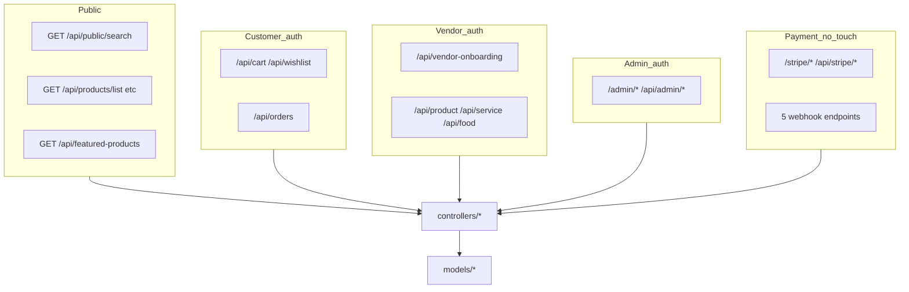

# Backend Architecture Map

Route → controller → model ownership for AI agents and reviewers. This is a **focused map** — deep lifecycle detail lives in [ARCHITECTURE.md](ARCHITECTURE.md) and [API_SURFACE.md](API_SURFACE.md).

**Last updated:** 2026-06-28

---

## Boundary overview

---

## Public marketplace and search

| Prefix / path | Router | Controller | Primary models |
| --- | --- | --- | --- |
| `/api/public/search` | [publicListing.js](../routes/publicListing.js) | [publicListing.js](../controllers/publicListing.js) | `Product`, `Service`, `Food`, `Business` |
| `/api/products/list`, `/api/products/filters` | same | same | `Product` |
| `/api/public/product/:id` | same | same | `Product` |
| `/api/services/list`, `/api/public/services/:id` | same | same | `Service` |
| `/api/food/list`, `/api/public/foods/:id` | same | same | `Food` |
| `/api/public/product/vendor-profile/:businessId` | same | same | `Business` |
| `/api/ranked`, `/:id/similar` | same | [productListingController.js](../controllers/productListingController.js) | `Product` |
| **`GET /api/featured-products`** | [featuredProductRoutes.js](../routes/featuredProductRoutes.js) | [featuredProducts.controller.js](../controllers/featuredProducts.controller.js) | `Product` (featured flag) |

**DTO:** Public card/detail shapes use [lib/listing/publicListingDto.js](../lib/listing/publicListingDto.js) (`toPublicListingCard`, `toPublicListingDetail`). Contract: [MVP_BACKEND_MARKETPLACE_DATA_CONTRACT.md](MVP_BACKEND_MARKETPLACE_DATA_CONTRACT.md).

**Canonical featured endpoint:** `GET /api/featured-products` — mounted at `/api` + `/featured-products`. **Do not** add or document `/api/products/featured` (not registered; returns 404).

**Search/filter detail:** [MVP_BACKEND_SEARCH_FILTER_READINESS.md](MVP_BACKEND_SEARCH_FILTER_READINESS.md)

---

## Auth and users

| Prefix | Router | Controller | Primary models |
| --- | --- | --- | --- |
| `/api/users` | [userRoutes.js](../routes/userRoutes.js) | [userController.js](../controllers/userController.js) | `User` |
| `/api/auth` | [authRoutes.js](../routes/authRoutes.js) | [authController.js](../controllers/authController.js) | `User` |

**Middleware:** [authenticate.js](../middlewares/authenticate.js) · [isAdmin.js](../middlewares/isAdmin.js) · [isCustomer.js](../middlewares/isCustomer.js) · [isBusinessOwner.js](../middlewares/isBusinessOwner.js) · [requireVerifiedVendor.js](../middlewares/requireVerifiedVendor.js)

**Response DTOs:** [toPublicAuthUser.js](../utils/toPublicAuthUser.js) · [toAdminUser.js](../utils/toAdminUser.js)

**Deep dive:** [AUTH_FLOW.md](AUTH_FLOW.md)

---

## Vendor onboarding and business profile

| Prefix | Router | Controller | Primary models |
| --- | --- | --- | --- |
| `/api/vendor-onboarding` | [vendorOnboarding.routes.js](../routes/vendorOnboarding.routes.js) | [vendorOnboarding.controller.js](../controllers/vendorOnboarding.controller.js) | `VendorOnboardingStage1` |
| `/admin/vendor-onboard-verify-stage1` | same router (second mount) | [vendorOnboardVerifyStage1.js](../controllers/admin/vendorOnboardVerifyStage1.js) | `VendorOnboardingStage1` |
| `/api/vendor-onboarding/webhook/payment` | raw mount in [app.js](../app.js) | `handleVendorPaymentWebhook` | `VendorOnboardingStage1` |
| `/api/business-profile` | [businessProfileRoutes.js](../routes/businessProfileRoutes.js) | [businessProfileController.js](../controllers/businessProfileController.js) | `BusinessProfile`, `VendorOnboardingStage1` |
| `/admin/business-profile-verify` | [businessProfileVerifyRoutes.js](../routes/admin/businessProfileVerifyRoutes.js) | admin profile verify controller | `BusinessProfile` |
| `/api/connect` | [connectRoutes.js](../routes/connectRoutes.js) | [connectController.js](../controllers/connectController.js) | `Business` |

**Sync on approval:** [syncBusinessFromOnboarding.js](../utils/syncBusinessFromOnboarding.js) → `Business`

**Deep dive:** [MVP_BACKEND_VENDOR_ONBOARDING_EMAIL_FLOW.md](MVP_BACKEND_VENDOR_ONBOARDING_EMAIL_FLOW.md) · [VENDOR_LIFECYCLE.md](VENDOR_LIFECYCLE.md)

---

## Vendor listings (authenticated)

| Prefix | Router | Controller | Primary models |
| --- | --- | --- | --- |
| `/api/product` | [productRoutes.js](../routes/productRoutes.js) | [productController.js](../controllers/productController.js), [productVariantController.js](../controllers/productVariantController.js) | `Product`, `ProductVariant` |
| `/api/service` | [serviceRoutes.js](../routes/serviceRoutes.js) | [serviceController.js](../controllers/serviceController.js) | `Service` |
| `/api/food` | [foodRoutes.js](../routes/foodRoutes.js) | [foodController.js](../controllers/foodController.js) | `Food` |
| `/api/business` | [businessRoutes.js](../routes/businessRoutes.js) | [businessController.js](../controllers/businessController.js) | `Business` |
| `/api/private` | [privateListing.js](../routes/privateListing.js) | [privateListing.js](../controllers/privateListing.js) | listing models |

**Services layer:** [productListingService.js](../services/productListingService.js) · [reviewService.js](../services/reviewService.js)

---

## Customer commerce

| Prefix | Router | Controller | Primary models |
| --- | --- | --- | --- |
| `/api/cart` | [cartRoutes.js](../routes/customer/cartRoutes.js) | [cartController.js](../controllers/customer/cartController.js) | `Cart` |
| `/api/wishlist` | [wishlistRoutes.js](../routes/customer/wishlistRoutes.js) | [wishlist.controller.js](../controllers/customer/wishlist.controller.js) | `Wishlist` |
| `/api/orders` | [orderRoutes.js](../routes/orderRoutes.js) | [orderController.js](../controllers/orderController.js) | `Order` |
| `/api/bookings` | [bookingRoutes.js](../routes/bookingRoutes.js) | [bookingController.js](../controllers/bookingController.js) | `Booking` |
| `/api/enquiries` | [enquiryRoutes.js](../routes/enquiryRoutes.js) | [enquiry.js](../controllers/customer/enquiry.js) | enquiry models |
| `/api/discounts` | [discounts.js](../routes/discounts.js) | [discountController.js](../controllers/discountController.js) | `Discount` |

---

## Admin

All admin routers typically use `router.use(authenticate, isAdmin)` at the top.

| Prefix | Router | Controller | Primary models |
| --- | --- | --- | --- |
| `/admin/users` | [admin/userRoutes.js](../routes/admin/userRoutes.js) | [user.controller.js](../controllers/admin/user.controller.js) | `User` |
| `/admin/api/business`, `/api/admin/business` | [admin/businessRoutes.js](../routes/admin/businessRoutes.js) | [business.Controller.js](../controllers/admin/business.Controller.js) | `Business` |
| `/admin/api/products` | [adminProductRoutes.js](../routes/admin/adminProductRoutes.js) | [adminProduct.controller.js](../controllers/admin/adminProduct.controller.js) | `Product` |
| `/api/admin/category/*` | [admin/*Category*Routes.js](../routes/admin/) | category controllers | `Category`, subcategory models |
| `/api/admin/category-requests` | [categoryRequestRoutes.js](../routes/admin/categoryRequestRoutes.js) | category request handlers | category request models |
| `/api/cms`, `/cms` | [admin/cmsRoutes.js](../routes/admin/cmsRoutes.js) | [cms.controller.js](../controllers/admin/cms.controller.js) | CMS models |
| `/admin/api/blogs` | [Blog/blogRoutes.js](../routes/admin/Blog/blogRoutes.js) | blog controller | `Blog` |

**Deep dive:** [admin-read-mutation.md](admin-read-mutation.md)

---

## Payments, Stripe, webhooks (no-touch by default)

| Prefix / path | Router / mount | Controller | Primary models |
| --- | --- | --- | --- |
| `/api/payments` | [paymentRoutes.js](../routes/paymentRoutes.js) | [paymentController.js](../controllers/paymentController.js) | `Order` |
| `/api/orders` (initiate, retrieve-intent) | [orderRoutes.js](../routes/orderRoutes.js) | [orderController.js](../controllers/orderController.js) | `Order`, `Business` |
| `/api/stripe` | [stripeRoutes.js](../routes/stripeRoutes.js) | [stripeController.js](../controllers/stripeController.js), [stripePaymentController.js](../controllers/stripePaymentController.js) | `Order`, `Business` |
| `/stripe` | [stripe.routes.js](../routes/stripe.routes.js) | [stripe.controller.js](../controllers/stripe.controller.js) | `Business` |
| `/api/subscriptions` | [subscriptionRoutes.js](../routes/subscriptionRoutes.js) | [subscriptionController.js](../controllers/subscriptionController.js) | `Subscription` |
| `/api/subscription-plans` | [subscriptionPlanRoutes.js](../routes/subscriptionPlanRoutes.js) | [subscriptionPlanController.js](../controllers/subscriptionPlanController.js) | `SubscriptionPlan` |
| `/api` (billing) | [api.routes.js](../routes/api.routes.js) | [billing.controller.js](../controllers/billing.controller.js) | `Subscription` |

### Webhook endpoints (raw body — mount before `express.json()`)

| Path | Handler | Env secret (name only) | Models |
| --- | --- | --- | --- |
| `POST /api/webhooks/stripe` | `webhookController.handleStripeWebhook` | `STRIPE_ORDER_WEBHOOK_SECRET` | `Order` |
| `POST /api/stripe/webhook` | `stripeController.handleStripeWebhook` | `STRIPE_BUSINESS_DRAFT_WEBHOOK_SECRET` | `Business`, `Subscription` |
| `POST /api/stripe/payment/webhook` | `stripePaymentController.stripePaymentWebhook` | `STRIPE_ORDER_POST_PAYMENT_WEBHOOK_SECRET` | `Order` + emails |
| `POST /api/subscription/webhook` | `webhookController.handleSubscriptionWebhook` | `STRIPE_SUBSCRIPTION_WEBHOOK_SECRET` | `Subscription` |
| `POST /api/vendor-onboarding/webhook/payment` | `handleVendorPaymentWebhook` | `STRIPE_VENDOR_VERIFICATION_WEBHOOK_SECRET` | `VendorOnboardingStage1` |

**Checkout helpers (merged #42):** [checkoutGuards.js](../utils/checkoutGuards.js) · [paymentIntentResponse.js](../utils/paymentIntentResponse.js)

**Deep dive:** [PAYMENT_FLOW.md](PAYMENT_FLOW.md) · [STRIPE_WEBHOOKS.md](STRIPE_WEBHOOKS.md) · [MVP_BACKEND_STRIPE_CONNECT_RUNTIME_VERIFICATION.md](MVP_BACKEND_STRIPE_CONNECT_RUNTIME_VERIFICATION.md)

---

## Email triggers

| Trigger area | Mail utilities | Notes |
| --- | --- | --- |
| Vendor onboarding submit / approval / rejection | [WellcomeMailer.js](../utils/WellcomeMailer.js), [approvalMail.js](../utils/approvalMail.js) | See [MVP_BACKEND_EMAIL_NOTIFICATIONS.md](MVP_BACKEND_EMAIL_NOTIFICATIONS.md) |
| Order status / vendor new order | [orderPhase.js](../utils/orderPhase.js) | Pre/post payment timing — follow-up #43 |
| Order paid confirmation | [OrderMail.js](../utils/OrderMail.js) | Webhook-triggered |
| Bookings | [bookingMailer.js](../utils/bookingMailer.js) | |
| Business profile | [BuisnessprofileMail.js](../utils/BuisnessprofileMail.js) | |
| Generic OTP / notifications | [mailer.js](../utils/mailer.js) | |

Env names: `MAIL_USER`, `MAIL_PASSWORD`, `ADMIN_EMAIL`, `SUPPORT_EMAIL`, `APP_NAME`, `APP_URL`

---

## Upload and media

| Path | Router | Controller / util | Storage |
| --- | --- | --- | --- |
| `POST /api/upload-image` | [uploadImage.js](../routes/uploadImage.js) | [savePendingImage.js](../utils/savePendingImage.js) | Cloudinary URL tracked in `PendingImage` |
| Vendor onboarding docs | [vendorOnboarding.routes.js](../routes/vendorOnboarding.routes.js) | [vendorOnboardingUpload.controller.js](../controllers/vendorOnboardingUpload.controller.js) | S3 presigned URLs (`AWS_*` env vars) |
| Product media | [productRoutes.js](../routes/productRoutes.js) | [s3Controller.js](../controllers/s3Controller.js) | S3 |

Optional env: `STORAGE_PROVIDER`, `CLOUDINARY_*`

---

## Boundary matrix (who can call what)

| Boundary | Auth | Typical roles | Examples |
| --- | --- | --- | --- |
| Public read | None | Anyone | `/api/featured-products`, `/api/public/search`, health `GET /` |
| Customer | `authenticate` + `isCustomer` | `customer` | cart, wishlist, order initiate, reviews |
| Vendor | `authenticate` + `isBusinessOwner` (+ often `requireVerifiedVendor`) | `business_owner` | product CRUD, vendor onboarding, upload-image |
| Admin | `authenticate` + `isAdmin` | `admin` | pending applications, category CRUD, user mgmt |
| Webhooks | Stripe signature | Stripe servers | five webhook paths — no JWT |
| Payment legacy | Often **none** (known gap #41) | Mixed | `/stripe/*`, some `/api/payments/*` — treat as no-touch |

---

## Do not touch without written approval

| Area | Why |
| --- | --- |
| Stripe Connect destination-charge architecture | Money flow; audit in #32 |
| All five webhook handlers and mount order in `app.js` | Signature + raw body order |
| `controllers/orderController.js` initiate / Connect PI | Checkout and payout split |
| Legacy `POST /api/payments/create-payment-intent` | Bypasses Connect (#41) |
| `.github/workflows/deploy-eb-production.yml` | Production deploy gate |
| Production EB env properties | Live secrets and config |
| `GET /api/featured-products` path or response wrapper | Canonical frontend contract |
| Real customer/vendor/payment data in tests or docs | Privacy and compliance |

---

## Known caveats

| Caveat | Detail |
| --- | --- |
| Unmounted CMS duplicate | [routes/cms/cmsRoutes.js](../routes/cms/cmsRoutes.js) is **not** mounted — active CMS uses [routes/admin/cmsRoutes.js](../routes/admin/cmsRoutes.js) |
| Double-mounted onboarding router | [vendorOnboarding.routes.js](../routes/vendorOnboarding.routes.js) at `/api/vendor-onboarding` and `/admin/vendor-onboard-verify-stage1` |
| Payload sanitizers | `express-mongo-sanitize` and `xss-clean` are mounted after `express.json()` and after raw webhook routes in [app.js](../app.js) |
| No global auth | Each route applies middleware explicitly |
| Sentry | `instrument.js`, Express error handling, and 5xx response capture are wired; capture depends on Sentry env being enabled |

---

## Related documentation

| Doc | Use when |
| --- | --- |
| [ARCHITECTURE.md](ARCHITECTURE.md) | Full repo layout, request lifecycle, models index |
| [API_SURFACE.md](API_SURFACE.md) | Complete HTTP route map with smoke notes |
| [LLM_CONTEXT.md](LLM_CONTEXT.md) | Agent safe-edit rules and quick lookup |
| [AGENT_WORKFLOW.md](AGENT_WORKFLOW.md) | Branch/PR/release process |
| [TEST_MATRIX.md](TEST_MATRIX.md) | Test file index by domain |
