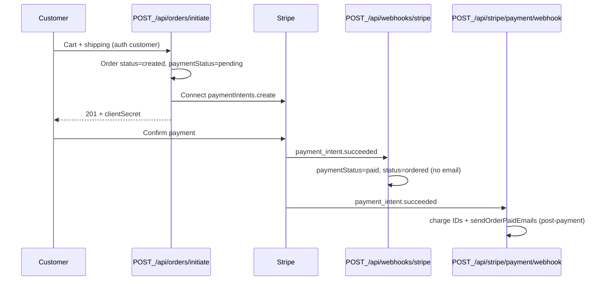

# Backend Launch Blockers — Batch 2 Audit

**Branch:** `sprint/backend-launch-blockers-41-43-69`  
**Date:** 2026-06-18  
**Builds on:** `sprint/backend-stability-roadmap-cleanup` (`5e6995e`)

Prior stabilization work is documented in [BACKEND_STABILITY_ROADMAP_AUDIT.md](BACKEND_STABILITY_ROADMAP_AUDIT.md). This audit covers issues **#41**, **#43**, and **#69** only.

---

## Current checkout / order / payment flow

| Step | File | Function / route |
| --- | --- | --- |
| Checkout | [controllers/orderController.js](../controllers/orderController.js) | `initiateOrder` |
| Connect PI | same | Stripe `paymentIntents.create` with Connect account |
| Legacy PI (guarded) | [controllers/paymentController.js](../controllers/paymentController.js) | `POST /api/payments/create-payment-intent` |
| Status webhook | [controllers/webhookController.js](../controllers/webhookController.js) | `handleStripeWebhook` |
| Post-payment webhook | [controllers/stripePaymentController.js](../controllers/stripePaymentController.js) | `stripePaymentWebhook` |
| Paid emails | [utils/OrderMail.js](../utils/OrderMail.js) | `sendOrderPaidEmails` |

**Canonical checkout:** `POST /api/orders/initiate` (Stripe Connect, #42).  
**Legacy path:** `POST /api/payments/create-payment-intent` — plain PI, now requires customer auth + order ownership.

---

## Email timing flow (before batch 2)

| Trigger | When | Emails | Problem |
| --- | --- | --- | --- |
| `initiateOrder` | After PI created, **before** payment | `sendCustomerOrderPlacedEmail`, `sendVendorNewOrderEmail` | Customer/vendor notified before payment confirmed |
| `stripePaymentWebhook` | After `payment_intent.succeeded` | `sendOrderPaidEmails` (confirmation + PDF) | Correct timing; **no duplicate guard** |

**After batch 2:**

- Pre-payment emails **removed** from `initiateOrder`
- Post-payment path only via `sendOrderPaidEmails`
- `Order.paidConfirmationEmailSentAt` prevents duplicate sends on webhook retry

---

## Route auth / protection map (payment-sensitive)

| Route | Method | Protection (after batch 2) | Notes |
| --- | --- | --- | --- |
| `/api/orders/initiate` | POST | `authenticate`, `isCustomer` | Connect checkout |
| `/api/orders/retrieve-intent/:id` | GET | `authenticate` + ownership in controller | |
| `/api/payments/create-payment-intent` | POST | `authenticate`, `isCustomer` + order ownership | Legacy; rate limited |
| `/stripe/account-session` | POST | `authenticate`, `isBusinessOwner` + Connect ownership | |
| `/stripe/express-login-link` | POST | same | |
| `/stripe/account-balance` | GET | same | |
| `/stripe/last-payout` | GET | same | |
| `/stripe/backfill-customers` | POST | `authenticate`, `isAdmin` | Admin-only |
| `/api/connect/:businessId/account-link` | POST | `authenticate`, `isBusinessOwner` + owner check in controller | Pre-existing |
| `/api/webhooks/stripe` | POST | Stripe signature | Raw body before JSON |
| `/api/stripe/payment/webhook` | POST | Stripe signature | Raw body before JSON |
| `/api/stripe/webhook` | POST | Stripe signature | Business draft webhook |
| `/api/vendor-onboarding/webhook/payment` | POST | Stripe signature | Raw body mount |
| `/api/subscription/webhook` | POST | Stripe signature | Raw body mount |
| `/api/health` | GET | Public | Liveness — no DB |
| `/api/ready` | GET | Public | Readiness — Mongo ping via `readyState` |
| `/` | GET | Public | Legacy health string (unchanged) |

### Intentionally public

- Stripe webhooks (signature-verified, raw body)
- `/api/connect/return`, `/api/connect/refresh` (redirect helpers)
- `/api/health`, `/api/ready` (no secrets in response)

### Deferred (out of batch 2 scope)

- Billing routes `/api/subscriptions/*`, `/api/billing-portal/session` — role-only auth; IDOR audit tracked in #76 / #66
- `GET /api/connect/:businessId/status` — owner check not in controller yet

---

## Health / readiness (before batch 2)

| Endpoint | Behavior |
| --- | --- |
| `GET /` | Inline JSON in [app.js](../app.js) — liveness only |
| `/api/health` | **Missing** |
| `/api/ready` | **Missing** |

---

## Files involved in batch 2

| Issue | Files |
| --- | --- |
| #41 | [routes/paymentRoutes.js](../routes/paymentRoutes.js), [routes/stripe.routes.js](../routes/stripe.routes.js), [routes/orderRoutes.js](../routes/orderRoutes.js), [controllers/paymentController.js](../controllers/paymentController.js), [controllers/stripe.controller.js](../controllers/stripe.controller.js), [utils/stripeConnectOwnership.js](../utils/stripeConnectOwnership.js) |
| #43 | [controllers/orderController.js](../controllers/orderController.js), [controllers/stripePaymentController.js](../controllers/stripePaymentController.js), [models/Order.js](../models/Order.js) |
| #69 | [routes/healthRoutes.js](../routes/healthRoutes.js), [app.js](../app.js) |
| Tests | [tests/stripe/payment-route-protection.test.js](../tests/stripe/payment-route-protection.test.js), [tests/stripe/order-email-safety.test.js](../tests/stripe/order-email-safety.test.js), [tests/health/health-readiness.test.js](../tests/health/health-readiness.test.js) |

---

## Risks and assumptions

| Assumption | Rationale |
| --- | --- |
| No guest checkout | All order routes require authenticated customer |
| Legacy PI route may still be used by old clients | Guarded with auth + ownership instead of 410 removal |
| Pre-payment “order placed” emails are not required for MVP | Final confirmation + invoice sent post-payment only |
| `paidConfirmationEmailSentAt` set after successful SMTP send | Failed send allows webhook retry to attempt again |
| Webhook raw-body order unchanged | Verified by existing `stripe-webhook-routing-signature.test.js` |
| Health endpoints public | Standard for EB/GHA probes; no env leakage |

---

## Related docs

- [BACKEND_LAUNCH_BLOCKERS_BATCH_2_PROOF.md](BACKEND_LAUNCH_BLOCKERS_BATCH_2_PROOF.md)
- [BACKEND_ROADMAP_ISSUES.md](BACKEND_ROADMAP_ISSUES.md)
- [MVP_BACKEND_EMAIL_NOTIFICATIONS.md](MVP_BACKEND_EMAIL_NOTIFICATIONS.md)
- [STRIPE_WEBHOOKS.md](STRIPE_WEBHOOKS.md)
