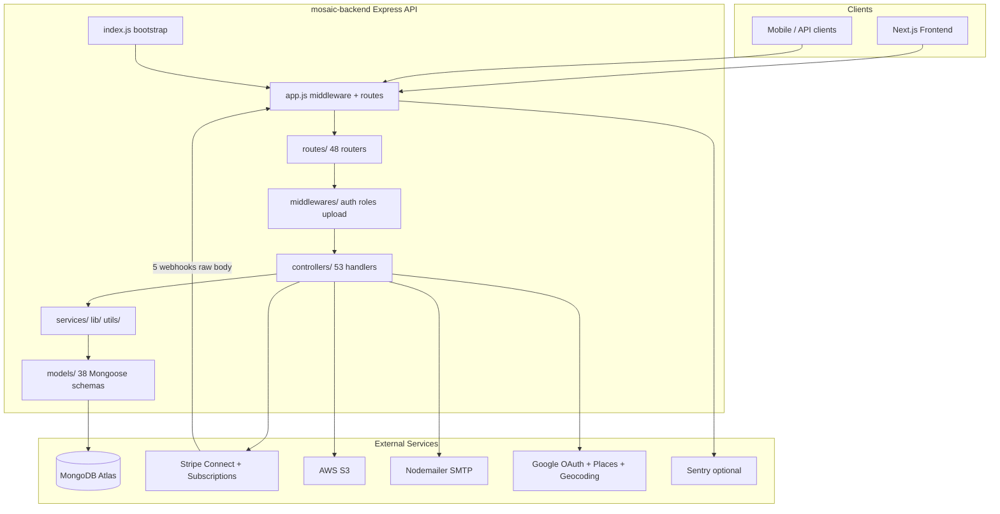
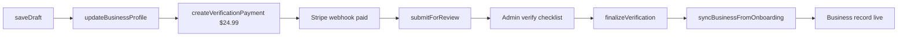
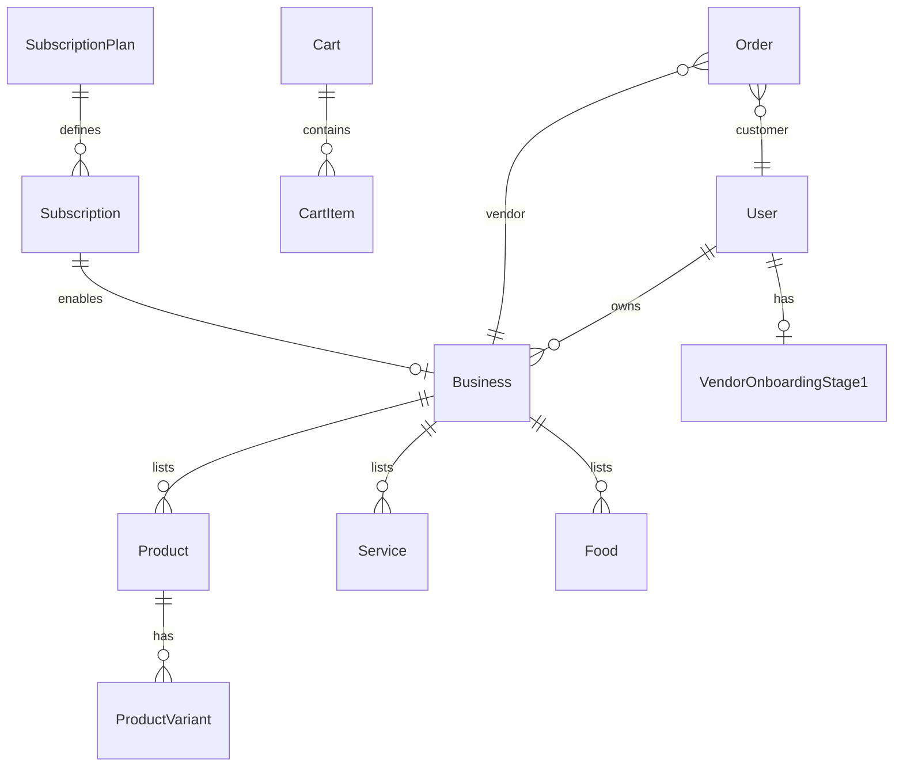

# Mosaic Backend — Full Architecture Report (Current State)

Use this document as project instructions for LLM coding assistants working on **mosaic-backend** (`mosaic-biz-hub` v1.0.0).

**Related:** [LLM_CONTEXT.md](LLM_CONTEXT.md) (safe-edit quick reference) · [BACKEND_ARCHITECTURE_MAP.md](BACKEND_ARCHITECTURE_MAP.md) (feature-to-file map) · [API_SURFACE.md](API_SURFACE.md) (full endpoint list)

---

## 1. Executive Summary

| Item | Value |
|------|-------|
| **Purpose** | REST API for Mosaic Biz Hub — a minority-owned business marketplace |
| **Production URL** | `https://api.mosaicbizhub.com` |
| **Stack** | Node.js + **Express 5** + **MongoDB (Mongoose)** — **NOT Supabase/Postgres** |
| **Language** | Plain JavaScript (CommonJS). No TypeScript, no build step |
| **Entry** | [`index.js`](../index.js) → [`app.js`](../app.js) |
| **Default port** | `3001` (`PORT` env var) |
| **Deploy target** | AWS Elastic Beanstalk (`us-east-1`), auto GitHub Actions deploy on push/merge to `main` (manual `workflow_dispatch` also available) |
| **Tests** | `npm test` → Node built-in test runner (~168 tests across 37 files) |
| **Docs hub** | [LLM_CONTEXT.md](LLM_CONTEXT.md) (start here for safe edits) |

**Three user roles:**
- **customer** — browse, cart, wishlist, orders, bookings, reviews
- **business_owner** (vendor) — onboarding, listings, Connect payouts, order fulfillment
- **admin** — user mgmt, vendor review, CMS, categories, moderation

---

## 2. High-Level Architecture



**Architectural pattern:** Controller-centric monolith. Most business logic lives in `controllers/` with shared helpers in `utils/`. A thin `services/` layer (4 files) and `lib/listing/` (4 files) handle marketplace ranking, reviews, and invoices. There is **no repository layer** and **no global auth middleware**.

**Request lifecycle:**
1. `index.js` loads `.env`, Sentry (`instrument.js`), connects MongoDB, starts HTTP server
2. `app.js` applies CORS → cookies → **Stripe webhooks (raw body)** → `express.json()` → sanitization → route dispatch
3. Route file applies per-route middleware (`authenticate`, role gates)
4. Controller validates, calls Stripe/AWS/mail, reads/writes Mongoose models
5. JSON response returned (or PDF stream for invoices)

---

## 3. Directory Structure

```
mosaic-backend/
├── index.js              # Bootstrap: dotenv, MongoDB, listen
├── app.js                # ALL route mounts + global middleware (critical file)
├── instrument.js         # Sentry init
├── config/Db.js          # mongoose.connect(MONGODB_URI)
│
├── routes/               # 48 Express routers (URL namespaces)
│   ├── admin/            # Admin CMS, categories, users, blogs
│   ├── customer/         # Cart, wishlist
│   └── *.js              # Feature routes
│
├── controllers/          # 53 request handlers (primary business logic)
│   ├── admin/
│   ├── customer/
│   └── pubic/            # Typo folder for public CMS reads
│
├── models/               # 38 Mongoose schemas (= database schema layer)
├── middlewares/          # Auth, role gates, vendor verification, upload, Sentry
├── services/             # productListing, review, invoice, debug (4 files)
├── utils/                # 33 shared helpers (mail, cookies, tax, shipping, onboarding)
├── helpers/stripePlan.js # Stripe product/price sync for subscription plans
├── validators/           # express-validator helpers (minimal)
├── lib/listing/          # Public DTOs, search filters, ranking
├── jobs/                 # cleanupImages.js (commented out, inactive)
├── seed/                 # Category seeds, dummy data, migrate script
├── scripts/              # Smoke test wrappers
├── tests/                # 37 test files (node --test)
└── docs/                 # 71 markdown docs (architecture, API, Stripe, deploy)
```

---

## 4. Bootstrap and Middleware (Critical Details)

### 4.1 Startup ([`index.js`](../index.js))

- Windows DNS workaround for MongoDB SRV resolution
- Loads **`.env` only** (NOT `.env.local`)
- Sentry instrumentation before app import
- MongoDB connect via [`config/Db.js`](../config/Db.js) — fails fast with `process.exit(1)` if unavailable
- Listens on `0.0.0.0:PORT` (default 3001)

### 4.2 Middleware order in [`app.js`](../app.js) — DO NOT REORDER casually

```
1. trust proxy (1)
2. sentryHttpCapture
3. cors (credentials, allowlist from utils/corsOrigins.js)
4. cookieParser()
5. STRIPE WEBHOOKS (express.raw BEFORE express.json):
   - POST /api/stripe/webhook
   - POST /api/stripe/payment/webhook
   - POST /api/webhooks/stripe
   - POST /api/vendor-onboarding/webhook/payment
   - POST /api/subscription/webhook
6. express.json({ limit: '1mb' })
7. mongoSanitize on body + params (NOT query — Express 5 read-only query)
8. xss-clean on body + params
9. Feature routers (~40 mounts)
10. GET / (smoke message)
11. Sentry Express error handler (if enabled)
```

**Breaking webhook mount order invalidates Stripe signature verification.**

### 4.3 Health endpoints

| Endpoint | Purpose |
|----------|---------|
| `GET /` | Simple "API is working" JSON |
| `GET /api/health` | Liveness: status, uptime, timestamp |
| `GET /api/ready` | Readiness: 200 if MongoDB connected, 503 if not |

---

## 5. Authentication and Authorization

### 5.1 Auth mechanism

- **JWT** stored in httpOnly `token` cookie (web) OR `Authorization: Bearer` header (API/mobile)
- [`middlewares/authenticate.js`](../middlewares/authenticate.js): verifies JWT, loads full `User` from DB, checks `sessionVersion`
- **Session invalidation:** `sessionVersion` incremented on password reset; stale JWTs rejected and cookies cleared
- **No global auth** — each route applies middleware explicitly

### 5.2 Roles

| Role | Enum value | Typical access |
|------|------------|----------------|
| Customer | `customer` | Cart, wishlist, orders, bookings, reviews |
| Vendor | `business_owner` | Business CRUD, products/services/food, Connect, vendor orders |
| Admin | `admin` | User mgmt, vendor review, CMS, categories, moderation |

### 5.3 Middleware gates

| Middleware | File | Checks |
|------------|------|--------|
| `authenticate` | `middlewares/authenticate.js` | Valid JWT + active user |
| `isAdmin` | `middlewares/isAdmin.js` | `req.user.role === 'admin'` |
| `isCustomer` | `middlewares/isCustomer.js` | `req.user.role === 'customer'` |
| `isBusinessOwner` | `middlewares/isBusinessOwner.js` | `req.user.role === 'business_owner'` |
| `isBusinessOwnerOrAdmin` | `middlewares/isBusinessOwnerOrAdmin.js` | owner or admin |
| `requireVerifiedVendor` | `middlewares/requireVerifiedVendor.js` | OTP verified, not blocked/deleted |
| `requireStage1VerifiedVendor` | same (factory) | + onboarding status `verified` |

### 5.4 Auth flows

**Registration:** `POST /api/users/register` → OTP email → `POST /api/users/verify-otp` → JWT cookies

**Login:** `POST /api/users/login` → bcrypt verify → JWT cookies

**Google OAuth:** `GET /api/auth/google` → redirect → callback → upsert User → JWT cookies → redirect to `FRONTEND_URL`

**Session probe:** `GET /api/users/auth/check` (authenticated)

**Rate limiting:** `express-rate-limit` on register, login, OTP, password reset, OAuth routes

### 5.5 Public auth response DTO

Use [`utils/toPublicAuthUser.js`](../utils/toPublicAuthUser.js) — never return raw User documents.

---

## 6. Core Business Domains

### 6.1 Vendor Onboarding (Stage 1)

**Primary files:** [`routes/vendorOnboarding.routes.js`](../routes/vendorOnboarding.routes.js), [`controllers/vendorOnboarding.controller.js`](../controllers/vendorOnboarding.controller.js), [`models/VendorOnboardingStage1.js`](../models/VendorOnboardingStage1.js)

**Mounted twice:** `/api/vendor-onboarding` AND `/admin/vendor-onboard-verify-stage1`



**Statuses:** `draft`, `submitted`, `verified`, `rejected`, `payment_pending`

**Key sync:** [`utils/syncBusinessFromOnboarding.js`](../utils/syncBusinessFromOnboarding.js) creates/updates `Business` after admin approval

**Uploads:** S3 presigned URLs via [`controllers/vendorOnboardingUpload.controller.js`](../controllers/vendorOnboardingUpload.controller.js) (JPEG/PNG/WebP/PDF)

### 6.2 Business and Listings

**Business model** ([`models/Business.js`](../models/Business.js)): owner, slug, listingType (`product`|`service`|`food`), subscription ref, Stripe Connect fields, tax/shipping settings, usage counters, plan tier limits

**Three listing types:**
- **Products** — `/api/product` with variants, SKU, stock ([`models/Product.js`](../models/Product.js), [`models/ProductVariant.js`](../models/ProductVariant.js))
- **Services** — `/api/service` with nested child services, booking ([`models/Service.js`](../models/Service.js))
- **Food** — `/api/food` with menu, geo location, table types ([`models/Food.js`](../models/Food.js))

**Public marketplace:**
- `GET /api/public/search` — keyword, location, ZIP, minority type, category filters
- `GET /api/products/list`, `/api/services/list`, `/api/food/list`
- `GET /api/ranked` — weighted interleave ranking by subscription tier + rating + recency
- `GET /api/featured-products` — **canonical featured endpoint** (do NOT use `/api/products/featured` — not registered)

**Private vendor listings:** `/api/private/*` (business_owner only)

**DTO layer:** [`lib/listing/publicListingDto.js`](../lib/listing/publicListingDto.js) — `toPublicListingCard`, `toPublicListingDetail`

**Tier limits:** [`utils/listingTierLimits.js`](../utils/listingTierLimits.js) enforces product+variant quotas per subscription plan

### 6.3 Customer Commerce

| Feature | Prefix | Key models |
|---------|--------|------------|
| Cart | `/api/cart` | `Cart`, `CartItem` |
| Wishlist | `/api/wishlist` | `Wishlist` (customer-only router) |
| Orders | `/api/orders` | `Order`, `Refund` |
| Bookings | `/api/bookings` | `Booking` (service + food) |
| Discounts | `/api/discounts` | `Discounts` |
| Enquiries | `/api/enquiries` | `BusinessEnquiry` |
| Reviews | on product/service/food routes | `Review` (polymorphic) |

### 6.4 Order Checkout (Stripe Connect)

**Flow:** `POST /api/orders/initiate` (customer) → validate items/stock/single-vendor → [`utils/checkoutGuards.js`](../utils/checkoutGuards.js) → Stripe Connect account check → create Order → Stripe PaymentIntent with `transfer_data.destination` → return `clientSecret` → frontend confirms → webhook marks paid → emails via [`utils/OrderMail.js`](../utils/OrderMail.js)

**Vendor lifecycle:** accept → ship → deliver → return (separate PUT endpoints)

**Invoice PDF:** `GET /api/orders/:id/invoice.pdf` via Puppeteer ([`services/invoiceService.js`](../services/invoiceService.js))

**Tax/shipping:** [`utils/vendorTax.js`](../utils/vendorTax.js), [`utils/vendorShipping.js`](../utils/vendorShipping.js)

### 6.5 Subscriptions and Billing

- **Plans:** `SubscriptionPlan` (Silver/Gold/Platinum) with Stripe product/price sync via [`helpers/stripePlan.js`](../helpers/stripePlan.js)
- **Active sub:** `Subscription` model linked to `Business`
- **Checkout:** `POST /api/stripe/create-checkout-session` (business_owner)
- **Billing portal:** `POST /api/billing-portal/session`
- **Webhook:** `POST /api/subscription/webhook` → [`webhookController.handleSubscriptionWebhook`](../controllers/webhookController.js)

### 6.6 Stripe Connect (Vendor Payouts)

- `POST /api/connect/:businessId/account-link` — start Express Connect onboarding
- `GET /api/connect/:businessId/status` — chargesEnabled, payoutsEnabled
- Embedded dashboard: `/stripe/account-session`, `/stripe/express-login-link` (business_owner)
- `Business.stripeConnectAccountId` required for checkout destination charges

### 6.7 Admin

**Router-level admin gates** (`router.use(authenticate, isAdmin)`) on: users, FAQs, testimonials, blogs, category-requests

| Area | Prefix |
|------|--------|
| Users | `/admin/users` |
| Business approval | `/admin/api/business`, `/api/admin/business` |
| Vendor onboarding review | `/admin/vendor-onboard-verify-stage1` |
| Business profile verify | `/admin/business-profile-verify` |
| Product moderation | `/admin/api/products` |
| Category CRUD | `/api/admin/category/*` |
| CMS | `/api/cms`, `/cms` |
| Blogs | `/admin/api/blogs` |
| Testimonials | `/api/admin/testimonials` |
| FAQs | `/admin/faqs` |

**Admin user DTO:** [`utils/toAdminUser.js`](../utils/toAdminUser.js)

### 6.8 CMS and Content

- **CMS pages:** privacy, terms, etc. — [`models/CMS.js`](../models/CMS.js)
- **Blogs:** [`models/Blog.js`](../models/Blog.js)
- **FAQs:** [`models/FAQ.js`](../models/FAQ.js)
- **Testimonials:** [`models/Testimonial.js`](../models/Testimonial.js)
- **Contact form:** `POST /api/contact-inquiry` → [`models/ContactInquiry.js`](../models/ContactInquiry.js)

### 6.9 Email Notifications

All via Nodemailer. Auth OTP/password-reset mail uses provider-neutral SMTP through [`utils/smtpTransport.js`](../utils/smtpTransport.js) when `MAIL_HOST` is set and keeps the Gmail fallback when `MAIL_HOST` is unset. Other legacy mailers still use their existing Gmail-style transport. Key files:
- [`utils/mailer.js`](../utils/mailer.js) — OTP, password reset, welcome email
- [`utils/smtpTransport.js`](../utils/smtpTransport.js) — auth SMTP config + From header
- [`utils/WellcomeMailer.js`](../utils/WellcomeMailer.js) — vendor onboarding
- [`utils/approvalMail.js`](../utils/approvalMail.js) — admin finalize
- [`utils/OrderMail.js`](../utils/OrderMail.js) — post-payment order emails
- [`utils/orderPhase.js`](../utils/orderPhase.js) — order status emails
- [`utils/bookingMailer.js`](../utils/bookingMailer.js) — booking notifications

Graceful skip if SMTP env vars missing: [`utils/vendorOnboardingEmailDelivery.js`](../utils/vendorOnboardingEmailDelivery.js)

---

## 7. Stripe Webhooks (Five Endpoints, Five Secrets)

| Route | Env secret | Handler | Updates |
|-------|------------|---------|---------|
| `POST /api/webhooks/stripe` | `STRIPE_ORDER_WEBHOOK_SECRET` | `webhookController.handleStripeWebhook` | Order payment status |
| `POST /api/stripe/webhook` | `STRIPE_BUSINESS_DRAFT_WEBHOOK_SECRET` | `stripeController.handleStripeWebhook` | Business, Subscription |
| `POST /api/stripe/payment/webhook` | `STRIPE_ORDER_POST_PAYMENT_WEBHOOK_SECRET` | `stripePaymentController.stripePaymentWebhook` | Order + emails |
| `POST /api/subscription/webhook` | `STRIPE_SUBSCRIPTION_WEBHOOK_SECRET` | `webhookController.handleSubscriptionWebhook` | Subscription lifecycle |
| `POST /api/vendor-onboarding/webhook/payment` | `STRIPE_VENDOR_VERIFICATION_WEBHOOK_SECRET` | `handleVendorPaymentWebhook` | VendorOnboardingStage1 payment |

All use `express.raw({ type: 'application/json' })` + Stripe signature verification.

---

## 8. Data Layer (MongoDB / Mongoose)

**No Supabase, no SQL migrations, no RLS, no generated TypeScript types.**

Schema = Mongoose models in [`models/`](../models/). Access control is application-layer only (middleware + controller ownership checks).

### 8.1 All 38 collections

**Identity:** User, Address

**Business:** Business, BusinessDraft (15-min TTL), BusinessProfile, VendorOnboardingStage1, BusinessEnquiry, MinorityType

**Catalog:** Product, ProductVariant, ProductCategory, ProductSubcategory, Service, ServiceCategory, ServiceSubcategory, Food, FoodCategory, FoodSubcategory, CategoryRequest, Review, PendingImage

**Commerce:** Cart, CartItem, Wishlist, Order, Refund, Booking, Discounts, Offer, OfferRedemption, OfferAttempt

**Subscriptions:** SubscriptionPlan, Subscription

**CMS:** CMS, Blog, FAQ, Testimonial, ContactInquiry

### 8.2 Core relationships



### 8.3 Schema hooks (pseudo-triggers)

- Auto slug generation on Product, Business, Service, Food, categories, Blog
- `VendorOnboardingStage1` generates `applicationId` on save
- `BusinessProfile` recalculates verification points on save
- `BusinessDraft` TTL index auto-deletes expired drafts
- `Review` unique constraint: one review per user per listing

### 8.4 Key indexes

Documented in [DATABASE_INDEX_AUDIT.md](DATABASE_INDEX_AUDIT.md). Notable: User email (unique), Product publish compounds, Order by userId/vendorId/status, Review uniqueness, Wishlist uniqueness, Business 2dsphere on location.

---

## 9. External Integrations

| Service | Purpose | Key env vars |
|---------|---------|--------------|
| MongoDB Atlas | Primary database | `MONGODB_URI` |
| Stripe | Payments, Connect, subscriptions, verification fee | `STRIPE_SECRET_KEY`, 5× webhook secrets, `PLATFORM_FEE_CENTS` |
| AWS S3 | Product images, vendor document uploads | `AWS_REGION`, `AWS_ACCESS_KEY_ID`, `AWS_SECRET_ACCESS_KEY`, `AWS_S3_BUCKET` |
| Cloudinary | Legacy image storage + PendingImage cleanup | `CLOUDINARY_*` |
| SMTP email | Auth OTP provider-neutral SMTP + legacy transactional mail | `MAIL_USER`, `MAIL_PASSWORD`, optional `MAIL_HOST`, `MAIL_PORT`, `MAIL_SECURE`, `MAIL_FROM`, `ADMIN_EMAIL`, `SUPPORT_EMAIL` |
| Google OAuth | Social login | `GOOGLE_CLIENT_ID`, `GOOGLE_CLIENT_SECRET`, `API_BASE_URL` |
| Google Places/Geocoding | Address autocomplete, geo | `GOOGLE_GEOCODING_API_KEY` |
| Sentry | Error monitoring (optional) | `SENTRY_DSN`, `SENTRY_ENABLED` |
| Puppeteer | Invoice PDF generation | `PUPPETEER_EXECUTABLE_PATH` |

**Not used despite being in package.json:** passport, passport-facebook, passport-google-oauth20 (Google auth uses `google-auth-library` directly). **No AI/LLM integrations.**

---

## 10. API Surface Summary (~195 endpoints)

Full route map: [API_SURFACE.md](API_SURFACE.md)

### Route prefix registry (from [`app.js`](../app.js))

| Prefix | Domain |
|--------|--------|
| `/api/users`, `/api/auth` | Auth |
| `/api/business`, `/api/business-profile` | Business CRUD |
| `/api/vendor-onboarding`, `/admin/vendor-onboard-verify-stage1` | Onboarding |
| `/api/product`, `/api/service`, `/api/food` | Vendor catalog |
| `/api`, `/api/private` | Public/private listings, search, ranked |
| `/api/cart`, `/api/wishlist` | Customer commerce |
| `/api/orders`, `/api/payments`, `/api/bookings` | Orders, payments, bookings |
| `/api/discounts`, `/api/enquiries` | Coupons, contact reveal |
| `/api/connect`, `/stripe`, `/api/stripe` | Stripe Connect + checkout |
| `/api/subscriptions`, `/api/subscription-plans`, `/api/billing-portal` | Subscriptions |
| `/api/webhooks`, webhook mounts | Stripe webhooks |
| `/admin/*`, `/api/admin/*`, `/cms` | Admin |
| `/api/google-places`, `/api/contact-inquiry` | Utilities |

### Validation

- **express-validator** on user, business, payment, admin blog routes
- **Custom validation:** [`utils/vendorOnboardingValidation.js`](../utils/vendorOnboardingValidation.js)
- **No Zod** in the project
- Product validators exist but are **commented out** in routes

### Response conventions (inconsistent — match neighboring code)

- Auth errors: `{ success: false, message }`
- Validation: `{ success: false, errors: [...] }`
- Success: `{ success: true, ... }` or domain-specific payload
- **No global 404 handler**

---

## 11. Testing and CI

| Command | Purpose |
|---------|---------|
| `npm test` | All tests: `node --test tests/**/*.test.js` |
| `npm run dev` | Nodemon on port 3001 |
| `npm run smoke:backend` | Post-deploy smoke wrapper |

**Test areas:** `tests/auth/`, `tests/admin/`, `tests/vendor/`, `tests/stripe/`, `tests/marketplace/`, `tests/email/`, `tests/health/`, `tests/cors/`

**CI:** [`.github/workflows/ci.yml`](../.github/workflows/ci.yml) — `npm ci` + `npm test` on PR/push to `main`/`staging`

**Not automated:** Live Stripe charges, S3 uploads, email delivery, full E2E checkout

---

## 12. Deployment and Environment

### Branch flow

`feature/*` or `sprint/backend-*` → PR → **`staging`** → PR → **`main`** → **auto** GHA EB deploy. Never open feature PRs directly to `main`. Manual `workflow_dispatch` remains for redeploys.

### Production deploy

- Workflow: [`.github/workflows/deploy-eb-production.yml`](../.github/workflows/deploy-eb-production.yml) — triggers on push/merge to `main` and via `workflow_dispatch`
- Deploy job requires the `test` job to pass; gated by GitHub `production` environment when configured
- EB app: `mosaic-biz-hub-backend`, env: `mosaic-backend-env`
- Region: `us-east-1`

### Environment variables

Authoritative template: [`.env.example`](../.env.example). Full inventory: [ENV_VAR_INVENTORY.md](ENV_VAR_INVENTORY.md)

**Critical groups:**
- Core: `PORT`, `NODE_ENV`, `MONGODB_URI`, `FRONTEND_URL`, `API_BASE_URL`
- Auth: `JWT_SECRET`, `COOKIE_*`, `GOOGLE_CLIENT_ID`, `GOOGLE_CLIENT_SECRET`
- Stripe: `STRIPE_SECRET_KEY` + 5 webhook secrets
- AWS: `AWS_*`
- Email: `MAIL_*`, `ADMIN_EMAIL`, `SUPPORT_EMAIL`, `APP_NAME`, `APP_URL`

**Local dev:** Copy `.env.example` → `.env`. App loads `.env` only.

---

## 13. Known Caveats and Technical Debt

| Issue | Detail |
|-------|--------|
| Unmounted dead route | [`routes/cms/cmsRoutes.js`](../routes/cms/cmsRoutes.js) not registered — use `routes/admin/cmsRoutes.js` |
| Duplicate mounts | Vendor onboarding router mounted at 2 prefixes; CMS at `/api/cms` + `/cms`; admin business at 2 prefixes |
| Controller-centric | Most logic in controllers, not services — Phase 2 refactor planned (#52) |
| Inconsistent error shapes | No standardized error middleware |
| Product validators disabled | Commented out in product routes |
| Background jobs inactive | `jobs/cleanupImages.js` fully commented out |
| Security gaps tracked | #41 payment route protection, #43 webhook idempotency |
| No hosted staging | `staging` branch is integration gate only |
| ARCHITECTURE.md stale note | Says sanitize not applied — **code does apply** mongoSanitize + xss-clean on body/params |

---

## 14. Safe Edit Rules for LLM Assistants

1. **Read before write** — Open route, controller, model, and existing test for the area
2. **Layer pattern:** `routes/` → `middlewares/` → `controllers/` → `models/` — no business logic in routes
3. **Register new routes in `app.js`** — every router needs `app.use(prefix, router)`
4. **Webhook changes need raw body** — mount BEFORE `express.json()`
5. **Use env var names from `.env.example`** — never hardcode secrets
6. **Auth checks use `req.user` from DB** — not raw JWT claims
7. **Use existing DTOs** — `toPublicListingCard`, `toPublicAuthUser`, `toAdminUser`
8. **Featured endpoint:** `GET /api/featured-products` only
9. **Run `npm test`** after auth, vendor, admin, marketplace, or webhook changes
10. **Minimal diff** — no drive-by refactors
11. **Never commit `.env`** or paste secrets into docs

### High-risk files (change with extreme care)

- [`app.js`](../app.js) — routing, CORS, webhook order
- [`middlewares/authenticate.js`](../middlewares/authenticate.js) — all protected routes
- [`controllers/webhookController.js`](../controllers/webhookController.js) — payment state
- [`controllers/orderController.js`](../controllers/orderController.js) — money flow
- [`utils/checkoutGuards.js`](../utils/checkoutGuards.js), [`utils/paymentIntentResponse.js`](../utils/paymentIntentResponse.js)
- [`utils/syncBusinessFromOnboarding.js`](../utils/syncBusinessFromOnboarding.js)
- [`models/User.js`](../models/User.js), [`models/Order.js`](../models/Order.js), [`models/Business.js`](../models/Business.js)

---

## 15. Recommended Read Order for New LLM Assistants

1. [MVP_BACKEND_PROGRAM_STATUS.md](MVP_BACKEND_PROGRAM_STATUS.md) — current sprint state
2. [LLM_CONTEXT.md](LLM_CONTEXT.md) — safe edit rules + quick lookup
3. **This report** — full architecture (you are here)
4. [BACKEND_ARCHITECTURE_MAP.md](BACKEND_ARCHITECTURE_MAP.md) — feature-to-file map
5. [API_SURFACE.md](API_SURFACE.md) — complete endpoint list
6. [AUTH_FLOW.md](AUTH_FLOW.md) — auth deep dive
7. [STRIPE_WEBHOOKS.md](STRIPE_WEBHOOKS.md) — payment webhooks
8. Domain-specific: [VENDOR_LIFECYCLE.md](VENDOR_LIFECYCLE.md), [PAYMENT_FLOW.md](PAYMENT_FLOW.md), [MVP_BACKEND_MARKETPLACE_DATA_CONTRACT.md](MVP_BACKEND_MARKETPLACE_DATA_CONTRACT.md)

---

## 16. Quick "I Need To Change X" Lookup

| Task | Start here |
|------|------------|
| Login / JWT / OAuth | `routes/userRoutes.js`, `middlewares/authenticate.js` |
| Public search / browse | `routes/publicListing.js`, `lib/listing/` |
| Featured products | `routes/featuredProductRoutes.js` |
| Vendor onboarding | `controllers/vendorOnboarding.controller.js` |
| Admin vendor approval | `controllers/admin/vendorOnboardVerifyStage1.js` |
| Orders / checkout | `controllers/orderController.js`, `utils/checkoutGuards.js` |
| Stripe webhook | `app.js` mount order, then handler controller |
| Email | `utils/WellcomeMailer.js`, `utils/OrderMail.js` |
| New API endpoint | route → controller → model → `app.js` mount → test |
| Deploy / release | [PRODUCTION_RUNBOOK.md](PRODUCTION_RUNBOOK.md) |
