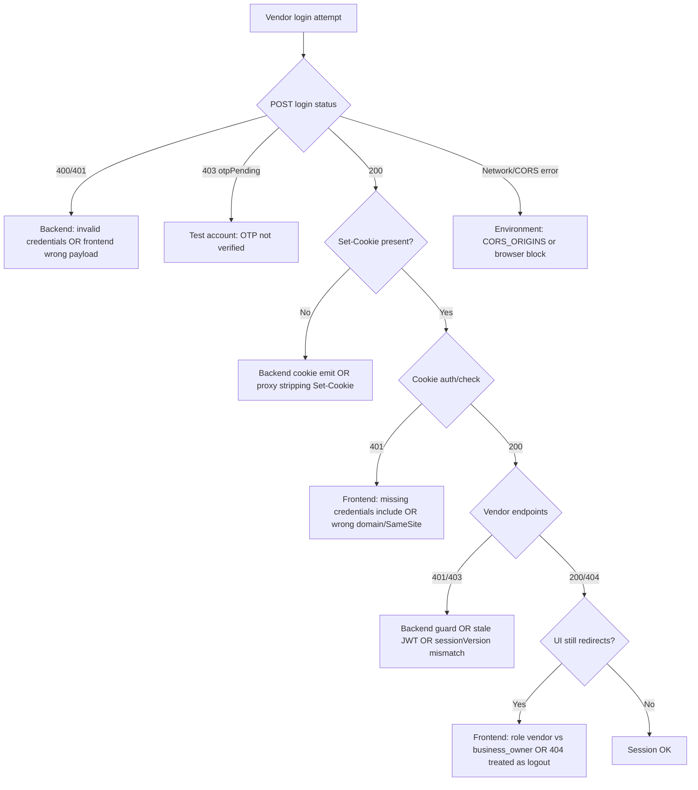

# Backend Vendor Auth & Production Smoke Proof

**Purpose:** Launch gate evidence for vendor session persistence and production HTTP smoke — audit-first, no auth/payment logic changes.

**Branch:** `qa/backend-vendor-auth-smoke-proof`  
**Evidence date:** 2026-06-19  
**Production API:** `https://api.mosaicbizhub.com`  
**Main SHA at audit:** `5180b2b`  
**Related:** [VENDOR_LOGIN_SESSION_AUDIT.md](VENDOR_LOGIN_SESSION_AUDIT.md), [BACKEND_PRODUCTION_SMOKE_PROOF.md](BACKEND_PRODUCTION_SMOKE_PROOF.md), PR [#96](https://github.com/Techware-Hut/mosaic-backend/pull/96)

**Domain note:** this proof predates the root-domain correction. `https://mosaicbizhub.com` is now the canonical production frontend. `https://app.mosaicbizhub.com` references below are historical evidence or temporary transition probes.

No secrets, JWTs, cookies, OTPs, passwords, or env values in this document.

---

## PR metadata (fill on merge)

| Field | Value |
| --- | --- |
| Branch | `qa/backend-vendor-auth-smoke-proof` |
| Commit SHA | `c84f5ae` |
| PR link | https://github.com/Techware-Hut/mosaic-backend/pull/97 |
| Deploy | **Not performed** |
| Merge | **Not performed** |

---

## PR #96 audit (`fix/backend-guard-admin-products-test-route`)

| Field | Value |
| --- | --- |
| State | **OPEN** (mergeable) |
| URL | https://github.com/Techware-Hut/mosaic-backend/pull/96 |
| `GET /admin/api/products/test` on `main` (`5180b2b`) | **Present** — unguarded debug route |
| On PR #96 branch | **Removed** |
| Production smoke (2026-06-19) | **200** unauth — confirms route live on deployed main |

**Merge before final smoke?** **Recommended yes** — independent hardening, no vendor-auth impact. **Not a blocker** for vendor session diagnosis.

---

## Commands run

| Command | Exit code | Result |
| --- | --- | --- |
| `git fetch origin main && git checkout main && git pull origin main` | 0 | Up to date at `5180b2b` |
| `git checkout -b qa/backend-vendor-auth-smoke-proof` | 0 | Branch created |
| `npm test` | 0 | **231 pass**, 0 fail |
| `npm run test:contract` | 0 | **16 pass**, 0 fail |
| `node -c app.js` | 0 | **PASS** |
| `./scripts/smoke-backend.ps1 -ApiBaseUrl https://api.mosaicbizhub.com` | 0 | **PASS=14 FAIL=0 SKIP=1 BLOCKED=5** |
| `./scripts/vendor-login-session-proof.ps1 -ApiBaseUrl https://api.mosaicbizhub.com -FrontendOrigin https://app.mosaicbizhub.com` | 0 | Public tier PASS; credentialed **BLOCKED** (no test credentials in session) |

---

## Production pass/fail matrix

| ID | Probe | Expected | Result | Owner if fail |
| --- | --- | --- | --- | --- |
| P0.1 | `GET /` | 200 | **PASS** | Backend / deploy |
| P0.2 | `GET /api/health` | 200 | **PASS** | Backend / deploy |
| P0.3 | `GET /api/ready` | 200 | **PASS** | Backend / Mongo |
| P1 | `GET /api/featured-products` | 200 | **PASS** | Backend |
| P0.4a | CORS OPTIONS from `https://app.mosaicbizhub.com` | 204 + exact ACAO + credentials | **PASS** | Backend CORS env |
| P0.4b | CORS OPTIONS from `https://mosaic-biz-frontend-launch.vercel.app` | 204 + exact ACAO + credentials | **PASS** | Backend CORS env |
| P2.1 | Unauth `GET /api/users/auth/check` | 401 | **PASS** | Backend |
| P4.2 | Unauth `POST /api/orders/initiate` | 401 | **PASS** | Backend |
| NOTE | Unauth `GET /api/admin/categories` | 200 (current main) | **PASS (NOTE)** | Hardening backlog — not P0 vendor blocker |
| NOTE | Unauth `GET /admin/api/products/test` | 200 on main / 404 after PR #96 | **PASS (NOTE)** — 200 on production | Merge PR #96 |
| V1 | CORS preflight `POST /api/users/login` from app origin | 204 + credentials | **PASS** | Backend CORS |
| V2 | Credentialed vendor login + cookie chain | 200 + Set-Cookie + auth/check 200 | **BLOCKED** | Release owner — set `SMOKE_TEST_VENDOR_EMAIL` / `SMOKE_TEST_VENDOR_PASSWORD` |
| V3 | Bearer `SMOKE_TEST_VENDOR_TOKEN` smoke (P2.3–P2.6) | 200 on auth/check, business/my | **BLOCKED** | Release owner — set token env var |

**Prior credentialed production proof (2026-06-18):** [VENDOR_LOGIN_SESSION_AUDIT.md](VENDOR_LOGIN_SESSION_AUDIT.md) — **PASS** for verified vendor cookie chain against production API.

---

## Live smoke commands (safe, no payment)

### Public production smoke (no secrets)

```powershell
./scripts/smoke-backend.ps1 -ApiBaseUrl https://api.mosaicbizhub.com
```

Probes approved CORS origins (canonical apex, transition app, and launch Vercel URL), health, featured-products, admin categories NOTE, admin products test NOTE.

### Credentialed vendor cookie chain (session-only env vars — never commit)

```powershell
$env:SMOKE_TEST_VENDOR_EMAIL = '<session-only>'
$env:SMOKE_TEST_VENDOR_PASSWORD = '<session-only>'
./scripts/vendor-login-session-proof.ps1 `
  -ApiBaseUrl https://api.mosaicbizhub.com `
  -FrontendOrigin https://app.mosaicbizhub.com
```

### Bearer vendor smoke (secondary — does not prove browser cookies)

```powershell
$env:SMOKE_TEST_VENDOR_TOKEN = '<session-only-jwt>'
./scripts/smoke-backend.ps1 -ApiBaseUrl https://api.mosaicbizhub.com -VendorToken $env:SMOKE_TEST_VENDOR_TOKEN
```

See [SMOKE_TEST_TOKENS.md](SMOKE_TEST_TOKENS.md).

---

## Vendor auth decision tree



### Failure ownership guide

| Symptom | Likely owner |
| --- | --- |
| Login 400/401 | Backend credentials validation **or** frontend payload |
| Login 403 `otpPending` | Test account state (OTP not verified) |
| Login 200, no Set-Cookie | Backend cookie config **or** proxy |
| auth/check 200, UI redirects | **Frontend** — role string or route guard |
| auth/check 200, vendor routes 401/403 | Backend guard **or** stale token |
| onboarding-data 404 after auth/check 200 | **Expected** for fresh vendor — frontend must not treat as logout |
| Browser CORS/network error | **Environment** — CORS_ORIGINS, mixed content, ad blockers |

---

## `GET /api/admin/categories` audit

| Question | Answer |
| --- | --- |
| Registered? | **Yes** — [routes/categoryRoutes.js](../routes/categoryRoutes.js) L30 |
| Auth middleware? | **No** — public |
| Production unauth HTTP | **200** (confirmed 2026-06-19) |
| Response content | Category taxonomy only — no user PII |
| P0 vendor session blocker? | **No** |
| Launch blocker? | **Medium** admin hardening backlog |
| Recommended follow-up | Separate guard PR — **stop for approval** |

Static test: [tests/admin/admin-categories-guard.test.js](../tests/admin/admin-categories-guard.test.js)

---

## Backend diagnosis: vendor session persistence

| Finding | Detail |
| --- | --- |
| Backend login path | **Role-agnostic** — same `loginUser` + `setAuthCookies` for `business_owner` and `customer` |
| Unit tests | [tests/auth/vendor-login-session.test.js](../tests/auth/vendor-login-session.test.js) — verified vendor login 200 + cookies |
| Production public smoke (this gate) | **PASS** — API reachable, CORS OK, unauth guards OK |
| Production credentialed smoke (this gate) | **BLOCKED** — no test credentials in CI session |
| Prior production credentialed proof | **PASS** (2026-06-18) — see [VENDOR_LOGIN_SESSION_AUDIT.md](VENDOR_LOGIN_SESSION_AUDIT.md) |

**Verdict:** No backend regression identified in this gate. Public production probes pass. Prior credentialed cookie-chain proof passed. **Frontend P0 vendor UI redirect failure remains owned by frontend** unless a fresh credentialed re-run fails:

1. Vendor login must use `credentials: 'include'`
2. Role check must accept **`business_owner`**, not `vendor`
3. `GET /api/vendor-onboarding/onboarding-data` **404** is normal for fresh vendors — not logout

---

## Files changed (this PR)

| File | Change |
| --- | --- |
| `docs/BACKEND_VENDOR_AUTH_SMOKE_PROOF.md` | **Added** — this document |
| `scripts/smoke-backend.ps1` | Dual CORS origins + admin categories/products NOTE probes |
| `scripts/smoke-backend.sh` | Parity with PowerShell |
| `tests/admin/admin-categories-guard.test.js` | **Added** — documents public admin categories route |
| `tests/admin/admin-product-routes-guard.test.js` | **Added** — audit tests for main state pending PR #96 |
| `tests/launch/backend-launch-contract.test.js` | Contract suite (from open PR #95) |
| `package.json` | `test:contract` script |
| `docs/README.md` | Index link |

---

## What was NOT tested

- Credentialed vendor login in this session (credentials not available)
- Live Stripe payments, webhooks, Connect charges
- Browser DevTools UI flow on canonical `https://mosaicbizhub.com`
- Full OTP register → verify → login end-to-end
- EB boot logs and deploy SHA confirmation on production

---

## Rollback notes

This PR is **docs + smoke script extensions + audit tests only**. No auth, cookie, CORS, payment, webhook, or middleware logic changed.

Rollback: revert this branch commit. Smoke script changes are additive NOTE rows and dual-origin CORS loop — safe to revert independently.

---

## Recommended next steps

1. **Merge PR #96** — remove debug admin products test route from production
2. **Re-run credentialed vendor proof** with release-owner test account env vars
3. **Frontend** — verify `business_owner` role and `credentials: 'include'` on `mosaicbizhub.com` ([#142–#144](https://github.com/Digital-Builders-757/mosaic-biz-frontend-launch/issues/142))
4. **Separate PR** — guard `GET /api/admin/categories` (approval required)
