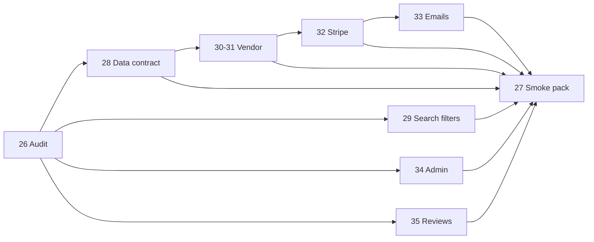

# MVP Backend API Audit

**Issue:** [#26 Backend MVP API audit](https://github.com/Techware-Hut/mosaic-backend/issues/26)  
**Branch:** `sprint/backend-mvp-api-audit`  
**Audit date:** 2026-06-17  
**Production API base:** `https://api.mosaicbizhub.com`

This document maps the Mosaic Biz Hub backend API surface for MVP launch readiness. It cross-references existing docs ([API_SURFACE.md](API_SURFACE.md), [ARCHITECTURE.md](ARCHITECTURE.md), [DECISION_REGISTER.md](DECISION_REGISTER.md), [TEST_MATRIX.md](TEST_MATRIX.md)) and ties findings to backend MVP issues **#26–#35**.

**Constraints observed during audit:** No deployment workflow changes. **`GET /api/featured-products`** is the canonical featured-products endpoint. There is no `/api/products/featured` route and none should be added without separate compatibility approval.

---

## 1. API route map

**Registry:** All routes mount from [`app.js`](../app.js). Stack: Express 5 + Mongoose (MongoDB). Roles: `admin`, `business_owner`, `customer`.

**Auth middleware:** [`middlewares/authenticate.js`](../middlewares/authenticate.js), [`isAdmin.js`](../middlewares/isAdmin.js), [`isBusinessOwner.js`](../middlewares/isBusinessOwner.js), [`isCustomer.js`](../middlewares/isCustomer.js), [`requireVerifiedVendor.js`](../middlewares/requireVerifiedVendor.js).

### 1.1 Health and global

| Method | Path | Auth | Handler |
|--------|------|------|---------|
| GET | `/` | Public | inline in `app.js` |
| GET | `/internal/sentry-debug` | Public (env-gated) | inline throw when `ENABLE_SENTRY_DEBUG_ROUTE=true` |

### 1.2 Auth and users

| Method | Path | Auth | Handler |
|--------|------|------|---------|
| POST | `/api/users/register` | Public | `userController.registerUser` |
| POST | `/api/users/login` | Public | `userController.loginUser` |
| POST | `/api/users/logout` | Public | `userController.logout` |
| POST | `/api/users/verify-otp` | Public | `userController.verifyOtp` |
| POST | `/api/users/resend-otp` | Public | `userController.resendOtp` |
| POST | `/api/users/forgot-password` | Public | `userController.forgotPassword` |
| POST | `/api/users/reset-password` | Public | `userController.resetPassword` |
| GET | `/api/users/auth/check` | Authenticated | inline + `toPublicAuthUser` |
| GET | `/api/auth/google` | Public | `authController.startGoogleAuth` |
| GET | `/api/auth/google/callback` | Public | `authController.handleGoogleCallback` |
| POST | `/api/auth/google/complete` | `mbh_tmp` cookie | `authController.completeGoogleProfile` |

**Files:** [`routes/userRoutes.js`](../routes/userRoutes.js), [`routes/authRoutes.js`](../routes/authRoutes.js)

### 1.3 Public marketplace (browse, search, detail)

| Method | Path | Auth | Handler |
|--------|------|------|---------|
| GET | `/api/products/list` | Public | `publicListing.getAllProducts` |
| GET | `/api/products/filters` | Public | `publicListing.getProductsByFilters` |
| GET | `/api/public/product/:productId` | Public | `publicListing.getProductById` |
| GET | `/api/public/products/business/:businessId` | Public | `publicListing.getProductsByBusinessId` |
| GET | `/api/public/product/vendor-profile/:businessId` | Public | `publicListing.getVendorProfile` |
| GET | `/api/public/search` | Public | `publicListing.searchPublicListings` |
| GET | `/api/ranked` | Public | `productListingController.listProductsRanked` |
| GET | `/api/:id/similar` | Public | `productListingController.listProductsRanked` |
| GET | `/api/services/list` | Public | `publicListing.getAllServices` |
| GET | `/api/services/:slug` | Public | `publicListing.getServiceBySlug` |
| GET | `/api/public/services/:id` | Public | `publicListing.getServiceById` |
| GET | `/api/food/list` | Public | `publicListing.getAllFood` |
| GET | `/api/public/foods/:id` | Public | `publicListing.getFoodById` |
| GET | `/api/featured-products` | Public | `featuredProducts.controller.getFeaturedProducts` **(canonical)** |
| GET | `/api/business/public/:slug` | Public | `businessController.getBusinessBySlugPublic` |
| GET | `/api/business/` | Public | `businessController.getProductBusinesses` |

**Files:** [`routes/publicListing.js`](../routes/publicListing.js), [`routes/featuredProductRoutes.js`](../routes/featuredProductRoutes.js), [`routes/businessRoutes.js`](../routes/businessRoutes.js)

**Note:** Vendor product CRUD uses mount **`/api/product`** (singular). Public listing uses **`/api/products/*`** (plural). There is **no** `/api/products/featured`.

### 1.4 Categories and taxonomy

| Method | Path | Auth | Handler |
|--------|------|------|---------|
| GET | `/api/categories` | Public | `categoryController.getAllCategories` |
| GET | `/api/categories/products` | Public | `categoryController.getProductCategories` |
| GET | `/api/categories/services` | Public | `categoryController.getServiceCategories` |
| GET | `/api/categories/foods` | Public | `categoryController.getFoodCategories` |
| GET | `/api/subcategories/:categoryId` | Public | `categoryController.getProductSubcategories` |
| GET | `/api/sub-categories` | Public | `categoryController.listSubcategories` |
| GET | `/api/products/subcategories/:categoryIdOrSlug` | Public | `subcategoryController.getProductSubcategories` |
| GET | `/api/services/subcategories/:categoryIdOrSlug` | Public | `subcategoryController.getServiceSubcategories` |
| GET | `/api/foods/subcategories/:categoryIdOrSlug` | Public | `subcategoryController.getFoodSubcategories` |
| POST | `/api/category-requests` | Vendor | `categoryController.createCategoryRequest` |
| GET | `/api/category-requests/my` | Vendor | `categoryController.getMyCategoryRequests` |
| GET | `/api/admin/categories` | **None** | `categoryController.getAllCategoriesAdmin` |

**Files:** [`routes/categoryRoutes.js`](../routes/categoryRoutes.js), [`routes/subcategoryRoutes.js`](../routes/subcategoryRoutes.js)

### 1.5 Vendor onboarding and business profile

Dual mount: `/api/vendor-onboarding` and `/admin/vendor-onboard-verify-stage1` (same router).

| Method | Path suffix | Auth | Handler |
|--------|-------------|------|---------|
| POST | `/draft` | Vendor verified | `vendorOnboarding.saveDraft` |
| GET | `/draft` | Vendor verified | `vendorOnboarding.getDraft` |
| POST | `/submit` | Vendor verified | `vendorOnboarding.submitForReview` |
| GET | `/onboarding-data` | Vendor verified | `vendorOnboarding.getOnboardingData` |
| GET | `/status/:applicationId` | **Public** | `vendorOnboarding.getStatusByApplicationId` |
| GET | `/applicationId` | Authenticated | `vendorOnboarding.getApplicationId` |
| GET | `/stage1/upload-url` | Vendor verified | `vendorOnboardingUpload.getStage1UploadUrl` |
| POST | `/stage1/create-payment` | Vendor verified | `vendorOnboarding.createVerificationPayment` |
| GET | `/stage1/payment-status` | Vendor verified | `vendorOnboarding.getPaymentStatus` |
| PUT/PATCH | `/business-profile` | Stage-1 verified | `vendorOnboarding.update/patchBusinessProfile` |
| GET | `/pending` | Admin | `vendorOnboardVerifyStage1.getPendingApplications` |
| GET | `/:applicationId` | Admin | `vendorOnboardVerifyStage1.getApplicationDetails` |
| POST | `/:applicationId/verify` | Admin | `vendorOnboardVerifyStage1.verifyAndAllocatePoints` |
| POST | `/:applicationId/finalize` | Admin | `vendorOnboardVerifyStage1.finalizeVerification` |

**Business profile wizard (post-onboarding):**

| Method | Path | Auth | Handler |
|--------|------|------|---------|
| POST | `/api/business-profile/save` | Authenticated | `businessProfileController.saveBusinessProfile` |
| POST | `/api/business-profile/submit` | Authenticated | `businessProfileController.submitForReview` |
| GET | `/api/business-profile/` | Authenticated | `businessProfileController.getBusinessProfile` |
| POST | `/api/business-profile/step4-survey` | Authenticated | `businessProfileController.saveStep4Survey` |

**Model:** [`models/VendorOnboardingStage1.js`](../models/VendorOnboardingStage1.js) — states: `draft`, `payment_pending`, `submitted`, `verified`, `rejected`.

**Files:** [`routes/vendorOnboarding.routes.js`](../routes/vendorOnboarding.routes.js), [`routes/businessProfileRoutes.js`](../routes/businessProfileRoutes.js)

### 1.6 Vendor business and listings (private)

| Method | Path | Auth | Handler |
|--------|------|------|---------|
| POST | `/api/business/` | Vendor | `businessController.createBusiness` |
| GET | `/api/business/my` | Vendor | `businessController.getMyBusinesses` |
| PUT | `/api/business/:id` | Vendor | `businessController.updateBusiness` |
| GET | `/api/business/:slug` | Vendor | `businessController.getBusinessBySlug` |
| GET/PUT | `/api/business/:id/shipping-settings` | Vendor | shipping settings |
| GET/PUT | `/api/business/:id/tax-settings` | Vendor | tax settings |
| GET | `/api/private/products/list` | Vendor | `privateListing.getAllProducts` |
| GET | `/api/private/services/list` | Vendor | `privateListing.getAllPrivateServicesForBusiness` |
| GET | `/api/private/food/list` | Vendor | `privateListing.getAllFood` |
| POST | `/api/product/` | Vendor | `productController.createProductWithVariants` |
| GET/PUT/DELETE | `/api/product/:productId` | Vendor | product CRUD |
| PATCH | `/api/product/update-variantstock/:variantId` | Vendor | stock update |
| POST/PUT/DELETE | `/api/product/*variants*` | Vendor | variant CRUD |
| POST | `/api/service/` | Vendor | `serviceController.createService` |
| POST | `/api/food/add-food` | Vendor | `foodController.createFood` |
| GET | `/api/service/my-services` | Vendor | vendor services list |
| GET | `/api/food/my-foods` | Vendor | vendor food list |

**Files:** [`routes/businessRoutes.js`](../routes/businessRoutes.js), [`routes/productRoutes.js`](../routes/productRoutes.js), [`routes/serviceRoutes.js`](../routes/serviceRoutes.js), [`routes/foodRoutes.js`](../routes/foodRoutes.js), [`routes/privateListing.js`](../routes/privateListing.js)

### 1.7 Cart, checkout, orders

| Method | Path | Auth | Handler |
|--------|------|------|---------|
| GET | `/api/cart/` | Authenticated | `cartController.getCart` |
| POST | `/api/cart/add` | Authenticated | `cartController.addItemToCart` |
| PUT/DELETE | `/api/cart/*` | Authenticated | cart update/remove |
| POST | `/api/cart/merge` | Authenticated | guest cart merge |
| POST | `/api/orders/initiate` | Authenticated | `orderController.initiateOrder` |
| GET | `/api/orders/retrieve-intent/:id` | Authenticated | `stripePaymentController.retrieveIntent` |
| GET | `/api/orders/user` | Authenticated | `orderController.getUserOrders` |
| GET | `/api/orders/vendor` | Vendor | `orderController.getVendorOrders` |
| PUT | `/api/orders/accept\|reject\|ship\|deliver/:orderId` | Vendor | order lifecycle |
| GET | `/api/orders/:id/invoice.pdf` | Authenticated | `invoiceController.getInvoicePdf` |
| GET | `/api/orders/admin` | Admin | `orderController.getAllOrdersAdmin` |
| POST | `/api/payments/create-payment-intent` | **None** (rate limited) | `paymentController.createPaymentIntent` |

**Files:** [`routes/customer/cartRoutes.js`](../routes/customer/cartRoutes.js), [`routes/orderRoutes.js`](../routes/orderRoutes.js), [`routes/paymentRoutes.js`](../routes/paymentRoutes.js)

### 1.8 Stripe Connect and webhooks

| Method | Path | Auth | Handler |
|--------|------|------|---------|
| POST | `/api/connect/:businessId/account-link` | Vendor | `connectController.createAccountLink` |
| GET | `/api/connect/:businessId/status` | Vendor | `connectController.getStatus` |
| GET | `/api/connect/return`, `/refresh` | Public | Connect redirect handlers |
| POST | `/stripe/account-session` | **None** | `stripe.controller.createAccountSession` |
| POST | `/stripe/express-login-link` | **None** | `stripe.controller.createExpressLoginLink` |
| GET | `/stripe/account-balance` | **None** | `stripe.controller.getAccountBalance` |
| GET | `/stripe/last-payout` | **None** | `stripe.controller.getLastPayout` |
| POST | `/api/stripe/create-checkout-session` | Vendor | `stripeController.createCheckoutSession` |
| POST | `/api/webhooks/stripe` | Stripe signature | `webhookController.handleStripeWebhook` (orders) |
| POST | `/api/stripe/webhook` | Stripe signature | `stripeController.handleStripeWebhook` (draft + Connect) |
| POST | `/api/stripe/payment/webhook` | Stripe signature | `stripePaymentController.stripePaymentWebhook` |
| POST | `/api/vendor-onboarding/webhook/payment` | Stripe signature | `vendorOnboarding.handleVendorPaymentWebhook` |
| POST | `/api/subscription/webhook` | Stripe signature | `webhookController.handleSubscriptionWebhook` |

**Files:** [`routes/connectRoutes.js`](../routes/connectRoutes.js), [`routes/stripe.routes.js`](../routes/stripe.routes.js), [`routes/stripeRoutes.js`](../routes/stripeRoutes.js), [`routes/webhookRoutes.js`](../routes/webhookRoutes.js). See [STRIPE_WEBHOOKS.md](STRIPE_WEBHOOKS.md).

### 1.9 Admin

| Mount | Key endpoints | Auth |
|-------|---------------|------|
| `/admin/users` | User CRUD, block | Admin |
| `/admin/api/business`, `/api/admin/business` | List, approve, patch status | Admin |
| `/admin/api/products` | List products, `PATCH /:productId/featured` | Admin |
| `/api/admin/category/product` (+ subcategory, service, food) | Category CRUD | Admin |
| `/api/admin/category-requests` | Approve/reject vendor category requests | Admin |
| `/admin/business-profile-verify` | Step-3 profile review queue | Admin |
| `/admin/vendor-onboard-verify-stage1` | Stage-1 vendor review (shared router) | Admin |
| `/api/cms/admin/*`, `/cms/admin/*` | CMS page CRUD | Admin |
| `/admin/api/blogs` | Blog CRUD, feature, publish | Admin |
| `/admin/faqs`, `/api/admin/testimonials` | FAQ and testimonial CRUD | Admin |

**Files:** [`routes/admin/`](../routes/admin/)

### 1.10 Reviews

| Method | Path | Auth | Handler |
|--------|------|------|---------|
| GET | `/api/product/:productId/reviews` | Public | `reviewController.listReviews('product')` |
| POST | `/api/product/:productId/reviews` | Customer | `reviewController.upsertReview('product')` |
| DELETE | `/api/product/:productId/reviews/:reviewId` | Customer | `reviewController.deleteReview('product')` |
| GET/POST/DELETE | `/api/service/:serviceId/reviews` | Public / Customer | same pattern for `service` |
| GET/POST/DELETE | `/api/food/:foodId/reviews` | Public / Customer | same pattern for `food` |

**Model:** [`models/Review.js`](../models/Review.js). **Service:** [`services/reviewService.js`](../services/reviewService.js).

### 1.11 Email (no HTTP — invoked from controllers)

| File | Triggers |
|------|----------|
| [`utils/mailer.js`](../utils/mailer.js) | Registration OTP, password reset, welcome |
| [`utils/WellcomeMailer.js`](../utils/WellcomeMailer.js) | Vendor welcome, onboarding submission/confirmation, admin notifications |
| [`utils/OrderMail.js`](../utils/OrderMail.js) | Order-paid emails to customer/vendor + PDF invoice |
| [`utils/approvalMail.js`](../utils/approvalMail.js) | Listing approval/rejection (product/service/food) |
| [`utils/bookingMailer.js`](../utils/bookingMailer.js) | Service booking notifications |
| [`utils/BuisnessprofileMail.js`](../utils/BuisnessprofileMail.js) | Business profile Step-3 admin notification |

**Transport:** Nodemailer + Gmail (`MAIL_USER`, `MAIL_PASSWORD` on Elastic Beanstalk).

### 1.12 Models index (Mongoose)

Core MVP models: `User`, `Business`, `VendorOnboardingStage1`, `BusinessProfile`, `Product`, `ProductVariant`, `ProductCategory`, `ProductSubcategory`, `Service`, `Food`, `Order`, `Cart`, `CartItem`, `Review`, `Subscription`, `SubscriptionPlan`, `CategoryRequest`, `ContactInquiry`.

Full list: [`models/`](../models/). No Prisma/SQL/Zod schema layer.

### 1.13 Tests and docs

| Area | Location |
|------|----------|
| Automated tests (77) | [`tests/`](../tests/) |
| Test matrix | [TEST_MATRIX.md](TEST_MATRIX.md) |
| Production smoke | [production-smoke-checklist.md](production-smoke-checklist.md) |
| Runbook | [PRODUCTION_RUNBOOK.md](PRODUCTION_RUNBOOK.md) |
| Vendor lifecycle | [VENDOR_LIFECYCLE.md](VENDOR_LIFECYCLE.md) |

### 1.14 Notable quirks

1. **`routes/cms/cmsRoutes.js`** is **not** mounted; active CMS is [`routes/admin/cmsRoutes.js`](../routes/admin/cmsRoutes.js).
2. Vendor onboarding router mounted **twice** (`/api/vendor-onboarding` + `/admin/vendor-onboard-verify-stage1`).
3. Several routes lack auth that may be unexpected: `GET /api/admin/categories`, all `/stripe/*`, `POST /api/payments/create-payment-intent`.
4. **`GET /api/featured-products`** is canonical; admin featured toggle is `PATCH /admin/api/products/:productId/featured`.

---

## 2. MVP coverage matrix (issues #26–#35)

| Issue | Title | Code present | Automated tests | Runtime smoke needed | Gap summary |
|-------|-------|--------------|-----------------|----------------------|-------------|
| [#26](https://github.com/Techware-Hut/mosaic-backend/issues/26) | Backend MVP API audit | This document | N/A | N/A | — |
| [#27](https://github.com/Techware-Hut/mosaic-backend/issues/27) | Backend MVP smoke proof pack | [production-smoke-checklist.md](production-smoke-checklist.md), [production-proof-pack-template.md](production-proof-pack-template.md) | Partial (deploy workflow health + CORS featured-products) | Full P0–P6 on production | No single consolidated proof pack filled for this release |
| [#28](https://github.com/Techware-Hut/mosaic-backend/issues/28) | Marketplace data contract | Implemented in PR #37 — DTO layer + controller wiring | 20 marketplace tests ([TEST_MATRIX.md](TEST_MATRIX.md)) | Card/detail field audit vs frontend on prod | See [MVP_BACKEND_MARKETPLACE_DATA_CONTRACT.md](MVP_BACKEND_MARKETPLACE_DATA_CONTRACT.md) |
| [#29](https://github.com/Techware-Hut/mosaic-backend/issues/29) | Search/filter API readiness | `GET /api/public/search`, list endpoints, `GET /api/products/filters` | 15 search-filter tests ([TEST_MATRIX.md](TEST_MATRIX.md)) | Query param smoke on prod after merge | **ZIP exact** on `address.zipCode`; **no radius/geolocation**; tag + verified filters; see [MVP_BACKEND_SEARCH_FILTER_READINESS.md](MVP_BACKEND_SEARCH_FILTER_READINESS.md) |
| [#30](https://github.com/Techware-Hut/mosaic-backend/issues/30) | Vendor onboarding + email | Full onboarding + `WellcomeMailer.js` + validation/email delivery helpers | 21 vendor/admin tests (incl. finalize + validation) | Payment webhook + approval email on prod | Submit MVP validation at `/submit`; finalize emails graceful when SMTP missing; see [MVP_BACKEND_VENDOR_ONBOARDING_EMAIL_FLOW.md](MVP_BACKEND_VENDOR_ONBOARDING_EMAIL_FLOW.md) |
| [#31](https://github.com/Techware-Hut/mosaic-backend/issues/31) | Vendor profile/listings/orders | Business, product, order vendor routes + `listingTierLimits` | 16 new vendor listing/order/stock tests (123 total) | End-to-end vendor flows on prod | Product+variant tier limit aligned; service/food limits pre-existing; see [MVP_BACKEND_VENDOR_SELF_SERVICE_APIS.md](MVP_BACKEND_VENDOR_SELF_SERVICE_APIS.md) |
| [#32](https://github.com/Techware-Hut/mosaic-backend/issues/32) | Stripe Connect checkout | Connect + 5 webhooks + order PI | Webhook routing/signature tests | Live PI + split payout on prod | `/stripe/*` routes **lack auth** — security risk |
| [#33](https://github.com/Techware-Hut/mosaic-backend/issues/33) | Email notifications | Order + onboarding + approval mails | None for delivery | SMTP on EB | **No review follow-up email** implemented |
| [#34](https://github.com/Techware-Hut/mosaic-backend/issues/34) | Admin dashboard APIs | Approve vendors, categories, featured toggle, `GET /api/orders/admin` | Admin user + pending queue tests | Admin role smoke | **No tags CRUD**; **no sales/revenue summary API** |
| [#35](https://github.com/Techware-Hut/mosaic-backend/issues/35) | Reviews API | Product/service/food review routes | None | Customer submit smoke | Implemented for 3 listing types; no vendor-level aggregate review endpoint |

---

## 3. What appears complete (code-level)

- Route registration in `app.js` with layered auth middleware
- JWT auth (7-day TTL), cookie + Bearer, `sessionVersion` invalidation on password reset
- Roles enforced from DB (`admin`, `business_owner`, `customer`), not raw JWT claims
- Vendor Stage-1 onboarding: draft → payment → submit → admin verify/finalize → Business sync
- Public browse: products, services, food, categories, subcategories, search
- **`GET /api/featured-products`** with pagination, populated category/subcategory/business
- Vendor product CRUD with variants and stock PATCH
- Cart CRUD, guest merge, order initiate, vendor order lifecycle (accept/reject/ship/deliver)
- Stripe Connect Express account link + status endpoints
- Five webhook handlers with distinct signing secrets (routing tested)
- Reviews: list (public), upsert/delete (customer) for product, service, food
- Admin: vendor pending queue, business approve, category CRUD, featured product toggle
- Email utilities for OTP, welcome, order confirmation, listing approval, onboarding
- **107 automated tests** (auth DTOs, vendor middleware, webhook wiring, admin guards, business sync, marketplace DTOs, search filters, vendor listing/order/stock)

---

## 4. What needs runtime testing

Cannot be proven by CI alone (mocked MongoDB/Stripe/email):

| Flow | Smoke reference |
|------|-----------------|
| Live Stripe PaymentIntent checkout + Connect destination/split | P4 in [production-smoke-checklist.md](production-smoke-checklist.md) |
| All 5 webhook endpoints with Stripe Dashboard test events | [STRIPE_WEBHOOKS.md](STRIPE_WEBHOOKS.md) |
| Email delivery (Gmail via EB env vars) | P5 |
| S3 presigned uploads (onboarding docs, product images) | P2–P3 |
| Full order: cart → initiate → pay → webhook → order emails + PDF | P4 |
| Admin finalize approve/reject with real MongoDB | P2.6 |
| CORS + cookie auth from launch frontend origin | Deploy workflow CORS probe + P1 |
| Google OAuth redirect flow | P1.8 |
| Featured products from frontend origin | `GET /api/featured-products` (canonical) |

**Blocker:** No hosted staging ([hosted-staging-decision.md](hosted-staging-decision.md)). Runtime smoke requires production test accounts and EB-configured secrets.

---

## 5. What appears missing or weak

| Gap | Detail |
|-----|--------|
| No `/api/products/featured` | By design — use **`GET /api/featured-products`** |
| No admin tags API | Tags on `Business.tags`; filterable via public search/list (#29 branch) |
| No admin sales/revenue summary | Only raw `GET /api/orders/admin` |
| No radius/geolocation filter | Location search is text regex; ZIP exact on `address.zipCode` (#29 branch); no lat/lng radius |
| No review follow-up email | Post-purchase review prompt not found in mail utilities |
| Unauthenticated routes | `GET /api/admin/categories`, `POST /stripe/*`, `POST /api/payments/create-payment-intent` |
| Reduced submit validation | `validateStage1Payload` enforces business name only (most rules commented out) |
| Partial automated tests | Search filters covered (#29 branch); reviews, checkout, email content still untested |
| Unmounted CMS router | `routes/cms/cmsRoutes.js` dead code |

---

## 6. What should be frontend-only

- Rich form validation for vendor onboarding fields (server validation minimal at submit)
- Admin sales/revenue dashboards (no aggregation API exists)
- Cart UX, checkout UI, Stripe Payment Element integration
- Search UX composing query params for `/api/public/search`
- Role-based routing and session refresh UX (`/api/users/auth/check` is backend probe)
- Display fallbacks for missing images, prices, vendor names in cards
- Client-side handling of 402 (unpaid verification fee) during vendor submit

---

## 7. What should be backend-only

- JWT issuance, `sessionVersion`, role enforcement on mutating routes
- Vendor onboarding state machine and admin finalize → Business sync
- Stripe webhooks updating order/subscription/onboarding payment state
- Connect Express account creation and capability tracking
- Email sending and invoice PDF generation
- Featured product flag (`isFeatured`) and canonical public feed query
- Review persistence and one-review-per-user enforcement
- Webhook signature verification and raw-body parsing order in `app.js`
- Category/taxonomy CRUD and admin approval workflows

---

## 8. Future phase / out of scope for MVP

- Hosted staging environment
- Refresh tokens / server-side session store
- Dedicated `/admin/tags` CRUD API
- Geolocation / ZIP-radius search
- Sales analytics / platform revenue dashboard API
- `/api/products/featured` alias (unless compatibility explicitly approved)
- Bookings and subscription billing beyond core marketplace checkout (code exists, not MVP-issue scope)
- Push-to-main auto-deploy re-enablement (gated per [DECISION_REGISTER.md](DECISION_REGISTER.md))

---

## 9. Test commands available

```powershell
npm test                    # 77 unit/integration tests (mocked)
npm run dev                 # local server :3001
npm start                   # production mode locally
node scripts/verify-auth-check-smoke.js   # live auth/check per role (manual)
```

**CI:** [`.github/workflows/ci.yml`](../.github/workflows/ci.yml) runs `npm test` on PR/push to `main`/`staging`.

### Audit run result (2026-06-17, branch `sprint/backend-mvp-api-audit`)

```
npm test
ℹ tests 77
ℹ pass 77
ℹ fail 0
ℹ duration_ms ~988
```

All 77 tests passed. Test files:

| Domain | Files |
|--------|-------|
| Auth | `tests/auth/*.test.js` (4 files) |
| Admin | `tests/admin/*.test.js` (2 files) |
| Vendor | `tests/vendor/*.test.js` (5 files) |
| Stripe | `tests/stripe/stripe-webhook-routing-signature.test.js` |

See [TEST_MATRIX.md](TEST_MATRIX.md) for manual smoke mapping.

---

## 10. Recommended backend fix order

Aligned to issue dependencies (audit → implementation → smoke proof):

1. ~~**#28 Marketplace data contract**~~ — **Done (PR #37):** null-safe DTOs for public listing/featured/detail; see [MVP_BACKEND_MARKETPLACE_DATA_CONTRACT.md](MVP_BACKEND_MARKETPLACE_DATA_CONTRACT.md)
2. ~~**#29 Search/filter**~~ — **Done (branch `sprint/backend-search-filter-readiness`):** shared filter module, ZIP exact, tag/verified, tests + [MVP_BACKEND_SEARCH_FILTER_READINESS.md](MVP_BACKEND_SEARCH_FILTER_READINESS.md); geolocation explicitly unsupported
3. ~~**#30 Vendor onboarding email**~~ — **Done (branch `sprint/backend-vendor-onboarding-email-flow`):** submit validation, graceful finalize emails, tests + [MVP_BACKEND_VENDOR_ONBOARDING_EMAIL_FLOW.md](MVP_BACKEND_VENDOR_ONBOARDING_EMAIL_FLOW.md)
4. ~~**#31 Vendor MVP APIs**~~ — **Done (branch `sprint/backend-vendor-profile-listings-orders-stock`):** product+variant tier limits, stock guards, vendor order tests + [MVP_BACKEND_VENDOR_SELF_SERVICE_APIS.md](MVP_BACKEND_VENDOR_SELF_SERVICE_APIS.md)
5. **#32 Stripe Connect runtime** — prod smoke for checkout + webhooks; remediate unauthenticated `/stripe/*` routes
6. **#33 Email notifications** — order confirmation smoke; document review-email gap
7. **#34 Admin APIs** — document sales summary gap; optional orders aggregation endpoint
8. **#35 Reviews** — add tests for upsert/duplicate guard; public list DTO audit
9. **#27 Smoke proof pack** — execute P0–P6 checklist, fill [production-proof-pack-template.md](production-proof-pack-template.md)
10. **Security hardening** — auth on exposed admin/stripe routes (track separately if out of MVP scope)

### Issue dependency diagram



---

## Related documentation

| Doc | Purpose |
|-----|---------|
| [API_SURFACE.md](API_SURFACE.md) | Full route map with smoke symbols |
| [ARCHITECTURE.md](ARCHITECTURE.md) | Repo layout and request lifecycle |
| [DECISION_REGISTER.md](DECISION_REGISTER.md) | MVP decisions and deferrals |
| [VENDOR_LIFECYCLE.md](VENDOR_LIFECYCLE.md) | Onboarding state machine |
| [STRIPE_WEBHOOKS.md](STRIPE_WEBHOOKS.md) | Webhook endpoints and events |
| [PRODUCTION_RUNBOOK.md](PRODUCTION_RUNBOOK.md) | Deploy and smoke procedures |

---

**Audit author:** Backend MVP sprint (issue #26)  
**No runtime, deploy, or workflow changes in this deliverable.**
