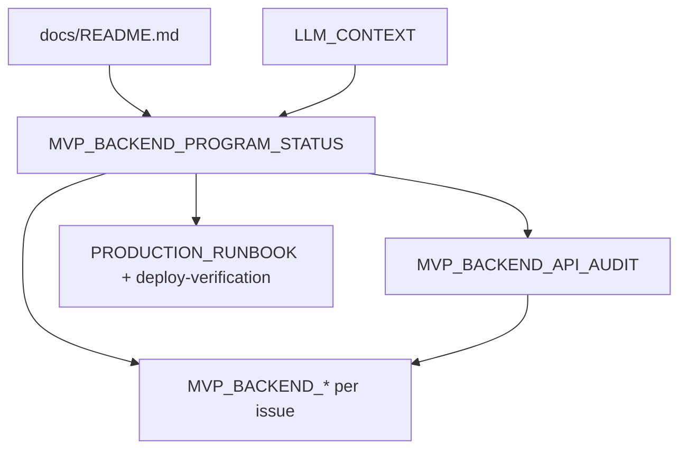

# MVP Backend Program Status

**Last updated:** 2026-06-17 (issue #33 branch)  
**Canonical hub** for backend MVP sprint (#26–#35): where Mosaic is today, what is live in production, what is in flight, and what comes next.

For deep technical detail, follow links to issue-specific docs — do not duplicate them here.

---

## Executive snapshot

| Item | Value |
| --- | --- |
| **Product** | Mosaic Biz Hub backend — minority-owned business marketplace REST API |
| **Production API** | `https://api.mosaicbizhub.com` |
| **Production deploy SHA** | `7f7e293` — issue #32 Stripe Connect audit docs/tests ([PR #47](https://github.com/Techware-Hut/mosaic-backend/pull/47)); payment runtime unchanged since `2134231` |
| **EB version label** | `mosaic-7f7e2930f931968da6985519cc3fc948aab778ae` |
| **`main` HEAD** | `7f7e293` |
| **Open PR** | None |
| **Automated tests** | **155/155** on `sprint/backend-email-notifications` branch (138 on prod `main`) |
| **Release model** | Controlled issue-by-issue merge → manual GHA EB deploy → tiered prod smoke → evidence in [deploy-verification.md](deploy-verification.md) |

---

## Issue tracker (#26–#35)

| Issue | Title | Code status | Production | Evidence |
| --- | --- | --- | --- | --- |
| [#26](https://github.com/Techware-Hut/mosaic-backend/issues/26) | Backend MVP API audit | **Merged** | N/A (docs) | [MVP_BACKEND_API_AUDIT.md](MVP_BACKEND_API_AUDIT.md) |
| [#27](https://github.com/Techware-Hut/mosaic-backend/issues/27) | Smoke proof pack | **Partial evidence** | Partial P0–P6 | [MVP_BACKEND_SMOKE_PROOF_PACK.md](MVP_BACKEND_SMOKE_PROOF_PACK.md) |
| [#28](https://github.com/Techware-Hut/mosaic-backend/issues/28) | Marketplace data contract | **Merged** (PR #37) | **Live** | [MVP_BACKEND_MARKETPLACE_DATA_CONTRACT.md](MVP_BACKEND_MARKETPLACE_DATA_CONTRACT.md) |
| [#29](https://github.com/Techware-Hut/mosaic-backend/issues/29) | Search/filter readiness | **Merged** (PR #38) | **Live** (`9f66c07`+) | [MVP_BACKEND_SEARCH_FILTER_READINESS.md](MVP_BACKEND_SEARCH_FILTER_READINESS.md) |
| [#30](https://github.com/Techware-Hut/mosaic-backend/issues/30) | Vendor onboarding + email | **Merged** (PR #39) | **Live** (`6cdf587`) | [MVP_BACKEND_VENDOR_ONBOARDING_EMAIL_FLOW.md](MVP_BACKEND_VENDOR_ONBOARDING_EMAIL_FLOW.md) |
| [#31](https://github.com/Techware-Hut/mosaic-backend/issues/31) | Vendor self-service APIs | **Merged** (PR #40) | **Live** (`2134231`) | [MVP_BACKEND_VENDOR_SELF_SERVICE_APIS.md](MVP_BACKEND_VENDOR_SELF_SERVICE_APIS.md) |
| [#32](https://github.com/Techware-Hut/mosaic-backend/issues/32) | Stripe Connect runtime | **Merged** (PR #47) | **Live** (`7f7e293` docs/tests) | [MVP_BACKEND_STRIPE_CONNECT_RUNTIME_VERIFICATION.md](MVP_BACKEND_STRIPE_CONNECT_RUNTIME_VERIFICATION.md) |
| [#33](https://github.com/Techware-Hut/mosaic-backend/issues/33) | Email notifications | **In progress** (branch) | N/A | [MVP_BACKEND_EMAIL_NOTIFICATIONS.md](MVP_BACKEND_EMAIL_NOTIFICATIONS.md) |
| [#34](https://github.com/Techware-Hut/mosaic-backend/issues/34) | Admin APIs | **Not started** | N/A | Audit §10 |
| [#35](https://github.com/Techware-Hut/mosaic-backend/issues/35) | Reviews | **Not started** | N/A | Audit §10 |

**Deploy log:** chronological merge/deploy/smoke records → [deploy-verification.md](deploy-verification.md)

---

## Where we are going

### Immediate gate

Issue #32 complete (merged, deployed). Checkout live smoke **PENDING** `SMOKE_TEST_*` accounts — tracked in #27 and follow-ups #41–#43.

### Next scheduled work

- **#33** Email notifications — audit + tests + docs (**in progress** on `sprint/backend-email-notifications`)
- **#41** Payment route hardening (P0 security follow-up from #32 audit)
- **#42** Checkout approval gate + safe `retrieveIntent` response

### Parallel / later

- **#27** — full P0–P6 smoke proof pack ([production-proof-pack-template.md](production-proof-pack-template.md))
- **#33–#35** — order emails, admin aggregation, reviews tests/DTO audit
- **Security hardening** — auth on exposed admin/stripe routes (tracked in audit and [DECISION_REGISTER.md](DECISION_REGISTER.md))

Issue dependency diagram: [MVP_BACKEND_API_AUDIT.md](MVP_BACKEND_API_AUDIT.md) §10 (Recommended backend fix order).

---

## How to read the documentation set

| Role | Read in this order |
| --- | --- |
| **Release / deploy owner** | This doc → [deploy-verification.md](deploy-verification.md) → issue-specific production section → [production-proof-pack-template.md](production-proof-pack-template.md) |
| **Developer / LLM** | [LLM_CONTEXT.md](LLM_CONTEXT.md) → this doc → [MVP_BACKEND_API_AUDIT.md](MVP_BACKEND_API_AUDIT.md) → relevant issue doc |
| **QA / smoke tester** | [production-smoke-checklist.md](production-smoke-checklist.md) → [TEST_MATRIX.md](TEST_MATRIX.md) → issue doc production section |

**Full index:** [docs/README.md](README.md)

---

## Known gaps (honest inventory)

| Gap | Impact | Where tracked |
| --- | --- | --- |
| No dedicated `SMOKE_TEST_*` vendor/admin accounts | Submit/finalize and tier-limit prod smoke **PENDING** / **SKIP** | [#30 deploy verification](deploy-verification.md), vendor self-service doc |
| Live SMTP inbox proof not captured | Email delivery unverified on production | [MVP_BACKEND_EMAIL_NOTIFICATIONS.md](MVP_BACKEND_EMAIL_NOTIFICATIONS.md) |
| `PATCH /business-profile` skips Business sync | PUT works; PATCH partial sync gap | [business-sync.md](business-sync.md), [DECISION_REGISTER.md](DECISION_REGISTER.md) |
| `Business.usage` counters not wired | Tier limits use live product/variant counts (#31) | [MVP_BACKEND_VENDOR_SELF_SERVICE_APIS.md](MVP_BACKEND_VENDOR_SELF_SERVICE_APIS.md) |
| Service/food/private-listing ownership | Not covered by #31 unit tests | [MVP_BACKEND_VENDOR_SELF_SERVICE_APIS.md](MVP_BACKEND_VENDOR_SELF_SERVICE_APIS.md) |
| `/stripe/*` routes lack auth | Pre-#32 security risk | [MVP_BACKEND_API_AUDIT.md](MVP_BACKEND_API_AUDIT.md), [security-remediation-notes.md](security-remediation-notes.md) |

---

## Maintenance rule

When sprint state changes (merge, deploy, smoke, or issue closed):

1. Update **this file first** (snapshot table, issue matrix, known gaps).
2. Patch counts and conclusions in linked docs ([TEST_MATRIX.md](TEST_MATRIX.md), [deploy-verification.md](deploy-verification.md), issue-specific MVP docs).
3. Add new `docs/` files to [docs/README.md](README.md).

---

## Related documentation

| Doc | Purpose |
| --- | --- |
| [MVP_BACKEND_API_AUDIT.md](MVP_BACKEND_API_AUDIT.md) | Full API surface audit and fix order |
| [DECISION_REGISTER.md](DECISION_REGISTER.md) | MVP decisions and deferrals |
| [PRODUCTION_RUNBOOK.md](PRODUCTION_RUNBOOK.md) | Deploy, smoke, rollback |
| [TEST_MATRIX.md](TEST_MATRIX.md) | Automated tests ↔ manual smoke mapping |
