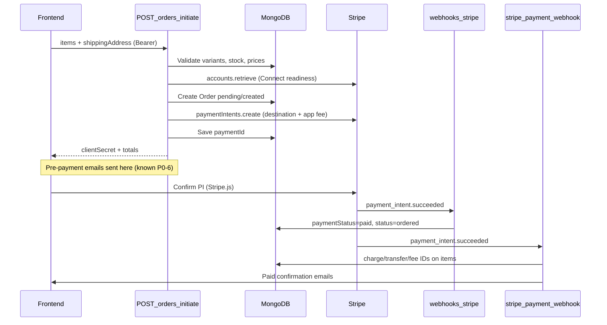

# MVP Backend Stripe Connect Runtime Verification (Issue #32)

> **Status:** Audit complete on branch `sprint/backend-stripe-connect-runtime-verification` (docs + tests only; **not deployed**). Program snapshot: [MVP_BACKEND_PROGRAM_STATUS.md](MVP_BACKEND_PROGRAM_STATUS.md).

**Related:** [PAYMENT_FLOW.md](PAYMENT_FLOW.md), [STRIPE_WEBHOOKS.md](STRIPE_WEBHOOKS.md), [TEST_MATRIX.md](TEST_MATRIX.md), [production-smoke-checklist.md](production-smoke-checklist.md)

---

## Purpose

Audit and verify existing Stripe Connect checkout split-payout behavior without changing payment architecture, deploying, or running live charges. Confirm the backend can safely initiate Connect destination charges, calculate platform/vendor amounts, and transition order payment state via webhooks.

**Out of scope:** Payment architecture refactor, deploy workflow edits, auth hardening on `/stripe/*`, changes to `GET /api/featured-products`, live production charges without written approval.

---

## Stripe Connect pattern

| Aspect | Choice |
|--------|--------|
| Connect account type | **Express** |
| Marketplace charge model | **Destination charges** on platform PaymentIntent |
| Platform fee | Flat `PLATFORM_FEE_CENTS` → `application_fee_amount` |
| Vendor payout | Stripe auto-transfers `amount - application_fee` via `transfer_data.destination` |
| Currency | Hardcoded `usd` / `USD` |
| Rounding | `Math.round(totalAmount * 100)` for PI cents |
| PI idempotency | `idempotencyKey: pi:{orderId}` |
| Refunds | `reverse_transfer: true`, `refund_application_fee: true` in order controller |

**Not used:** separate charges + manual transfers, `on_behalf_of`, direct charges on connected account.

### Split payout calculation

```
totalCents     = Math.round((subtotalInclTax + shipping) * 100)
platformCents  = parseInt(PLATFORM_FEE_CENTS || "0", 10)
vendorNetCents = totalCents - platformCents   // enforced by Stripe on destination transfer
```

Platform fee is a **flat per-order cent amount**, not a percentage. Default is `0` when env unset.

---

## Files audited

### Controllers

| File | Role |
|------|------|
| [`controllers/orderController.js`](../controllers/orderController.js) | `initiateOrder` — Connect PI creation; refund handlers |
| [`controllers/stripePaymentController.js`](../controllers/stripePaymentController.js) | Post-payment webhook; `retrieveIntent` |
| [`controllers/webhookController.js`](../controllers/webhookController.js) | Order status webhook (`payment_intent.*`, `charge.refunded`) |
| [`controllers/connectController.js`](../controllers/connectController.js) | Connect onboarding Account Links + status sync |
| [`controllers/stripe.controller.js`](../controllers/stripe.controller.js) | Embedded Connect dashboard helpers (**unauthenticated**) |
| [`controllers/paymentController.js`](../controllers/paymentController.js) | Legacy PI path (no Connect split) |
| [`controllers/stripeController.js`](../controllers/stripeController.js) | Subscription Checkout Session + `account.updated` |

### Routes

| File | Endpoints |
|------|-----------|
| [`routes/orderRoutes.js`](../routes/orderRoutes.js) | `POST /initiate`, `GET /retrieve-intent/:id` |
| [`routes/webhookRoutes.js`](../routes/webhookRoutes.js) | `POST /api/webhooks/stripe` |
| [`routes/stripeRoutes.js`](../routes/stripeRoutes.js) | `POST /api/stripe/webhook`, `POST /api/stripe/payment/webhook`, `POST /api/stripe/create-checkout-session` |
| [`routes/connectRoutes.js`](../routes/connectRoutes.js) | `POST /api/connect/:businessId/account-link`, `GET .../status` |
| [`routes/paymentRoutes.js`](../routes/paymentRoutes.js) | `POST /api/payments/create-payment-intent` (legacy) |
| [`routes/stripe.routes.js`](../routes/stripe.routes.js) | `/stripe/*` (no `/api` prefix) |
| [`app.js`](../app.js) | Webhook raw-body mounts before `express.json()` |

### Models

| File | Stripe fields |
|------|---------------|
| [`models/Business.js`](../models/Business.js) | `stripeConnectAccountId`, `chargesEnabled`, `payoutsEnabled`, `onboardingStatus`, `capabilities` |
| [`models/Order.js`](../models/Order.js) | `paymentId`, `paymentStatus`, `items[].chargeId/transferId/applicationFeeId` |

### Tests (existing + added)

| File | Coverage |
|------|----------|
| [`tests/stripe/stripe-webhook-routing-signature.test.js`](../tests/stripe/stripe-webhook-routing-signature.test.js) | 5 webhook routes, signatures, mount order |
| [`tests/stripe/order-initiate-connect.test.js`](../tests/stripe/order-initiate-connect.test.js) | **New** — Connect guards, fee params, rounding, safe errors |
| [`tests/stripe/order-webhook-handlers.test.js`](../tests/stripe/order-webhook-handlers.test.js) | **New** — order status + post-payment webhook logic |

---

## Endpoints audited

| Method | Route | Auth | Handler | Changed in #32 |
|--------|-------|------|---------|----------------|
| POST | `/api/orders/initiate` | Customer JWT | `initiateOrder` | No |
| GET | `/api/orders/retrieve-intent/:id` | Customer JWT | `retrieveIntent` | No |
| POST | `/api/webhooks/stripe` | Stripe signature | `handleStripeWebhook` | No |
| POST | `/api/stripe/payment/webhook` | Stripe signature | `stripePaymentWebhook` | No |
| POST | `/api/connect/:businessId/account-link` | Business owner | `createAccountLink` | No |
| GET | `/api/connect/:businessId/status` | Business owner | `getStatus` | No |
| POST | `/api/payments/create-payment-intent` | None (rate-limited) | `createPaymentIntent` | No |
| POST/GET | `/stripe/*` | **None** | Connect dashboard helpers | No |
| GET | `/api/featured-products` | Public | `getFeaturedProducts` | **No — preserved** |

---

## Required environment variables (names only)

| Variable | Purpose |
|----------|---------|
| `STRIPE_SECRET_KEY` | All Stripe SDK calls; mode = `sk_test_*` or `sk_live_*` prefix |
| `STRIPE_ORDER_WEBHOOK_SECRET` | Order status webhook signing |
| `STRIPE_ORDER_POST_PAYMENT_WEBHOOK_SECRET` | Post-payment webhook signing |
| `STRIPE_BUSINESS_DRAFT_WEBHOOK_SECRET` | Draft checkout + `account.updated` |
| `STRIPE_SUBSCRIPTION_WEBHOOK_SECRET` | Subscription billing |
| `STRIPE_VENDOR_VERIFICATION_WEBHOOK_SECRET` | Vendor $24.99 verification fee |
| `PLATFORM_FEE_CENTS` | Flat platform fee per order (default `0`) |
| `CONNECT_RETURN_URL`, `CONNECT_REFRESH_URL` | Connect onboarding redirects |
| `CONNECT_RETURN_PATH`, `CONNECT_REFRESH_PATH` | Path fallbacks with `FRONTEND_URL` |
| `FRONTEND_URL` | Connect return/refresh base |
| `BILLING_PORTAL_RETURN_URL` | Billing portal return |

Full list: [`.env.example`](../.env.example), [production-env-checklist.md](production-env-checklist.md)

---

## Checkout / order lifecycle



### Preconditions enforced in `initiateOrder`

1. Valid cart items, shipping address, single vendor
2. Server-derived prices (±$0.01 tolerance vs client `price`)
3. Stock available (unless backorder allowed)
4. **`Business.isApproved === true`** (#42)
5. **`Business.isActive === true`** (#42)
6. `Business.stripeConnectAccountId` present
7. Live Stripe account: `charges_enabled` + active `transfers` capability

### Not enforced at checkout (documented gaps)

- Vendor onboarding `verified` status (separate from `Business.isApproved`)
- Active subscription tier (listing gate only)

---

## Checkout approval gate (#42)

**Helper:** [`utils/checkoutGuards.js`](../utils/checkoutGuards.js) — `getBusinessCheckoutBlock(business)`

| Business state | HTTP | Message |
| --- | --- | --- |
| Missing | 404 | Vendor business not found. |
| `isApproved === false` | 403 | This vendor is not approved for checkout. |
| `isActive === false` | 403 | This vendor is temporarily unavailable for checkout. |
| No `stripeConnectAccountId` | 400 | Vendor is not connected to Stripe. |
| Approved + active + Connect ready | — | Proceeds to PI creation |

Admin block flow sets `isApproved: false` and `isActive: false` together ([`business.Controller.js`](../controllers/admin/business.Controller.js)).

---

## Sanitized PaymentIntent response (#42)

**Endpoint:** `GET /api/orders/retrieve-intent/:id` (customer JWT required)

**Helper:** [`utils/paymentIntentResponse.js`](../utils/paymentIntentResponse.js)

### Ownership

- Loads orders by `paymentId` first
- Returns **403** if any order `userId` does not match authenticated customer

### `paymentIntent` safe fields

| Field | Included |
| --- | --- |
| `id` | Yes |
| `status` | Yes |
| `amount` | Yes |
| `currency` | Yes |
| `created` | Yes |
| `metadata.orderId` / `metadata.groupOrderId` | Yes (when present) |
| `client_secret` | **No** |
| `charges` | **No** |
| `payment_method` | **No** |
| `transfer_data` | **No** |
| `customer` | **No** |
| `last_payment_error` | **No** |

### `orders` poll shape

Returns per-order: `id`, `groupOrderId`, `status`, `paymentStatus`, `totalAmount`, `currency`, and item `title`/`quantity`/`price`/`size` only. Omits `userId`, vendor references, and internal Stripe IDs.

### Error mapping

- Stripe retrieve failures → **500** with generic message only (no `error.message` in body)
- Missing orders → **404**
- Wrong customer → **403**

---

## Runtime safety review (updated #42)

| Check | Result |
|-------|--------|
| Test vs live mode | Driven by `STRIPE_SECRET_KEY` prefix only |
| Secret keys logged | **No** — logs use IDs, not keys |
| Webhook secrets exposed | **No** — signature verification required |
| Client responses safe | `initiateOrder` returns `clientSecret` only; `retrieveIntent` returns sanitized PI (#42) |
| Stripe errors to client | Generic `500` or mapped `400`; no secret leakage |
| PI idempotency | `pi:{orderId}` on create |
| Order double-create on retry | Order persisted before PI; retry creates new order (no cart-level idempotency) |
| Webhook idempotency | Status updates idempotent; post-payment may resend emails on Stripe retry |

---

## Unsupported or unsafe scenarios

| Scenario | Behavior | Safe? |
|----------|----------|-------|
| Vendor missing Connect account | 400 `"Vendor is not connected to Stripe."` | Yes — blocks checkout |
| Connect onboarding incomplete | 400 `"Vendor Stripe onboarding incomplete."` | Yes |
| Multi-vendor cart | 400 single-vendor message | Yes |
| Price tampering | 400 price mismatch | Yes |
| Unapproved / deactivated vendor | 403 blocked at checkout (#42) | Yes |
| Legacy `/api/payments/create-payment-intent` | Plain PI, no Connect split, no auth | **Bypass risk** — track #41 |
| Unauthenticated `/stripe/*` | Anyone with account ID can request sessions | **Unsafe** — track #41 |
| `retrieveIntent` over-exposure | Sanitized PI + order poll (#42) | **Mitigated** |
| `PLATFORM_FEE_CENTS >= total` | Stripe rejects PI after order saved | Low — orphan pending order |
| Pre-payment order emails | Sent in `initiateOrder` before pay succeeds | Known product issue (P0-6) |
| Prod live charge without approval | **STOP** — see gate below | N/A |

---

## Test coverage summary

| Area | Automated | Manual / prod |
|------|-----------|---------------|
| Webhook routing + signatures | Yes (9 tests) | P4.1, P4.5 |
| Connect checkout guards | Yes (10 tests) | P5.2 |
| Platform fee on PI | Yes (mocked) | P5.3 + Dashboard |
| Webhook order status | Yes (5 tests) | P4.4, P5.3 |
| Full E2E pay + split payout | **No** | P5.3 (test mode) |
| Live prod charge | **No** | **BLOCKED** |

**Automated count:** 123 → **138** (`npm test`)

New files:
- `tests/stripe/order-initiate-connect.test.js` (10 tests)
- `tests/stripe/order-webhook-handlers.test.js` (5 tests)

---

## Production smoke plan

### Tier A — Safe, no charges (can run anytime)

| Step | Action | Expected |
|------|--------|----------|
| A1 | `GET /health` | 200 |
| A2 | Unsigned `POST /api/webhooks/stripe` | 400 missing signature |
| A3 | `GET /api/connect/:businessId/status` (owner JWT) | Connect flags JSON |
| A4 | Stripe Dashboard → Webhooks → delivery log | Recent 200s for 5 endpoints |

### Tier B — Test-mode E2E (local/staging `sk_test_*` only)

**Requires:** `SMOKE_TEST_CUSTOMER_*`, `SMOKE_TEST_VENDOR_*` with completed Connect test account and published listing.

| Step | Action | Record |
|------|--------|--------|
| B1 | Login as smoke customer | JWT (do not commit) |
| B2 | `POST /api/orders/initiate` — single vendor item | `orderId`, `clientSecret`, `totals.totalAmount` |
| B3 | Confirm PI with Stripe test card `4242424242424242` | PI status `succeeded` |
| B4 | Poll `GET /api/orders/retrieve-intent/:piId` | `paymentStatus: paid` |
| B5 | Vendor `GET /api/orders/vendor` | Order visible |
| B6 | Stripe Dashboard (test mode) | Charge shows `application_fee`, transfer to `acct_*` |
| B7 | **Rollback** | Refund via vendor reject flow or Dashboard refund |

### Tier C — Production API live charge

## LIVE-CHARGE APPROVAL GATE — STOP

**Do not run Tier C without ALL of:**

1. Written approval from release owner
2. Dedicated `SMOKE_TEST_*` accounts (not real customers/vendors)
3. Smoke vendor with verified Connect account in production Stripe
4. Pre-documented: product/listing ID, exact amount, expected `PLATFORM_FEE_CENTS`, refund owner
5. Confirmation `STRIPE_SECRET_KEY` mode matches test intent (`sk_live_*` on prod EB per [production-env-checklist.md](production-env-checklist.md))

**Current status:** **BLOCKED** — no `SMOKE_TEST_*` accounts provisioned; production uses live Stripe keys.

### Rollback / refund considerations

- **Test mode:** Stripe Dashboard refund or `orderController` reject/cancel refund path (`reverse_transfer: true`, `refund_application_fee: true`)
- **Live approved smoke:** Same refund paths; record PI/charge IDs in proof pack; verify transfer reversal in Connect Dashboard
- **Failed PI (never confirmed):** Order remains `pending`/`created`; no charge to refund

---

## Files changed in #42

| File | Change |
|------|--------|
| `utils/checkoutGuards.js` | **Created** — business approval/active gate |
| `utils/paymentIntentResponse.js` | **Created** — sanitized PI + order poll |
| `controllers/orderController.js` | Approval gate before Connect checks |
| `controllers/stripePaymentController.js` | Sanitized `retrieveIntent` + ownership |
| `tests/stripe/order-initiate-connect.test.js` | +5 approval gate tests |
| `tests/stripe/checkout-approval-paymentintent-safety.test.js` | **Created** — retrieve-intent safety |
| `tests/utils/checkout-paymentintent-response.test.js` | **Created** — util unit tests |
| `docs/MVP_BACKEND_STRIPE_CONNECT_RUNTIME_VERIFICATION.md` | #42 sections |
| `docs/TEST_MATRIX.md` | #42 test index |
| `docs/MVP_BACKEND_PROGRAM_STATUS.md` | #42 status |

**Not changed:** Connect destination-charge architecture, webhook handlers, deploy workflows, `GET /api/featured-products`.

---

## Files changed in #32

| File | Change |
|------|--------|
| `docs/MVP_BACKEND_STRIPE_CONNECT_RUNTIME_VERIFICATION.md` | **Created** |
| `docs/TEST_MATRIX.md` | Stripe Connect checkout section |
| `docs/deploy-verification.md` | #32 audit entry |
| `docs/MVP_BACKEND_PROGRAM_STATUS.md` | #32 status update |
| `tests/stripe/order-initiate-connect.test.js` | **Created** |
| `tests/stripe/order-webhook-handlers.test.js` | **Created** |

**Not changed:** Payment controllers, routes, deploy workflows, `GET /api/featured-products`.

---

## Confirmations

- [x] No secrets committed
- [x] No deployment workflow changed
- [x] No unrelated marketplace/frontend endpoint changed
- [x] Live runtime testing blocked pending approval + smoke accounts
- [x] `GET /api/featured-products` preserved (canonical)
