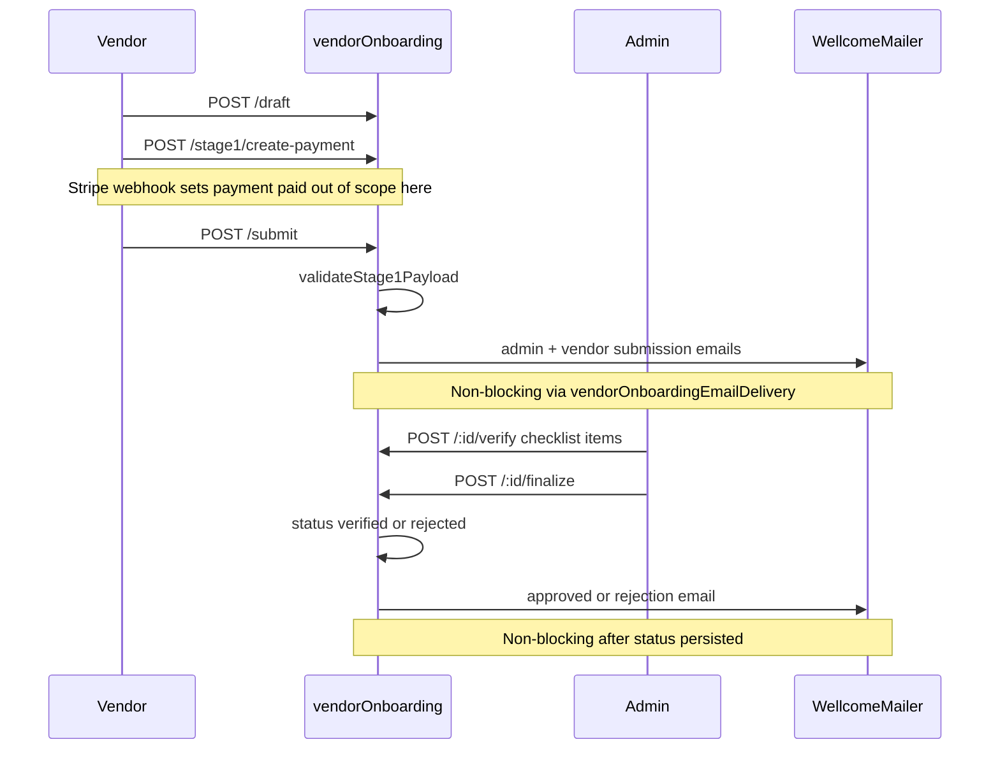

# MVP Backend Vendor Onboarding Email Flow (Issue #30)

**Branch:** `sprint/backend-vendor-onboarding-email-flow`  
**Status:** Implemented on branch — **not merged or deployed to production**

**Related:** [VENDOR_LIFECYCLE.md](VENDOR_LIFECYCLE.md) (full lifecycle reference)

---

## Purpose

Make vendor registration submit validation, admin approval/rejection transitions, and onboarding emails MVP-ready with graceful SMTP failure handling and test coverage.

**Principle:** Do not fake email delivery. When `MAIL_USER` / `MAIL_PASSWORD` are missing, skip sends and log a warning — HTTP transitions still succeed.

---

## End-to-end flow

---

## Routes involved

| Route | Role | Handler |
|-------|------|---------|
| `POST /api/vendor-onboarding/draft` | Vendor | `saveDraft` |
| `POST /api/vendor-onboarding/submit` | Vendor | `submitForReview` |
| `GET /api/vendor-onboarding/pending` | Admin | `getPendingApplications` |
| `GET /api/vendor-onboarding/:applicationId` | Admin | `getApplicationDetails` |
| `POST /api/vendor-onboarding/:applicationId/verify` | Admin | `verifyAndAllocatePoints` |
| `POST /api/vendor-onboarding/:applicationId/finalize` | Admin | `finalizeVerification` |

---

## Status flow

| Status | Meaning | Admin queue? |
|--------|---------|--------------|
| `draft` | In progress | No |
| `payment_pending` | Awaiting verification payment | No |
| `submitted` | Awaiting admin review | **Yes** |
| `verified` | Admin approved Stage 1 | No |
| `rejected` | Missing required docs at finalize | No |

**Resubmission:** `rejected` → `saveDraft` → `draft` → `submitForReview` → `submitted`

**Finalize guard:** Only applications in `submitted` may be finalized (returns **400** otherwise).

---

## Submit-time required fields

Enforced by [`utils/vendorOnboardingValidation.js`](../utils/vendorOnboardingValidation.js) at `POST /submit` only (draft saves remain permissive):

| Field | Rule |
|-------|------|
| `businessName` | Min 2 characters |
| `businessType` | `product`, `service`, or `food` |
| `primaryContactName` | Non-empty |
| `address.city`, `address.state`, `address.country`, `address.zipCode` | Non-empty |
| `acceptedTerms`, `declarationAccepted` | Must be `true` |
| `minorityCategories` | Required when `isMinorityOwned === true` |
| Social URLs | Validated only when provided |

Document checklist (EIN, license, minority proof) is validated at **admin finalize**, not at submit.

---

## Email matrix

| Trigger | Template helper | Recipient |
|---------|-----------------|-----------|
| Submit success | `sendAdminOnboardingSubmissionEmail` | `ADMIN_EMAIL` |
| Submit success | `sendVendorSubmissionConfirmationEmail` | Vendor user email |
| Finalize approve | `sendVendorApprovedEmail` | Vendor user email |
| Finalize approve + badge | `sendVendorTrustBadgeAssignedEmail` | Vendor user email |
| Finalize reject | `sendVendorRejectionEmail` | Vendor user email |

**Delivery helper:** [`utils/vendorOnboardingEmailDelivery.js`](../utils/vendorOnboardingEmailDelivery.js)

**Environment variables (names only):**

- `MAIL_USER`
- `MAIL_PASSWORD`
- `ADMIN_EMAIL`
- `FRONTEND_URL` (used in some templates)

**Provider:** Existing Nodemailer + Gmail transport — no new provider introduced.

---

## Graceful email failure

| Scenario | HTTP | Status transition | Response |
|----------|------|-------------------|----------|
| SMTP not configured | 200 | Applied | `emailSkipped: true`, `emailSent: false` |
| SMTP send throws | 200 | Applied | `emailSent: false`, error logged (message only) |
| Submit emails fail | 200 | Submitted | `emailSent` / `emailSkipped` on submit response |

Secrets and full payloads are never logged.

---

## Marketplace visibility

- Finalize sets `VendorOnboardingStage1.status = 'verified'` and syncs `Business.points` / `Business.badge`.
- Public marketplace listing visibility still follows existing `Business.isActive`, published listing flags, and visible-business gates — **approval alone does not guarantee public listings**.

---

## Tests

| File | Count | Coverage |
|------|------:|----------|
| [`tests/vendor/vendor-onboarding-validation.test.js`](../tests/vendor/vendor-onboarding-validation.test.js) | 10 | Submit validation rules |
| [`tests/admin/vendor-onboarding-finalize.test.js`](../tests/admin/vendor-onboarding-finalize.test.js) | 5 | Approve/reject, email graceful failure |
| Existing vendor/admin tests | 16 | Resubmit, pending queue, middleware |

Full suite: **107/107** (`npm test`)

---

## Known gaps

| Gap | Detail |
|-----|--------|
| Live SMTP proof on production | Requires EB env vars + manual send verification post-deploy |
| Stage 2 subscription | After `verified`, subscription payment still required |
| Trust badge profile | Logo + bio required before badge verification email path |
| Payment webhook E2E | Out of scope — not modified in #30 |

---

## Post-merge manual smoke (after deploy)

1. **P2.5** — Submit vendor application with paid verification fee; confirm **200** and validation errors for incomplete payload.
2. **P3.3–P3.4** — Admin verify checklist items; finalize approve → vendor receives email if SMTP configured.
3. **P3.4 reject path** — Finalize with missing docs → `rejected` status + rejection email or `emailSkipped`.
4. Confirm no OTP or `MAIL_PASSWORD` values in EB logs after auth/onboarding smoke.

---

## Production deployment

**Not deployed.** Branch/PR only; no merge, no EB deploy in this issue pass.
