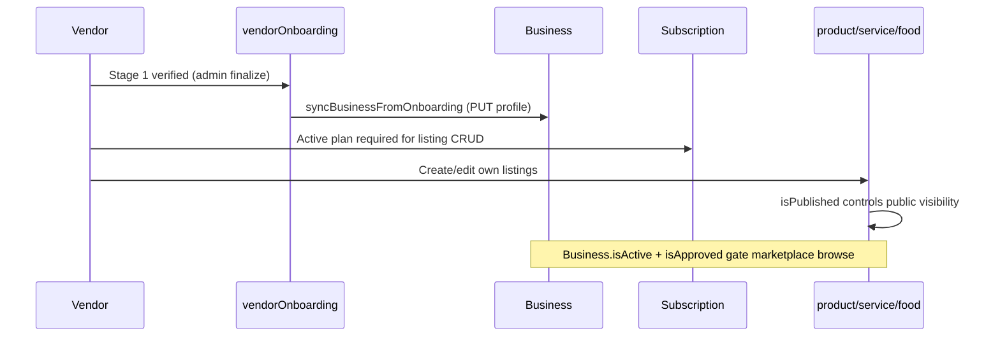

# MVP Backend Vendor Self-Service APIs (Issue #31)

**Branch:** `sprint/backend-vendor-profile-listings-orders-stock`  
**Status:** Implemented on branch — **not merged or deployed to production**

**Related:** [VENDOR_LIFECYCLE.md](VENDOR_LIFECYCLE.md), [tier-listing-limit-implementation.md](tier-listing-limit-implementation.md), [business-sync.md](business-sync.md)

---

## Purpose

Document and harden approved-vendor self-service APIs so vendors can safely manage profile/business data, product/service/food listings, variant stock, and view their own paid order records — with test coverage and honest gap reporting.

**Out of scope for #31:** Stripe checkout, webhooks, payouts, payment intent creation, public marketplace DTO changes.

---

## Approved vendor eligibility flow

| Gate | Field / route | Effect |
|------|---------------|--------|
| OTP + role | `requireVerifiedVendor` | `business_owner`, verified OTP, not blocked |
| Stage 1 approved | `requireStage1VerifiedVendor` | `VendorOnboardingStage1.status === 'verified'` for profile PUT/PATCH |
| Subscription | product/service/food controllers | Active subscription required to create listings |
| Business ownership | `Business.findOne({ owner: userId })` | Vendor cannot mutate another vendor's business |
| Listing ownership | `ownerId === req.user._id` | Vendor cannot edit another vendor's listing |
| Order scope | `Order.vendorId === req.user._id` | Vendor order inbox is vendor-scoped |

**Unapproved / rejected vendors:** Blocked from Stage-1-verified profile routes; listing CRUD requires `isBusinessOwner` but subscription checks fail without active plan. Rejected vendors can revise via onboarding draft/resubmit (#30).

---

## Routes audited

### Profile and business

| Method | Route | Auth | Notes |
|--------|-------|------|-------|
| PUT/PATCH | `/api/vendor-onboarding/business-profile` | Stage-1 verified vendor | Allowlisted fields; PUT syncs Business |
| GET | `/api/vendor-onboarding/onboarding-data` | Verified vendor | Own onboarding snapshot |
| GET/PUT | `/api/business/my`, `/api/business/:id` | Business owner | Owner-scoped CRUD |
| GET/PUT | `/api/business/:id/shipping-settings`, `tax-settings` | Business owner | Owner-scoped |
| POST/GET | `/api/business-profile/*` | Authenticated | Legacy wizard (separate from onboarding path) |

### Listings (vendor-private)

| Type | Create | Update | List (vendor) | Public browse |
|------|--------|--------|---------------|---------------|
| Product | `POST /api/product/` | `PUT /api/product/:productId` | `GET /api/product/business/:businessId`, `/api/private/products/list` | `/api/products/*` (unchanged DTO) |
| Service | `POST /api/service/` | `PUT /api/service/:id` | `GET /api/service/my-services`, `/api/private/services/list` | `/api/services/*` |
| Food | `POST /api/food/add-food` | `PUT /api/food/update-food/:id` | `GET /api/food/my-foods`, `/api/private/food/list` | `/api/food/*` |

### Stock

| Method | Route | Scope |
|--------|-------|-------|
| PATCH | `/api/product/update-variantstock/:variantId` | `ownerId` match; ops: `set`, `increment`, `decrement` |

Products only — services/food do not have inventory fields (booking/slots separate).

### Vendor orders

| Method | Route | Behavior |
|--------|-------|----------|
| GET | `/api/orders/vendor` | `{ vendorId, paymentStatus: paid/refunded }`; optional `?status`, `?businessId` |
| PUT | `/api/orders/accept\|reject\|ship\|deliver\|return/:orderId` | `Order.findOne({ _id, vendorId })` |

Order status enum: `created`, `ordered`, `accepted`, `rejected`, `shipped`, `delivered`, `cancelled`, `returned`, `refunded`.

Empty vendor inbox returns `{ success: true, count: 0, orders: [] }`.

---

## Listing visibility and status

| Model | Visibility field | Notes |
|-------|------------------|-------|
| Product / Variant | `isPublished`, `isDeleted` | Cart/checkout require published + not deleted |
| Service / Food | `isPublished` | No soft-delete flag on service/food models |
| Business | `isActive`, `isApproved`, subscription | Gates public marketplace visibility |

Vendor edits do not change public marketplace DTO mappers (`lib/listing/publicListingDto.js`) — backward compatible.

---

## Listing tier limits

**Decision:** Enforce product quota as **product count + variant count** per [`tier-listing-limit-implementation.md`](tier-listing-limit-implementation.md).

| Listing type | Enforcement | Location |
|--------------|-------------|----------|
| Product + variants | **Enforced** (this issue) | [`utils/listingTierLimits.js`](../utils/listingTierLimits.js) → `createProductWithVariants`, `addVariants` |
| Service child services | Enforced (pre-existing) | `serviceController.js` |
| Food documents | Enforced (pre-existing) | `foodController.js` |
| Gallery images | Enforced per plan | product/food/service controllers |
| `Business.usage` counters | **Not wired** | Documented gap — do not fake |

---

## Stock behavior

| Operation | Validation |
|-----------|------------|
| `set` | Rejects negative values (400) |
| `increment` | Rejects negative increment amount |
| `decrement` | Rejects insufficient stock (400) |
| Unknown op | 400 — no silent fallback |

Stock decrements on order accept remain in `orderController.js` (unchanged — out of payment scope).

---

## Auth and ownership summary

| Resource | Guard pattern |
|----------|---------------|
| Profile (onboarding) | Authenticated vendor + allowlist; userId from JWT only |
| Business | `owner: req.user._id` in queries |
| Product/service/food | `ownerId.toString() === req.user._id.toString()` |
| Private listing lists | Filter `{ businessId, ownerId }` |
| Vendor orders | `vendorId: req.user._id` (normalized in #31) |

---

## Tests added (branch)

| File | Count | Coverage |
|------|------:|----------|
| [`tests/vendor/listing-tier-limits.test.js`](../tests/vendor/listing-tier-limits.test.js) | 5 | Quota util |
| [`tests/vendor/vendor-listing-ownership.test.js`](../tests/vendor/vendor-listing-ownership.test.js) | 2 | Product update 403/404 |
| [`tests/vendor/vendor-variant-stock.test.js`](../tests/vendor/vendor-variant-stock.test.js) | 5 | Stock PATCH validation |
| [`tests/vendor/vendor-orders.test.js`](../tests/vendor/vendor-orders.test.js) | 4 | Vendor order filter + accept guards |

Full suite: **123/123** (`npm test`)

---

## Known gaps

| Gap | Detail |
|-----|--------|
| PATCH profile sync | PATCH `/business-profile` does not call `syncBusinessFromOnboarding` (PUT does) |
| `Business.usage` | Model helpers exist but controllers don't increment |
| Live E2E vendor flows | Requires post-deploy smoke with disposable accounts |
| Service/food ownership tests | Covered by controller logic audit; no dedicated mocked tests yet |
| Order accept stock path | Not unit-tested (touches payment-adjacent accept flow) |

---

## Manual smoke after merge/deploy

Use dedicated test vendor only. Do not mutate real production applications.

| ID | Check |
|----|-------|
| P2.1 | Verified vendor saves draft / views onboarding data |
| P2.5 | Submit validation still works (#30) |
| P3.4 | Admin finalize still works (#30) |
| P5.1 | Connect status for vendor business |
| P5.5 | `GET /api/orders/vendor` returns only own paid orders; empty safe |
| P6.1 | Public listing cards unchanged after vendor publish toggle |
| Tier limit | Create product+variants until plan limit → expect **403** |
| Stock | `PATCH /api/product/update-variantstock/:variantId` with negative `set` → **400** |

---

## Production deployment

**Not deployed.** Branch/PR only; no merge, no EB deploy in this issue pass.
