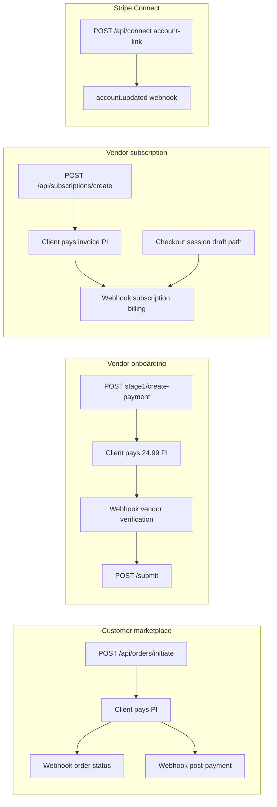
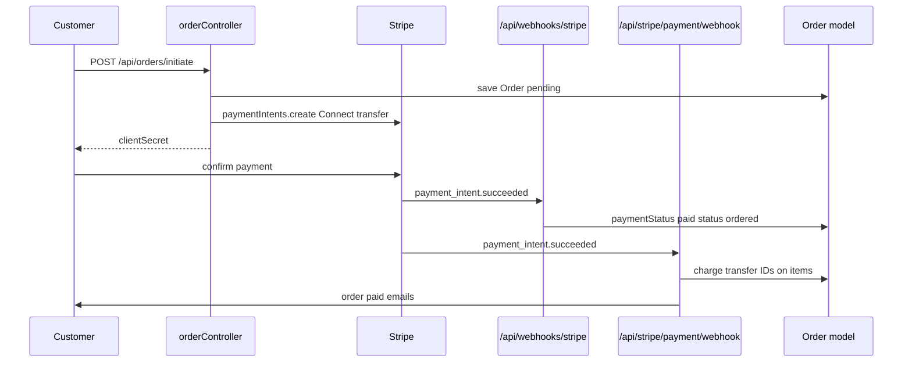

# Payment Flow

Non-webhook Stripe and payment paths in Mosaic Biz Hub. For webhook ownership and signature testing, see [STRIPE_WEBHOOKS.md](STRIPE_WEBHOOKS.md).

**Stack:** Stripe PaymentIntents, Checkout Sessions, Connect transfers, Billing Portal. MongoDB via Mongoose.

---

## Payment surfaces overview



---

## Environment variables (names only)

| Variable | Used by |
|----------|---------|
| `STRIPE_SECRET_KEY` | All Stripe SDK calls |
| `STRIPE_ORDER_WEBHOOK_SECRET` | Order status webhook |
| `STRIPE_ORDER_POST_PAYMENT_WEBHOOK_SECRET` | Post-payment webhook |
| `STRIPE_BUSINESS_DRAFT_WEBHOOK_SECRET` | Business draft webhook |
| `STRIPE_SUBSCRIPTION_WEBHOOK_SECRET` | Subscription webhook |
| `STRIPE_VENDOR_VERIFICATION_WEBHOOK_SECRET` | Vendor verification webhook |
| `PLATFORM_FEE_CENTS` | Order Connect platform fee (default `0`) |
| `BILLING_PORTAL_RETURN_URL` | Billing portal return |
| `CONNECT_RETURN_URL`, `CONNECT_REFRESH_URL` | Connect onboarding redirects |

Full list: [`.env.example`](../.env.example), [production-env-checklist.md](production-env-checklist.md)

---

## 1. Marketplace orders (Stripe Connect)

**Primary path:** [`orderController.initiateOrder`](../controllers/orderController.js)

| Step | Detail |
|------|--------|
| Route | `POST /api/orders/initiate` (authenticated customer) |
| Validation | Cart items, stock, server-derived totals, shipping address |
| Order created | `paymentStatus: pending`, `status: created`, `paymentId` empty initially |
| PaymentIntent | `stripe.paymentIntents.create` with `transfer_data.destination` = vendor `stripeConnectAccountId` |
| Platform fee | `application_fee_amount` from `PLATFORM_FEE_CENTS` |
| Metadata | `orderId`, `groupOrderId` |
| Response | `clientSecret` for client-side confirmation |
| Pre-payment emails | Customer order-placed + vendor new-order (before payment succeeds) |

**After client pays — two webhooks (see [STRIPE_WEBHOOKS.md](STRIPE_WEBHOOKS.md)):**

1. `/api/webhooks/stripe` — sets `paymentStatus: paid`, `status: ordered`
2. `/api/stripe/payment/webhook` — stores charge/transfer IDs, sends paid confirmation emails

**Retrieve payment:** `GET /api/orders/retrieve-intent/:id` → [`stripePaymentController.retrieveIntent`](../controllers/stripePaymentController.js)

**Legacy PI path:** `POST /api/payments/create-payment-intent` → [`paymentController.createPaymentIntent`](../controllers/paymentController.js) — amount derived from order total (client amount must match).

**Refunds:** `orderController` refund handlers call `stripe.refunds.create` (admin/vendor flows).

---

## 2. Vendor verification fee ($24.99)

**Path:** [VENDOR_LIFECYCLE.md](VENDOR_LIFECYCLE.md) § Phase 3

| Step | Route / handler |
|------|-----------------|
| Create PI | `POST /api/vendor-onboarding/stage1/create-payment` → `createVerificationPayment` |
| Amount | 2499 cents USD |
| Metadata | `userId`, `type: vendor_verification`, `applicationId` |
| On create | `verificationPayment.status = pending`, application `status = payment_pending` |
| Webhook | `POST /api/vendor-onboarding/webhook/payment` |
| On success | `verificationPayment.status = paid`, application `status = draft` |
| Submit gate | `submitForReview` returns `402` if not paid |

---

## 3. Vendor subscriptions

### Path A — API subscription create

| Step | Detail |
|------|--------|
| Route | `POST /api/subscriptions/create` → [`subscriptionController.createSubscription`](../controllers/subscriptionController.js) |
| Auth | `authenticate` |
| Stripe | Creates customer + subscription (`payment_behavior: default_incomplete`) |
| Local | Creates `Subscription` document (pending) |
| Client | Pays via `latest_invoice.payment_intent.client_secret` |
| Webhook | `/api/subscription/webhook` activates on `invoice.payment_succeeded` |

**Read:** `GET /api/subscriptions/user/subscriptions`  
**Plans:** `GET /api/subscription-plans`

### Path B — Business draft checkout (legacy/alternate)

| Step | Detail |
|------|--------|
| Route | `POST /api/stripe/create-checkout-session` → [`stripeController.createCheckoutSession`](../controllers/stripeController.js) |
| Auth | `authenticate`, `isBusinessOwner` |
| Input | `draftId` (BusinessDraft) |
| Stripe | Checkout Session `mode: subscription` |
| Webhook | `/api/stripe/webhook` on `checkout.session.completed` creates `Business` + `Subscription` |

### Billing management

| Route | Handler |
|-------|---------|
| `GET /api/subscriptions/current` | [`subscriptions.controller`](../controllers/subscriptions.controller.js) |
| `POST /api/subscriptions/:id/cancel` | Cancel at period end |
| `POST /api/subscriptions/:id/resume` | Resume cancelled |
| `POST /api/billing-portal/session` | [`billing.controller`](../controllers/billing.controller.js) — Stripe Billing Portal |

**Plan sync:** [`helpers/stripePlan.js`](../helpers/stripePlan.js) ensures Stripe product/price for `SubscriptionPlan`.

---

## 4. Stripe Connect (vendor payouts)

| Route | Handler | Purpose |
|-------|---------|---------|
| `POST /api/connect/:businessId/account-link` | [`connectController.createAccountLink`](../controllers/connectController.js) | Express account onboarding |
| `GET /api/connect/:businessId/status` | `getStatus` | Retrieve Connect account state |
| `GET /api/connect/:businessId/return` | `handleReturn` | OAuth return |
| `GET /api/connect/:businessId/refresh` | `handleRefresh` | Refresh link |

**Dashboard embed:** `/stripe/account-session`, `/stripe/express-login`, balance/payout routes in [`routes/stripe.routes.js`](../routes/stripe.routes.js) → [`stripe.controller.js`](../controllers/stripe.controller.js)

**Webhook sync:** `account.updated` on `/api/stripe/webhook` updates `Business.chargesEnabled`, `payoutsEnabled`, `onboardingStatus`.

**Order dependency:** `initiateOrder` requires `business.stripeConnectAccountId` for Connect destination transfer.

---

## 5. Payment flow sequence (marketplace order)



---

## 6. Models updated by payment type

| Flow | Primary models | Key fields |
|------|----------------|------------|
| Marketplace order | `Order` | `paymentId`, `paymentStatus`, `status`, `items[].chargeId/transferId` |
| Vendor verification | `VendorOnboardingStage1` | `verificationPayment`, `status` |
| Subscription API | `Subscription` | `stripeSubscriptionId`, `paymentStatus`, `status` |
| Business draft checkout | `BusinessDraft`, `Business`, `Subscription` | Draft deleted after success |
| Connect | `Business` | `stripeConnectAccountId`, `chargesEnabled`, `payoutsEnabled` |

---

## 7. Testing payments

### Automated

```bash
npm test
```

Webhook tests in `tests/stripe/`. Vendor payment tests in `tests/vendor/`.

### Manual smoke (post-deploy)

| Tier | Doc section | Covers |
|------|-------------|--------|
| P2 | [production-smoke-checklist.md](production-smoke-checklist.md) | Vendor verification payment |
| P4 | Same | All 5 webhook deliveries |
| P5 | Same | Connect + order initiate + pay |

### Local dev notes

- App reads `.env`, not `.env.local` ([SETUP.md](../SETUP.md)).
- Use Stripe test mode keys and test card `4242 4242 4242 4242`.
- Vendor webhook allows unsigned body only when `NODE_ENV=development`.

---

## 8. Launch-critical payment rules

1. **Server-derived order totals** — `initiateOrder` and `createPaymentIntent` validate amounts against DB, not client-only input.
2. **Connect destination required** — Orders need vendor `stripeConnectAccountId`.
3. **Five webhook secrets** — One per endpoint; never shared ([STRIPE_WEBHOOKS.md](STRIPE_WEBHOOKS.md)).
4. **Raw body before JSON** — Webhook mount order in `app.js` is mandatory.
5. **Vendor submit requires paid verification** — `402` if verification PI unpaid.
6. **Two order webhooks** — Status (#1) and post-payment (#5) are separate; both may fire for same PI.
7. **Unsigned webhooks rejected in production** — Except vendor dev bypass; verify with curl smoke tests.

---

## 9. Related routes quick reference

| Method | Path | Auth | Purpose |
|--------|------|------|---------|
| POST | `/api/orders/initiate` | Customer | Create order + Connect PI |
| GET | `/api/orders/retrieve-intent/:id` | Varies | PI + orders lookup |
| POST | `/api/payments/create-payment-intent` | — | Legacy PI from orderId |
| POST | `/api/vendor-onboarding/stage1/create-payment` | Vendor | Verification fee PI |
| POST | `/api/subscriptions/create` | User | Subscription PI |
| POST | `/api/stripe/create-checkout-session` | Business owner | Draft checkout |
| POST | `/api/connect/:businessId/account-link` | — | Connect onboarding |
| POST | `/api/billing-portal/session` | — | Manage subscription |

Webhooks: see [STRIPE_WEBHOOKS.md](STRIPE_WEBHOOKS.md).
