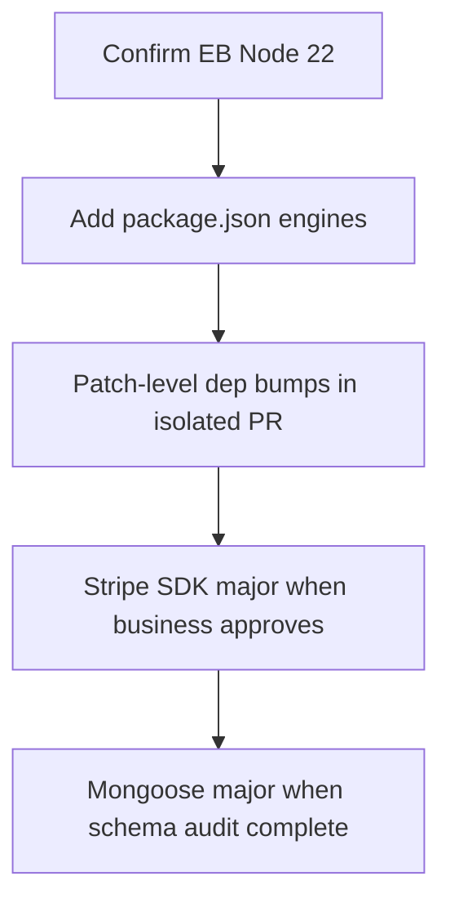

# Platform and Dependency Audit

**Issue:** [#51 Backend platform and dependency modernization audit](https://github.com/Techware-Hut/mosaic-backend/issues/51)  
**Date:** 2026-06-22  
**Scope:** Audit-first — document versions, drift, and upgrade sequence. **No package upgrades in this batch.**

---

## Runtime alignment

| Environment | Node version | Source |
|-------------|--------------|--------|
| CI (`.github/workflows/ci.yml`) | **22** | Updated in PR #108 (was 18) |
| Deploy workflow (`deploy-eb-production.yml`) | **22** | `setup-node` step |
| `package.json` `engines` | **Not set** | Recommend `"node": ">=22"` |
| Production EB | **22** (target) | Align with deploy workflow; verify in EB console |

**Recommendation:** Add `"engines": { "node": ">=22" }` to `package.json` in a future PR after EB runtime confirmed.

---

## Core dependencies (production)

| Package | Current (`package.json`) | Role | Risk / notes |
|---------|-------------------------|------|--------------|
| `express` | ^5.1.0 | HTTP server | Already on v5 — audit route handlers for Express 5 read-only `req.query` (fixed in app.js sanitize) |
| `mongoose` | ^8.15.1 | MongoDB ODM | Active 8.x line; safe patch upgrades |
| `stripe` | ^18.3.0 | Payments + Connect | Pin major; test webhooks before bump |
| `@sentry/node` | ^10.58.0 | Error monitoring | Optional at runtime (`SENTRY_DSN`); verify EB env |
| `jsonwebtoken` | ^9.0.2 | Auth tokens | Mature; no urgent action |
| `express-rate-limit` | ^7.5.0 | Abuse protection | Applied on auth/payment routes (#57) |
| `express-validator` | ^7.2.1 | Input validation | Auth routes |
| `express-mongo-sanitize` | ^2.2.0 | NoSQL injection | Applied in app.js |
| `dotenv` | ^16.6.1 | Local env | Safe patch |
| `cors` | ^2.8.5 | CORS | Production allowlist in EB env |
| `multer` | ^2.0.1 | Uploads | Review with #71 file-upload audit |
| `nodemailer` | ^7.0.3 | SMTP mail | Production credentials in EB only |
| `mongodb-memory-server` | ^11.2.0 (dev) | Integration tests | Requires Node 20+ (BSON); CI on 22 |

---

## Node LTS recommendation

| Target | Rationale |
|--------|-----------|
| **Node 22 LTS** (current) | Matches CI + deploy; satisfies `mongodb-memory-server` / BSON requirements |
| Node 24 | Evaluate after EB platform supports it; not required for launch |

Node 18 reached end-of-life for active LTS — **do not downgrade CI**.

---

## Safe vs major upgrade candidates

### Safe (patch/minor — when approved)

- `mongoose` 8.x patch
- `dotenv`, `cors`, `axios` patch
- `@aws-sdk/client-s3` minor (already ^3.850)
- `express-validator`, `express-rate-limit` patch

### Major (requires dedicated PR + full test suite)

| Package | Current | Notes |
|---------|---------|-------|
| `stripe` | 18.x | Webhook + Connect regression tests required |
| `mongoose` | 9.x (future) | Schema/index review |
| `puppeteer` | 24.x | Heavy; only if PDF generation path changes |

**Rule:** No blind major upgrades. Run `npm test` + `npm run test:integration` + smoke scripts after any dependency PR.

---

## Express 5 readiness

| Area | Status |
|------|--------|
| Installed version | 5.1.0 |
| `req.query` mutation | **Fixed** — sanitize skips query ([`app.js`](../app.js)) |
| Webhook raw body | Registered before `express.json` |
| Route handlers | Controller-centric; no known Express 4-only APIs flagged |

---

## Upgrade sequence (recommended)

**Rollback:** EB application version revert via [BACKEND_EB_DEPLOY_RUNBOOK.md](BACKEND_EB_DEPLOY_RUNBOOK.md); `npm ci` from lockfile on branch revert.

---

## Issue #51 acceptance

| Criterion | Status |
|-----------|--------|
| Node versions documented (local, CI, EB, engines) | **Done** |
| Package audit (Express, Mongoose, Stripe, Sentry, etc.) | **Done** |
| EOL / risky deps identified | **Done** — Node 18 deprecated for CI |
| Safe patch vs major candidates | **Done** |
| Upgrade sequence + rollback | **Done** |
| No blind upgrades in this issue | **Met** |
| `npm test` passes | **Met** |

---

## References

- [`package.json`](../package.json)
- [`.github/workflows/ci.yml`](../.github/workflows/ci.yml)
- [`docs/ENV_VAR_INVENTORY.md`](ENV_VAR_INVENTORY.md)
- [`docs/TEST_MATRIX.md`](TEST_MATRIX.md)
