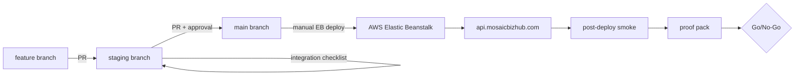

# Production Runbook

Operational guide for release owners: deployment verification, rollback confirmation, smoke testing, and sign-off.

**Audience:** Release owner, infrastructure/AWS owner, backend engineer, reviewer.

**Related docs (detail, not duplicated here):**

| Doc | Use for |
|-----|---------|
| [STAGING.md](../STAGING.md) | Integration branch checklist |
| [DEPLOYMENT.md](../DEPLOYMENT.md) | Branch policy and rollback steps |
| [production-env-checklist.md](production-env-checklist.md) | EB env var names |
| [production-smoke-checklist.md](production-smoke-checklist.md) | Full smoke tiers P0–P6 |
| [TEST_MATRIX.md](TEST_MATRIX.md) | Automated tests vs manual smoke mapping |
| [production-proof-pack-template.md](production-proof-pack-template.md) | Per-release evidence record |
| [stripe-webhook-registration.md](stripe-webhook-registration.md) | Webhook Dashboard setup |
| [STRIPE_WEBHOOKS.md](STRIPE_WEBHOOKS.md) | Webhook smoke curl commands |
| [hosted-staging-decision.md](hosted-staging-decision.md) | Why there is no staging host |
| [launch-readiness-report.md](launch-readiness-report.md) | Open P0 blockers |
| [production-env-checklist.md](production-env-checklist.md) § Observability | Sentry env var names |

---

## Production URLs (read first)

| URL | Use |
|-----|-----|
| **`https://api.mosaicbizhub.com`** | **Supported production API** — use for all smoke tests, Stripe webhook registration, and OAuth callbacks |
| `http://mosaic-backend.us-east-1.elasticbeanstalk.com/` | EB hostname — **HTTP only** for optional raw health probe |
| `https://mosaic-backend.us-east-1.elasticbeanstalk.com` | **Do not use** for production smoke — TLS certificate CN mismatch |

Frontend (canonical): `https://mosaicbizhub.com` (transition: `https://app.mosaicbizhub.com`)

---

## Hosted staging status

**There is no hosted staging backend in the MVP workflow.**

| Branch | Deploy target |
|--------|---------------|
| `feature/*` | Local dev only |
| `staging` | **None** — integration and PR review only |
| `main` | AWS Elastic Beanstalk production |

Runtime validation happens **after** `main` is deployed to production, using **dedicated test accounts**. See [hosted-staging-decision.md](hosted-staging-decision.md).

Pre-merge checks on `staging` (local boot, `npm test`, code review) are **provisional** — they do not replace post-deploy production smoke.

---

## Release path (end to end)



| Step | Action | Owner | Sign-off type |
|------|--------|-------|---------------|
| 1 | Work on `feature/*`; open PR → `staging` | Backend engineer | — |
| 2 | Complete [STAGING.md](../STAGING.md) integration checklist | Backend engineer + reviewer | **Provisional** |
| 3 | Open PR `staging` → `main`; obtain approvals | Reviewer + release owner | **Provisional** |
| 4 | Confirm rollback readiness (SHA, EB path) | Release owner + infra owner | **Provisional** |
| 5 | Auto-deploy exact `main` commit to EB via GHA | GitHub Actions (on push/merge to `main`) | — |
| 6 | **Confirm deployed commit on EB** | **Infrastructure / deployment owner** | **Required before final smoke** |
| 7 | Run post-deploy smoke on `https://api.mosaicbizhub.com` | Release owner | **Provisional until commit confirmed** |
| 8 | Fill proof pack; Go/No-Go decision | Release owner | **Final launch sign-off** |

**Auto-deploy on merge.** Merging or pushing to `main` triggers the deploy workflow after tests pass. Manual `workflow_dispatch` remains available for redeploys.

**Critical rule:** Final launch sign-off requires the **deployment owner to confirm the commit SHA running on EB** matches the intended `main` release. Baseline health probes on the custom domain (while an older commit is still live) are **not** sufficient for sign-off.

---

## Roles

| Role | Responsibility |
|------|----------------|
| Backend engineer | Feature work, local validation, `npm test`, docs updates, env change identification |
| Reviewer / tech lead | PR review; security-sensitive diff approval |
| Release owner | Deploy window, smoke coordination, proof pack, Go/No-Go |
| Infrastructure / AWS owner | EB deploy, secrets, networking, **deployed commit confirmation**, rollback execution |
| Deployment owner | Same as infra owner for sign-off — must attest EB commit SHA |

---

## Phase 1 — Pre-deploy checklist

Complete **before** infrastructure owner deploys to EB.

### Integration (on `staging` branch)

- [ ] PR `feature/*` → `staging` reviewed and merged
- [ ] [STAGING.md](../STAGING.md) integration checklist complete
- [ ] `npm test` pass recorded (local)
- [ ] App boots locally with `.env` ([SETUP.md](../SETUP.md)) — not `.env.local`
- [ ] No secrets committed; new env vars documented in [production-env-checklist.md](production-env-checklist.md) and [README.md](../README.md)
- [ ] Security behavior changes noted in [security-remediation-notes.md](security-remediation-notes.md) if applicable

### Promotion (PR `staging` → `main`)

- [ ] PR opened with clear release summary
- [ ] Reviewer approval obtained
- [ ] Release owner approval obtained
- [ ] No direct commits to `main`

### Rollback confirmation (mandatory)

- [ ] **Last known-good commit SHA** on EB recorded (rollback target)
- [ ] **Candidate release commit SHA** on `main` recorded (post-merge)
- [ ] EB rollback path confirmed with infrastructure owner (redeploy previous application version)
- [ ] Production env restore path understood ([production-env-checklist.md](production-env-checklist.md))
- [ ] Release owner and infrastructure owner identified for deploy window

### Production configuration

- [ ] All required EB env var **names** present ([production-env-checklist.md](production-env-checklist.md)) — verify values with infra owner, do not paste into tickets
- [ ] All **5 Stripe webhooks** registered at `https://api.mosaicbizhub.com` paths ([stripe-webhook-registration.md](stripe-webhook-registration.md))
- [ ] MongoDB, S3, mail, and Stripe set to production resources (not dev)
- [ ] `NODE_ENV=production` on EB
- [ ] `API_BASE_URL` points to `https://api.mosaicbizhub.com`

---

## Phase 2 — Deploy execution

**Owner:** Infrastructure / AWS owner

1. Deploy the approved **`main` commit SHA** to AWS Elastic Beanstalk.
2. Verify EB application health is green.
3. Review boot logs:
   - MongoDB connected
   - Server listening on expected port
   - No missing-env crash (especially Google OAuth, JWT, Stripe)
4. **Record and communicate deployed commit SHA** to release owner.

| Field | Value |
|-------|-------|
| Deployed commit SHA | _filled by deployment owner_ |
| Deploy timestamp (UTC) | _filled by deployment owner_ |
| Previous known-good SHA | _from rollback checklist_ |
| PR link (`staging` → `main`) | _URL_ |

**Gate:** Release owner must **not** begin final smoke sign-off until deployment owner confirms the SHA above.

---

## Phase 3 — Post-deploy smoke checklist

Run against **`https://api.mosaicbizhub.com` only**. Use **dedicated test accounts**.

Full tier detail: [production-smoke-checklist.md](production-smoke-checklist.md)

### Minimum smoke (required for deploy Go)

| ID | Check | Expected |
|----|-------|----------|
| P0.1 | `GET https://api.mosaicbizhub.com/` | HTTP 200 health JSON |
| P0.2 | EB boot logs | Mongo connected; no startup crash |
| P1.4 | Login + logout (test user) | Session works |
| P1.5 | `GET /api/users/auth/check` unauthenticated | HTTP 401 |
| P4.1 | Stripe Dashboard — 5 endpoints | Recent successful delivery OR signed test event |
| P4.5 | Unsigned webhook POST (one route) | HTTP 400 — see [STRIPE_WEBHOOKS.md](STRIPE_WEBHOOKS.md) |

### Extended smoke (recommended before launch sign-off)

| Tier | Scope | IDs |
|------|-------|-----|
| S1 Auth | Full auth flows | P1.1–P1.8 |
| S2 Vendor | Onboarding + verification payment | P2.1–P2.6 |
| S3 Admin | Application review | P3.1–P3.5 |
| S4 Stripe | All webhook paths | P4.1–P4.5 |
| S5 Orders | Connect + checkout | P5.1–P5.5 |
| S6 Public | Discovery APIs | P6.1–P6.5 |

### Log hygiene

- [ ] P0.3 — After auth smoke, confirm **no OTP values** in EB application logs

### Provisional vs final smoke

| Type | When | Valid for launch sign-off? |
|------|------|----------------------------|
| **Provisional** | Before EB commit confirmed; or baseline probes on custom domain while old commit may still be live | **No** |
| **Post-deploy (commit confirmed)** | After deployment owner attests SHA on EB | **Yes** — if full matrix passes |
| **Pre-merge local** | `npm test`, local boot on `staging` branch | **No** — integration gate only |

---

## Phase 4 — Rollback procedure

### If rollback is needed

1. Stop further promotions to `main`.
2. Infrastructure owner re-deploys **last known-good commit SHA** on EB.
3. Confirm `GET https://api.mosaicbizhub.com/` → 200.
4. Re-run minimal smoke: P0.1, P1.4, one webhook check.
5. Restore EB env vars if the failure was config-related.
6. Log incident: failed commit, impact, rollback time, approvers.
7. Update proof pack with rollback record.

### Post-rollback sign-off

Treat rollback deploy like a new release: deployment owner confirms SHA, release owner runs minimum smoke, proof pack updated.

---

## Observability — Sentry error monitoring

Production error monitoring is **optional** until `SENTRY_DSN` is set on Elastic Beanstalk. Initialization is env-gated — local dev and CI run without Sentry when the DSN is unset.

### Setup (infrastructure owner)

1. Create a Sentry project for the backend (Node/Express).
2. On EB, set env vars from [production-env-checklist.md](production-env-checklist.md) § Observability:
   - `SENTRY_DSN` — from Sentry project settings (**never commit to git**)
   - `SENTRY_ENVIRONMENT=production`
   - `SENTRY_RELEASE=mosaic-<git-sha>` — align with EB version label from deploy workflow
   - `SENTRY_TRACES_SAMPLE_RATE=0` (recommended for MVP — errors only)
   - `SENTRY_ENABLED=true`
3. Deploy the release that includes `instrument.js` and Sentry middleware.
4. Restart or redeploy EB so env vars take effect.

### What is captured

| Signal | Mechanism |
|--------|-----------|
| Unhandled exceptions | Sentry Express error handler |
| HTTP 5xx responses | Response `finish` hook (includes controller try/catch paths) |
| Startup failures | Mongo connect failure in `index.js` |

Sensitive fields (passwords, tokens, OTPs, Stripe secrets, cookies) are scrubbed in `beforeSend`. Request bodies are not logged by default.

### Post-deploy verification

1. Temporarily set `ENABLE_SENTRY_DEBUG_ROUTE=true` on EB.
2. `GET https://api.mosaicbizhub.com/internal/sentry-debug` — expect HTTP 500.
3. Confirm a new error event in the Sentry dashboard (environment `production`, release matches deploy SHA).
4. Set `ENABLE_SENTRY_DEBUG_ROUTE=false` before launch sign-off.

### Rollback notes

If Sentry causes boot issues, set `SENTRY_ENABLED=false` or remove `SENTRY_DSN` on EB and restart — the app runs without monitoring.

---

## Phase 5 — Evidence collection checklist

Copy [production-proof-pack-template.md](production-proof-pack-template.md) per release. Fill all sections.

### Required metadata

- [ ] Candidate / deployed commit SHA
- [ ] Previous known-good SHA
- [ ] Deploy timestamp (UTC)
- [ ] PR link (`staging` → `main`)
- [ ] Approvers (reviewer, release owner)
- [ ] Executor (infra owner)
- [ ] **EB deployed commit confirmed by deployment owner** (yes/no + SHA)

### Required evidence

- [ ] Smoke matrix P0.1–P6 with PASS/FAIL/PENDING/BLOCKED
- [ ] `npm test` result (pre-merge)
- [ ] Stripe Dashboard delivery screenshot (**redact secrets**)
- [ ] Rollback confirmation checkboxes
- [ ] Go/No-Go decision and date

### Safe to capture

- HTTP status codes, route paths, event type names
- Deploy and commit SHAs, PR URLs, timestamps
- Test account **labels** (not passwords)
- Env var **names** configured on EB
- Redacted Dashboard screenshots

### Never capture

- `whsec_*`, `sk_live_*`, `sk_test_*` secrets
- `.env` contents, SMTP passwords, JWT tokens
- OTP values, password reset codes
- Full webhook payloads with customer PII or card data
- `client_secret` from PaymentIntents

Store proof packs per [deploy-verification.md](deploy-verification.md) practice. Do not commit secrets to git.

---

## Go / No-Go checklist

### Deploy Go (healthy release on EB)

All required for **deploy Go**:

- [ ] Deployed commit SHA confirmed on EB by deployment owner
- [ ] P0.1 health check PASS on `https://api.mosaicbizhub.com`
- [ ] P0.2 boot logs clean
- [ ] P1.4 login/logout PASS (test account)
- [ ] P4.1 or equivalent webhook delivery verified
- [ ] Rollback SHA recorded
- [ ] Proof pack started

**Deploy Go means:** the intended release is live and minimally healthy. It does **not** mean unrestricted public launch.

### Launch sign-off Go (final)

All required for **final launch sign-off**:

- [ ] Everything in Deploy Go
- [ ] Extended smoke tiers complete per release scope (minimum S1–S4 for payment/auth releases)
- [ ] P0.3 log hygiene PASS
- [ ] No new P0 regressions introduced by this release
- [ ] Open P0 blockers reviewed — accepted risk documented or remediated
- [ ] Proof pack complete with deployment owner attestation
- [ ] Rollback SHA recorded and rollback path confirmed pre-deploy
- [ ] Post-deploy smoke complete per release scope (commit confirmed on EB)
- [ ] Product owner **written approval** (Bryan) recorded
- [ ] Release owner explicit **Go** recorded

### No-Go triggers (automatic)

- [ ] Deployed EB commit does not match approved `main` SHA
- [ ] P0.1 fails on canonical URL
- [ ] Boot crash or Mongo disconnect in logs
- [ ] Unsigned webhooks return 200 in production (P4.5 fail)
- [ ] Auth completely broken (cannot login test user)
- [ ] Rollback path not confirmed pre-deploy

---

## What blocks launch sign-off

Deploy health and launch readiness are **different**.

### Infrastructure / process blockers

| Blocker | Mitigation |
|---------|------------|
| EB deployed commit unconfirmed | Deployment owner must attest SHA before final sign-off |
| Missing Stripe webhook registration | Register all 5 endpoints; verify deliveries |
| Missing production env vars | [production-env-checklist.md](production-env-checklist.md) |
| No proof pack | Copy template; fill smoke matrix |

### Known open P0 code blockers

Smoke may PASS while these remain. Track in [launch-readiness-report.md](launch-readiness-report.md) §9.

| ID | Risk |
|----|------|
| P0-1 | No automated CI in repo |
| P0-2 | `POST /api/business` trusts client `paymentStatus` |
| P0-3 | Product tier limits not enforced on create |
| P0-4 | Vendor submit validation mostly disabled |
| P0-5 | Business `isActive: true` before admin approval |
| P0-6 | Order confirmation emails before payment |
| P0-7 | `/api/payments/create-payment-intent` unauthenticated |
| P0-8 | `/stripe/*` Connect routes unauthenticated |
| P0-9 | Sanitization middleware not mounted |
| P0-10 | Dual vendor onboarding paths |
| P0-11 | Duplicate order webhook handlers |

### Environment strategy blocker

| Blocker | Note |
|---------|------|
| No hosted staging | Production is first integrated runtime — increases blast radius; mitigated by controlled smoke and test accounts |

**Sign-off statement template:**

> **Deploy Go:** EB commit `{SHA}` confirmed by `{deployment owner}` on `{date}`. Minimum smoke PASS.
>
> **Launch sign-off:** `{Go | No-Go}` — `{release owner}` — Open P0 blockers: `{accepted | list}`.

---

## Quick reference commands

### Health probe (canonical URL)

```powershell
(Invoke-WebRequest -Uri "https://api.mosaicbizhub.com/" -UseBasicParsing).StatusCode
```

Expected: `200`

### Automated tests (pre-merge)

```bash
npm test
```

### Unsigned webhook rejection (production safe negative test)

See curl examples in [STRIPE_WEBHOOKS.md](STRIPE_WEBHOOKS.md). Expect HTTP `400` on all five routes.

### Auth smoke script (local or pointed at API)

```bash
node scripts/verify-auth-check-smoke.js
```

---

## Runbook revision

Update this file when branch policy, EB environment, canonical URL, or sign-off gates change. Link from [DEPLOYMENT.md](../DEPLOYMENT.md) and [README.md](../README.md).
