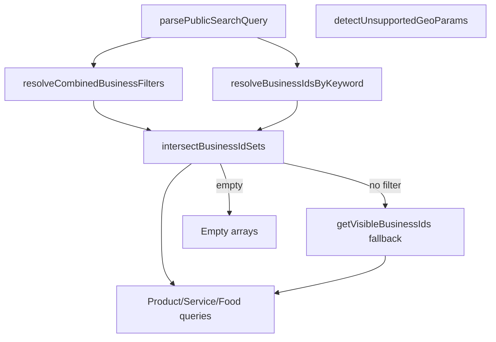

# Public Search & Taxonomy Audit

**Issue:** [#72 Public search relevance and taxonomy normalization audit](https://github.com/Techware-Hut/mosaic-backend/issues/72)  
**Date:** 2026-06-22  
**Scope:** Audit-first — document source of truth, filter behavior, and enum drift. No geolocation, no response contract breaks.

---

## Executive summary

Public search is implemented in [`lib/listing/publicSearchFilters.js`](../lib/listing/publicSearchFilters.js) and orchestrated by `GET` handlers in [`controllers/publicListing.js`](../controllers/publicListing.js), primarily `searchPublicListings`. Filtering is **regex-based** against MongoDB fields — there is no Atlas Search index or relevance scoring.

| Area | Status | Notes |
|------|--------|-------|
| Keyword search | Documented | Business name/description/tags + listing title/description |
| Category filters | Documented | Per listing-type taxonomy tables (`ProductCategory`, `ServiceCategory`, `FoodCategory`) |
| Minority type | Drift risk | Two representations: `MinorityType` ObjectId vs onboarding string enums |
| Business type | Not searchable | `VendorOnboardingStage1.businessType` enum exists but is not a public filter |
| City/state/zip | Documented | ZIP exact match; city/state flexible regex on `address.*` |
| Geolocation | Explicitly unsupported | `lat`, `lng`, `radius`, `nearMe` reported in `filters.unsupported` |

---

## Canonical search entry point

| Endpoint | Auth | Helper |
|----------|------|--------|
| `GET /api/public/search` (and aliases via `searchPublicListings`) | Public | `parsePublicSearchQuery` → `resolveCombinedBusinessFilters` → per-type listing queries |

### Query parameters (normalized)

| Param | Aliases | Behavior |
|-------|---------|----------|
| `keyword` | `search` | Trimmed; case-insensitive regex on listings and businesses |
| `listingType` | — | `product`, `service`, `food`, or `all` (invalid values default to `all`) |
| `categoryId` | — | ObjectId string; applied per listing type in unified search |
| `categorySlug` | — | Resolved per type via `resolveCategoryIdForListingType`; unknown slug → empty result |
| `city`, `state`, `country` | — | Combined `$and` on `address.city`, `address.state`, `address.country` |
| `location` | — | Free-text match across address fields and business name |
| `zip` | — | Exact case-insensitive match on `address.zipCode` |
| `minorityType` | — | ObjectId or name matched against `MinorityType` collection + onboarding `minorityCategories` |
| `tag` / `tags` | — | Comma-separated; exact case-insensitive match on `Business.tags` |
| `verified` | — | `true` limits to businesses with onboarding `status: verified` |
| `page`, `limit` | — | `limit` clamped 1–50; `page` minimum 1 |

---

## Taxonomy source of truth

### Listing categories (per type — not unified)

| Listing type | Model | Slug field | Used by |
|--------------|-------|------------|---------|
| Product | [`models/ProductCategory.js`](../models/ProductCategory.js) | `slug` (auto from `name`) | Product browse, search, featured |
| Service | [`models/ServiceCategory.js`](../models/ServiceCategory.js) | `slug` | Service browse, search |
| Food | [`models/FoodCategory.js`](../models/FoodCategory.js) | `slug` | Food browse, search |

**Implication:** The same `categorySlug` in unified search resolves against **three separate tables**. A slug valid for products may return empty for services/foods. This is intentional per-type taxonomy, not a shared category tree.

### Minority type (dual representation — drift risk)

| Source | Storage | Search behavior |
|--------|---------|-----------------|
| [`models/MinorityType.js`](../models/MinorityType.js) | `Business.minorityType` (ObjectId ref) | Name regex + ObjectId pass-through in `resolveBusinessIdsForMinorityType` |
| [`models/VendorOnboardingStage1.js`](../models/VendorOnboardingStage1.js) `minorityCategories` | String enum array | Regex match on enum strings |

**Onboarding enum values:** `African-American`, `Asian`, `LatinX`, `Woman`, `Disabled Veteran`, `Other`

**Drift examples:**

| Issue | Impact |
|-------|--------|
| `LatinX` vs `Latino` / `Hispanic` | Keyword/minority filter may miss businesses if frontend uses different labels |
| Onboarding strings vs `MinorityType.name` | Admin-seeded minority types may not align with onboarding enum spelling |
| Listing-level `minorityType` on Product/Service/Food | Field exists on schemas but unified search filters at **business** level only |

**Recommendation (future, not in this batch):** Single normalization map from frontend labels → `MinorityType` ObjectId at onboarding finalize time.

### Business type (not exposed in search)

| Source | Values | Search |
|--------|--------|--------|
| `VendorOnboardingStage1.businessType` | `product`, `service`, `food` | **Not a filter** — use `listingType` on search instead |

### Tags

| Source | Field | Match |
|--------|-------|-------|
| `Business.tags` | `[String]` | Exact case-insensitive per tag in `resolveBusinessIdsByTags` |

Tags are vendor-supplied free text — no controlled vocabulary.

---

## Filter combination logic

- Business-scoped filters (location, minority, tag, verified) are **intersected** when multiple are present.
- Keyword on businesses intersects with business filters when both apply.
- When no business filters match, search returns empty arrays (not an error).
- Default scope when no filters: active businesses only (`isPublished: true` on listings).

---

## Known inconsistencies (inventory)

| ID | Category | Description | Severity |
|----|----------|-------------|----------|
| T1 | Minority taxonomy | Onboarding enum strings ≠ `MinorityType.name` seed data | Medium |
| T2 | Category slug | Same slug string may exist in multiple type tables with different IDs | Low (by design) |
| T3 | `LatinX` spelling | Non-standard casing vs common `Latinx` | Low |
| T4 | `businessType` vs `listingType` | Similar names, different semantics | Low (documented) |
| T5 | Subcategory filters | Available on per-type list endpoints; not in unified `searchPublicListings` | Medium gap |
| T6 | Relevance | Regex match order is undefined; no scoring | Future phase |

---

## Explicit non-goals (per #72 guardrails)

- No fake geolocation or radius search
- No Atlas Search migration in this batch
- No breaking changes to `searchPublicListings` response shape

---

## Tests added/extended

See [`tests/marketplace/public-search-filters.test.js`](../tests/marketplace/public-search-filters.test.js):

- Empty keyword parsing
- Invalid `listingType` default
- City/state filter preservation
- Minority type empty input
- City+state combined location query
- Unknown `categorySlug` empty search response

---

## References

- [`lib/listing/publicSearchFilters.js`](../lib/listing/publicSearchFilters.js)
- [`controllers/publicListing.js`](../controllers/publicListing.js) — `searchPublicListings`, `resolveCategoryIdForListingType`
- [`docs/MVP_BACKEND_MARKETPLACE_DATA_CONTRACT.md`](MVP_BACKEND_MARKETPLACE_DATA_CONTRACT.md)
- Closed: #29 Search/filter readiness, #44 Performance/pagination audit
