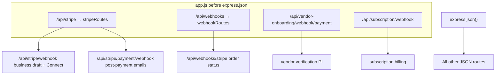

# Stripe Webhooks

Webhook ownership, event handling, signature verification, and safe testing for Mosaic Biz Hub.

**Related:** [PAYMENT_FLOW.md](PAYMENT_FLOW.md) (non-webhook payment paths), [stripe-webhook-registration.md](stripe-webhook-registration.md) (Dashboard setup), [VENDOR_LIFECYCLE.md](VENDOR_LIFECYCLE.md) (vendor verification fee)

**Tests:** [`tests/stripe/stripe-webhook-routing-signature.test.js`](../tests/stripe/stripe-webhook-routing-signature.test.js)

---

## Critical infrastructure rule

All five webhook mounts in [`app.js`](../app.js) register **before** `express.json()`. Stripe signature verification requires the **raw request body**. If a webhook is mounted after JSON parsing, signatures fail permanently.

Webhook routers also apply `express.raw()` on POST paths ([`routes/webhookRoutes.js`](../routes/webhookRoutes.js), [`routes/stripeRoutes.js`](../routes/stripeRoutes.js), and inline mounts in `app.js`).

---

## Required webhook route table

| Route | Env secret | Handler | Business flow | Category |
|-------|------------|---------|---------------|----------|
| `POST /api/webhooks/stripe` | `STRIPE_ORDER_WEBHOOK_SECRET` | `webhookController.handleStripeWebhook` | Marketplace **order payment status** | Order-related |
| `POST /api/stripe/webhook` | `STRIPE_BUSINESS_DRAFT_WEBHOOK_SECRET` | `stripeController.handleStripeWebhook` | **Business draft checkout** + Connect account sync | Subscription / Connect |
| `POST /api/subscription/webhook` | `STRIPE_SUBSCRIPTION_WEBHOOK_SECRET` | `webhookController.handleSubscriptionWebhook` | **Subscription billing lifecycle** | Subscription-related |
| `POST /api/vendor-onboarding/webhook/payment` | `STRIPE_VENDOR_VERIFICATION_WEBHOOK_SECRET` | `vendorOnboarding.controller.handleVendorPaymentWebhook` | **Vendor Stage-1 $24.99 verification** | Vendor-onboarding |
| `POST /api/stripe/payment/webhook` | `STRIPE_ORDER_POST_PAYMENT_WEBHOOK_SECRET` | `stripePaymentController.stripePaymentWebhook` | **Post-payment order enrichment + emails** | Post-payment / order-related |

Each route has its **own** signing secret. Secrets must not be shared across endpoints.

Production base URL: `https://api.mosaicbizhub.com`

---

## Ownership by business flow

### Order-related (two endpoints — different jobs)

Marketplace checkout creates a Stripe PaymentIntent in [`orderController.initiateOrder`](../controllers/orderController.js) with Connect `transfer_data.destination` and metadata `orderId`.

| Endpoint | Owns | Does NOT own |
|----------|------|--------------|
| `/api/webhooks/stripe` | `Order.paymentStatus`, `Order.status` from PI metadata | Emails, charge/transfer IDs on line items |
| `/api/stripe/payment/webhook` | Charge/transfer/fee IDs on `order.items`, confirmation emails via `sendOrderPaidEmails` | Initial status transition (may also set `paid` / `ordered`) |

Both can receive `payment_intent.succeeded` for the same PaymentIntent if registered in Stripe Dashboard. This is **intentional split responsibility** — do not collapse into one handler without understanding both code paths.

**Legacy alternate path:** `POST /api/payments/create-payment-intent` ([`paymentController.createPaymentIntent`](../controllers/paymentController.js)) also sets `metadata.orderId` — canonical order webhook handles those PIs too.

### Subscription-related

| Endpoint | Owns |
|----------|------|
| `/api/subscription/webhook` | `Subscription.paymentStatus`, `Subscription.status` from invoice/charge/PI events |
| `/api/stripe/webhook` (`checkout.session.completed`) | Creates `Subscription` + `Business` from `BusinessDraft` after Checkout |

Vendor subscription creation also uses `POST /api/subscriptions/create` ([`subscriptionController.createSubscription`](../controllers/subscriptionController.js)) — billing events arrive at `/api/subscription/webhook`.

### Vendor-onboarding-related

| Endpoint | Owns |
|----------|------|
| `/api/vendor-onboarding/webhook/payment` | `VendorOnboardingStage1.verificationPayment.status`, application `status` after PI success/failure |

Triggered by PaymentIntent from `POST /api/vendor-onboarding/stage1/create-payment` with metadata `type: vendor_verification`.

### Connect-related (not a separate webhook route)

`POST /api/stripe/webhook` handles `account.updated` → syncs `Business.chargesEnabled`, `payoutsEnabled`, `onboardingStatus` for Connect accounts.

---

## Event types handled per route

### 1. `POST /api/webhooks/stripe`

**File:** [`controllers/webhookController.js`](../controllers/webhookController.js) → `handleStripeWebhook`

| Event type | Action |
|------------|--------|
| `payment_intent.succeeded` | `Order.findByIdAndUpdate(metadata.orderId)` → `paymentStatus: paid`, `status: ordered` |
| `payment_intent.payment_failed` | Order → `paymentStatus: failed`, `status: cancelled` |
| `payment_intent.requires_action` | Log only; `200` ack |
| `charge.refunded` | Order → `paymentStatus: refunded`, `status: refunded` (uses `metadata.orderId` on charge) |
| Other | Log unhandled; `200` ack |

**Extra guard:** Rejects non-raw body (parsed JSON object) with `400` before signature verification.

### 2. `POST /api/stripe/webhook`

**File:** [`controllers/stripeController.js`](../controllers/stripeController.js) → `handleStripeWebhook`

| Event type | Action |
|------------|--------|
| `checkout.session.completed` | Create `Subscription` + `Business` from `BusinessDraft`; delete draft; welcome email |
| `account.updated` | Sync Connect capabilities on matching `Business` |
| Other | `400 Unhandled event type` |

### 3. `POST /api/subscription/webhook`

**File:** [`controllers/webhookController.js`](../controllers/webhookController.js) → `handleSubscriptionWebhook`

| Event type | Action |
|------------|--------|
| `customer.created` | Ignored (log) |
| `invoice.payment_succeeded` | Subscription → `paymentStatus: COMPLETED`, `status: active` |
| `invoice.payment_failed` | Subscription → `paymentStatus: FAILED`, `status: cancelled` |
| `charge.updated` | If `metadata.subscriptionId` and charge succeeded → activate subscription |
| `charge.succeeded` | If `metadata.subscriptionId` → activate subscription |
| `payment_intent.succeeded` | If `metadata.subscriptionId` → activate subscription |
| Other | Log unhandled; `200` ack |

**Note:** Handler uses `invoice.payment_succeeded` (not `invoice.paid`). Register the event types this handler actually switches on.

### 4. `POST /api/vendor-onboarding/webhook/payment`

**File:** [`controllers/vendorOnboarding.controller.js`](../controllers/vendorOnboarding.controller.js) → `handleVendorPaymentWebhook`

| Event type | Action |
|------------|--------|
| `payment_intent.succeeded` | If `metadata.type === 'vendor_verification'` → `verificationPayment.status = paid`, `status = draft` |
| `payment_intent.payment_failed` | If vendor verification → `verificationPayment.status = failed`, `status = payment_pending` |
| Other | Log unhandled; `200` ack |

### 5. `POST /api/stripe/payment/webhook`

**File:** [`controllers/stripePaymentController.js`](../controllers/stripePaymentController.js) → `stripePaymentWebhook`

| Event type | Action |
|------------|--------|
| `payment_intent.succeeded` | Find orders by `paymentId`; set `paid`/`ordered`; store `chargeId`, `transferId`, `applicationFeeId` on items; send order-paid emails |
| Other | `200` ack only |

---

## Signature verification behavior

All handlers use `stripe.webhooks.constructEvent(payload, sig, endpointSecret)` with the route-specific env var.

### Missing `stripe-signature` header

| Route | Response (production) | Notes |
|-------|----------------------|-------|
| `/api/webhooks/stripe` | `400` — `stripe-signature header is required` | Before `constructEvent` |
| `/api/subscription/webhook` | `400` — `stripe-signature header is required` | Before `constructEvent` |
| `/api/stripe/webhook` | `400` — `Webhook Error: ...` | Via `constructEvent` throw |
| `/api/stripe/payment/webhook` | `400` — `Webhook Error: ...` | Via `constructEvent` throw |
| `/api/vendor-onboarding/webhook/payment` | `400` — `stripe-signature header is required` | **Only when `NODE_ENV !== 'development'`** |

### Vendor route development exception

When `NODE_ENV=development` and no signature is present, `handleVendorPaymentWebhook` parses the body as JSON directly (local CLI testing). **Never rely on this in production** — tests assert production rejects unsigned requests.

### Invalid or wrong secret

All routes return **`400`** with body containing `Webhook Error:` and the Stripe SDK message.

### Missing endpoint secret (server misconfiguration)

| Route | Response |
|-------|----------|
| `/api/webhooks/stripe` | `500` — `Stripe webhook secret is not configured` |
| `/api/subscription/webhook` | `500` — `Stripe webhook secret is not configured` |
| Vendor webhook (no sig, non-dev) | `500` if secret missing after sig check path |

### Successful verification

Typically **`200`** — body may be `{ received: true }`, JSON object, empty send, or plain `received: true` string depending on handler.

---

## Webhook mount diagram



---

## Runtime smoke test commands

### Automated (recommended before deploy)

```bash
npm test
```

Runs [`tests/stripe/stripe-webhook-routing-signature.test.js`](../tests/stripe/stripe-webhook-routing-signature.test.js) — verifies mount order, per-route secrets, signature rejection, raw-body guard.

### Unsigned rejection (local or production)

Replace `BASE` with `http://localhost:3001` or `https://api.mosaicbizhub.com`.

Preferred PowerShell harness:

```powershell
powershell -NoProfile -ExecutionPolicy Bypass -File .\scripts\production-stripe-webhook-runtime-smoke.ps1 -ValidateOnly
powershell -NoProfile -ExecutionPolicy Bypass -File .\scripts\production-stripe-webhook-runtime-smoke.ps1 -SendUnsignedProbes
```

The harness writes redacted status-only output under `docs/qa-redacted/production-stripe-webhook-runtime-2026-06-28/`. See [qa/PRODUCTION_STRIPE_WEBHOOK_RUNTIME_SMOKE_RUNBOOK_2026_06_28.md](qa/PRODUCTION_STRIPE_WEBHOOK_RUNTIME_SMOKE_RUNBOOK_2026_06_28.md).

**Expect HTTP `400` for all routes below (no secrets in request):**

```bash
# Canonical order webhook
curl -s -o /dev/null -w "%{http_code}\n" -X POST "$BASE/api/webhooks/stripe" \
  -H "Content-Type: application/json" \
  -d '{"type":"payment_intent.succeeded","data":{"object":{}}}'

# Business draft webhook
curl -s -o /dev/null -w "%{http_code}\n" -X POST "$BASE/api/stripe/webhook" \
  -H "Content-Type: application/json" \
  -d '{"type":"checkout.session.completed","data":{"object":{}}}'

# Subscription webhook
curl -s -o /dev/null -w "%{http_code}\n" -X POST "$BASE/api/subscription/webhook" \
  -H "Content-Type: application/json" \
  -d '{"type":"invoice.payment_succeeded","data":{"object":{}}}'

# Vendor verification webhook (must 400 in production)
curl -s -o /dev/null -w "%{http_code}\n" -X POST "$BASE/api/vendor-onboarding/webhook/payment" \
  -H "Content-Type: application/json" \
  -d '{"type":"payment_intent.succeeded","data":{"object":{"metadata":{"type":"vendor_verification"}}}}'

# Post-payment order webhook
curl -s -o /dev/null -w "%{http_code}\n" -X POST "$BASE/api/stripe/payment/webhook" \
  -H "Content-Type: application/json" \
  -d '{"type":"payment_intent.succeeded","data":{"object":{}}}'
```

**Interpretation:**

- `400` = correct rejection (unsigned or invalid payload)
- `500` = handler reached but env secret missing (misconfiguration)
- `200` on unsigned POST in production = **failure** (investigate immediately)

### Signed delivery (Stripe Dashboard or CLI)

```bash
# Example: forward one endpoint locally
stripe listen --forward-to localhost:3001/api/webhooks/stripe
# Copy CLI whsec into .env as STRIPE_ORDER_WEBHOOK_SECRET
stripe trigger payment_intent.succeeded
```

Repeat per endpoint with matching secret env var. See [stripe-webhook-registration.md](stripe-webhook-registration.md).

### Post-deploy checklist

Tier P4 in [production-smoke-checklist.md](production-smoke-checklist.md):

- P4.1 — Dashboard shows successful deliveries for all 5 endpoints
- P4.5 — No signature bypass in production

---

## Evidence: safe to capture

| Safe | Example |
|------|---------|
| HTTP status codes | `400` unsigned, `200` signed test delivery |
| Route paths | `/api/webhooks/stripe` |
| Event type names | `payment_intent.succeeded` |
| Timestamp / deploy SHA | Proof pack metadata |
| Stripe Dashboard delivery screenshot | **Redact** signing secret and payload customer data |
| `npm test` pass count | `57/57 pass` |
| Env var **names** present | `STRIPE_ORDER_WEBHOOK_SECRET` configured (not value) |
| Order/application **IDs** in test accounts | Non-production test data only |

Record in [production-proof-pack-template.md](production-proof-pack-template.md).

---

## Evidence: never capture

| Never include | Why |
|---------------|-----|
| `whsec_*` signing secrets | Full webhook impersonation |
| `sk_live_*` / `sk_test_*` API keys | Account access |
| Raw webhook payload with card/bank data | PCI / privacy |
| `client_secret` from PaymentIntent | Payment completion risk |
| Customer email, name, address in screenshots | PII |
| Full JWT session tokens | Account takeover |
| `.env` file contents | Contains all secrets |

Redact before attaching to proof packs, tickets, or chat.

---

## Troubleshooting

| Symptom | Likely cause | Check |
|---------|--------------|-------|
| 400 signature verification failed | Wrong `whsec` for that route | Env var matches Dashboard endpoint |
| 400 expected raw request body | Webhook after `express.json()` or wrong Content-Type | `app.js` mount order |
| Order paid in Stripe, DB still pending | Event sent to wrong endpoint | Order status = #1; emails = #5 |
| Subscription not active | Wrong event type registered | Handler expects `invoice.payment_succeeded` |
| Vendor fee paid, still can't submit | Webhook #4 not firing | `verificationPayment.status` in DB |
| 200 on unsigned curl in prod | Wrong `NODE_ENV` or vendor dev bypass | P4.5 smoke |

---

## File reference

| File | Role |
|------|------|
| [`app.js`](../app.js) | Webhook mount order |
| [`routes/webhookRoutes.js`](../routes/webhookRoutes.js) | `/api/webhooks/stripe` |
| [`routes/stripeRoutes.js`](../routes/stripeRoutes.js) | `/api/stripe/webhook`, `/api/stripe/payment/webhook` |
| [`controllers/webhookController.js`](../controllers/webhookController.js) | Order status + subscription webhooks |
| [`controllers/stripeController.js`](../controllers/stripeController.js) | Business draft + Connect webhook |
| [`controllers/stripePaymentController.js`](../controllers/stripePaymentController.js) | Post-payment webhook |
| [`controllers/vendorOnboarding.controller.js`](../controllers/vendorOnboarding.controller.js) | Vendor verification webhook |
| [`.env.example`](../.env.example) | Secret env var names |
