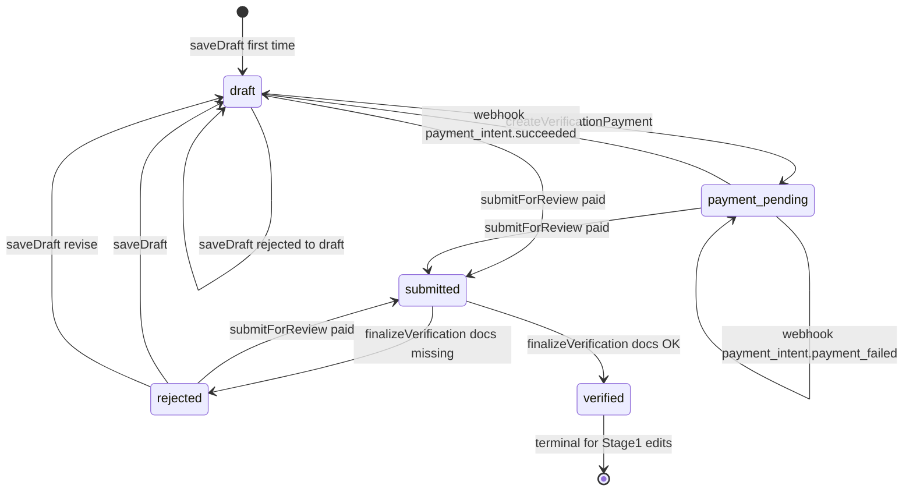
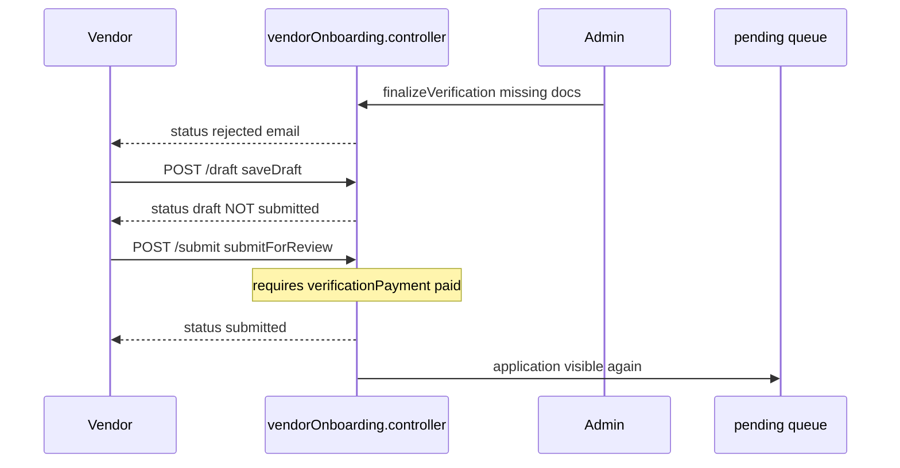
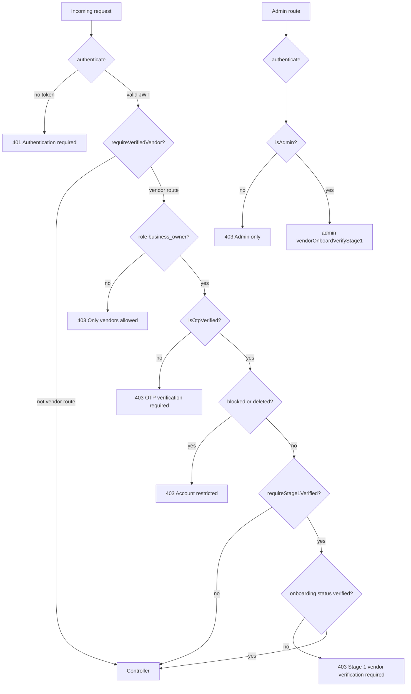
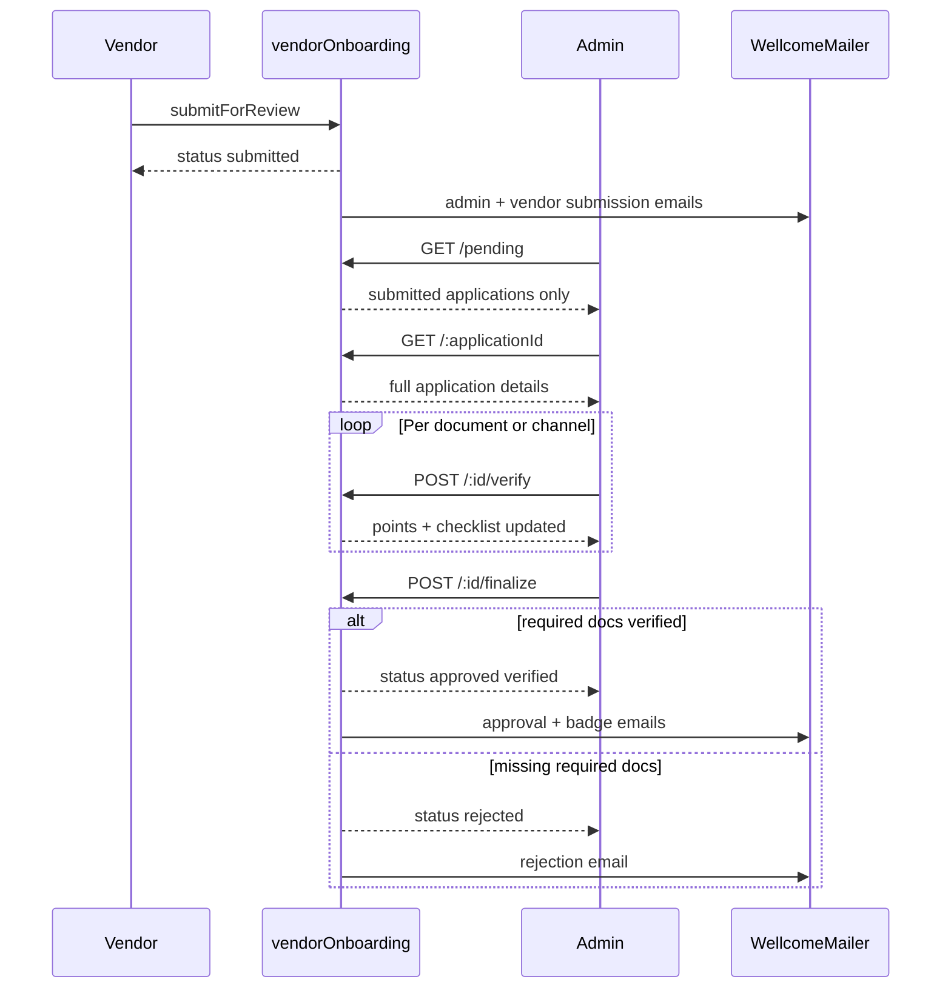

# Vendor Lifecycle

How vendors move from account registration through Stage-1 onboarding, verification payment, admin review, approval, rejection, and resubmission.

**Related docs:** [AUTH_FLOW.md](AUTH_FLOW.md), [business-sync.md](business-sync.md), [vendor-field-protection.md](vendor-field-protection.md), [admin-pending-applications-statuses.md](admin-pending-applications-statuses.md)

**Source files:**

| Layer | Files |
|-------|-------|
| Model | [`models/VendorOnboardingStage1.js`](../models/VendorOnboardingStage1.js) |
| Routes | [`routes/vendorOnboarding.routes.js`](../routes/vendorOnboarding.routes.js) |
| Vendor handlers | [`controllers/vendorOnboarding.controller.js`](../controllers/vendorOnboarding.controller.js) |
| Upload handler | [`controllers/vendorOnboardingUpload.controller.js`](../controllers/vendorOnboardingUpload.controller.js) |
| Admin handlers | [`controllers/admin/vendorOnboardVerifyStage1.js`](../controllers/admin/vendorOnboardVerifyStage1.js) |
| Middleware | [`middlewares/requireVerifiedVendor.js`](../middlewares/requireVerifiedVendor.js) |
| Field rules | [`utils/vendorOnboardingProfileFields.js`](../utils/vendorOnboardingProfileFields.js) |
| MIME rules | [`utils/vendorOnboardingUploadMimeAllowlist.js`](../utils/vendorOnboardingUploadMimeAllowlist.js) |
| Business sync | [`utils/syncBusinessFromOnboarding.js`](../utils/syncBusinessFromOnboarding.js) |
| Tests | [`tests/vendor/`](../tests/vendor/) |

**Route prefixes:** `/api/vendor-onboarding` (vendor + shared) and `/admin/vendor-onboard-verify-stage1` (admin subset of same router).

---

## Lifecycle overview

A vendor is a `User` with `role: 'business_owner'`. Stage-1 state lives in one `VendorOnboardingStage1` document per user (`userId` unique). The operational marketplace record is `Business`, linked via `onboarding.businessId` after profile sync.

```
Register (business_owner) → OTP verify → saveDraft → pay $24.99 fee → submitForReview
  → admin verify checklist → finalize → verified OR rejected
  → (if verified) subscription + business profile → Business sync
```

**Important naming:** Admin approval persists as `status: 'verified'` in the database. API responses from `finalizeVerification` may say `approved` in JSON, but the stored enum value is `verified`.

---

## Application states

Defined in [`models/VendorOnboardingStage1.js`](../models/VendorOnboardingStage1.js):

```javascript
status: {
  enum: ['draft', 'payment_pending', 'submitted', 'verified', 'rejected'],
  default: 'draft',
}
```

Separate from application status: `verificationPayment.status` — `not_started` | `pending` | `paid` | `failed`.

### State reference

| State | Meaning | In admin queue? | Vendor can edit draft? |
|-------|---------|-----------------|------------------------|
| `draft` | Application in progress; payment may or may not be paid | No | Yes |
| `payment_pending` | Stripe PaymentIntent created; awaiting payment | No | Yes (via saveDraft paths) |
| `submitted` | Vendor submitted; awaiting admin review | **Yes** | No (submit is idempotent) |
| `verified` | Admin approved Stage 1 | No | **No** — saveDraft blocked |
| `rejected` | Admin rejected (missing required docs) | No | Yes — saveDraft moves to `draft` |

Admin pending queue allowlist: **only `submitted`** ([`PENDING_REVIEW_STATUSES`](../controllers/admin/vendorOnboardVerifyStage1.js)).

---

## State machine



### Transition table

| From | Event | Handler | To | Notes |
|------|-------|---------|-----|-------|
| — | First `saveDraft` | `saveDraft` | `draft` | Creates doc; auto `applicationId` via pre-save hook |
| `draft` | `createVerificationPayment` | `createVerificationPayment` | `payment_pending` | PI $24.99; clears `submittedAt` |
| `payment_pending` | Stripe `payment_intent.succeeded` | `handleVendorPaymentWebhook` | `draft` | Sets `verificationPayment.status = paid` |
| `payment_pending` | Stripe `payment_intent.payment_failed` | `handleVendorPaymentWebhook` | `payment_pending` | Sets `verificationPayment.status = failed` |
| `draft` / `payment_pending` / `rejected` | `submitForReview` (paid) | `submitForReview` | `submitted` | Sets `submittedAt`; emails admin + vendor |
| `submitted` | `submitForReview` again | `submitForReview` | `submitted` | Idempotent `200` — no error |
| `rejected` | `saveDraft` | `saveDraft` | `draft` | **Does not** auto-resubmit |
| `submitted` | `finalizeVerification` (explicit `decision: 'approve'`, docs OK) | `finalizeVerification` | `verified` | Badge from points; approval email; review metadata persisted |
| `submitted` | `finalizeVerification` (explicit `decision: 'approve'`, docs missing) | `finalizeVerification` | — | **Blocked** `400` with `missingRequiredDocuments` — never silently rejects against admin intent |
| `submitted` | `finalizeVerification` (explicit `decision: 'reject'`) | `finalizeVerification` | `rejected` | Always allowed; admin `rejectionReason` takes precedence; rejection email |
| `submitted` | `finalizeVerification` (no `decision`, docs OK) | `finalizeVerification` | `verified` | Legacy auto behavior preserved |
| `submitted` | `finalizeVerification` (no `decision`, docs missing) | `finalizeVerification` | `rejected` | Legacy auto behavior; generated missing-docs reason persisted |
| `verified` | `saveDraft` | `saveDraft` | — | **Blocked** `400` |

---

## Phase 1: Vendor account registration

Before onboarding, the user must exist as `business_owner`:

1. `POST /api/users/register` with `role: 'business_owner'` ([`userController.registerUser`](../controllers/userController.js)).
2. `getSafePublicRole` prevents self-assigning `admin`.
3. `POST /api/users/verify-otp` → JWT session; `isOtpVerified: true`.

Google OAuth users can also become vendors if their existing role is `business_owner` ([`authController.getServerAssignedOAuthRole`](../controllers/authController.js)).

---

## Phase 2: Draft state

**Route:** `POST /api/vendor-onboarding/draft`  
**Handler:** `vendorOnboarding.controller.saveDraft`  
**Middleware:** `authenticate` → `requireVerifiedVendor`

### Behavior

1. Blocks edit only when `status === 'verified'`.
2. Creates new `VendorOnboardingStage1` if none exists (`status: 'draft'`).
3. Strips protected fields via `stripProtectedVendorFields` ([`vendorOnboardingProfileFields.js`](../utils/vendorOnboardingProfileFields.js)).
4. Maps frontend aliases (`businessOwnershipType` → `ownershipType`, `websiteUrl` → `website`, etc.).
5. Applies fields through `applyVendorDraftField` — document arrays get `verified: false`; media subdocs preserve admin `verified` flag.
6. If `status === 'rejected'` → sets `status = 'draft'` (revision mode, not resubmission).
7. Returns full onboarding document in response.

**Read draft:** `GET /api/vendor-onboarding/draft` → `getDraft`  
**Read combined data:** `GET /api/vendor-onboarding/onboarding-data` → `getOnboardingData`

---

## Phase 3: Verification payment ($24.99)

**Create payment:** `POST /api/vendor-onboarding/stage1/create-payment` → `createVerificationPayment`  
**Check status:** `GET /api/vendor-onboarding/stage1/payment-status` → `getPaymentStatus`  
**Webhook:** `POST /api/vendor-onboarding/webhook/payment` → `handleVendorPaymentWebhook` (raw body in [`app.js`](../app.js))

| Step | What happens |
|------|----------------|
| Create PI | Stripe PaymentIntent `amount: 2499` USD; metadata `type: vendor_verification` |
| On create | `verificationPayment.status = pending`, `status = payment_pending` |
| Webhook success | `verificationPayment.status = paid`, `status = draft` |
| Webhook failure | `verificationPayment.status = failed`, `status = payment_pending` |
| Already paid | `createVerificationPayment` returns `400` |

`getPaymentStatus` exposes `canSubmit: true` only when `verificationPayment.status === 'paid'`.

---

## Phase 4: Submitted / pending review

**Route:** `POST /api/vendor-onboarding/submit` → `submitForReview`

### Preconditions

1. Onboarding document exists.
2. Status must be `draft`, `payment_pending`, or `rejected` (or already `submitted` for idempotent success).
3. `verificationPayment.status === 'paid'` — otherwise `402`.
4. `validateStage1Payload` — currently enforces **business name min 2 chars** only (most rules commented out in code).

### On success

- `status = 'submitted'`, `submittedAt = now`
- Emails: `sendAdminOnboardingSubmissionEmail`, `sendVendorSubmissionConfirmationEmail` (non-blocking on failure)
- Application appears in admin queue (`GET .../pending`)

---

## Phase 5: Approved state (`verified`)

Admin approval is a two-step process:

### Step A — Document verification (incremental)

**Route:** `POST /api/vendor-onboarding/:applicationId/verify` (admin)  
**Handler:** `verifyAndAllocatePoints`

- Admin marks checklist items (`verificationType` + `isVerified`).
- Adds points to `totalVerificationPoints` per channel/document.
- Valid types include `minority-proof`, `tax-doc`, `business-license`, social links, profile image, bio, policy docs, etc.
- Auto-grants 10 minority points if no minority docs uploaded (`autoVerifyMinorityDocsIfMissing`).

### Step B — Final decision

**Route:** `POST /api/vendor-onboarding/:applicationId/finalize` (admin)  
**Handler:** `finalizeVerification`

**Request body (all optional — omitting `decision` preserves the legacy auto-decide contract):**

| Field | Meaning |
|-------|---------|
| `decision` | `'approve'` or `'reject'` — explicit admin intent |
| `rejectionReason` | Vendor-visible rejection reason (falls back to generated missing-docs list) |
| `adminNotes` | Internal review notes (persisted, not emailed) |
| `requiredNextAction` | Vendor-visible next step (defaults to "Update your application and resubmit for review.") |

**Decision rules:**

- `decision: 'approve'` — requires the document checklist below; if docs are missing, returns `400` with `missingRequiredDocuments` (never silently rejects against admin intent).
- `decision: 'reject'` — always allowed from `submitted`.
- No `decision` — auto: approve when required docs verified, reject otherwise.

**Approval criteria (launch-critical):** Required **document checklist** flags, not point total:

| Check | Required when |
|-------|---------------|
| `verificationChecklist.taxDocs` | Always |
| `verificationChecklist.businessLicense` | Always |
| `verificationChecklist.minorityDocs` | Only if `isMinorityOwned === true` |

If approved → `status = 'verified'`. If rejected → `status = 'rejected'`.

**Persisted review metadata (on `VendorOnboardingStage1`):** `reviewDecision`, `rejectionReason`, `adminReviewNotes`, `requiredNextAction`, `reviewedBy`, `reviewedAt`, `verifiedAt` / `rejectedAt`. All are vendor-write-protected (stripped by `saveDraft`). The response includes `data.applicationStatus` with the real stored enum value alongside the legacy `data.status` (`approved`/`rejected`).

**Badge assignment (does not affect approve/reject):**

| Points | Badge |
|--------|-------|
| ≥ 80 | Diamond |
| ≥ 50 | Platinum |
| ≥ 40 | Gold |
| ≥ 30 | Silver |

On finalize: `syncBusinessPoints` updates `Business.points` and `Business.badge` if a Business exists. Emails: approved, rejection, or badge assignment.

**Note:** `finalizeVerification` does **not** call `syncBusinessFromOnboarding`. Full Business record creation/update happens later via profile PUT (see Phase 7).

### Step C - Vendor guidance notifications

**Route:** `POST /api/vendor-onboarding/:applicationId/verification-guidance` (admin)
**Handler:** `sendVerificationGuidanceNotification`

This route sends vendor-facing clarification/correction emails without changing the Stage-1 application status. Supported `outcome` values:

| Outcome | Email purpose |
|---------|---------------|
| `missing_documents` | Required documents are missing or not verified |
| `failed_validation` | A submitted document/detail did not pass verification |
| `discrepancy` | Application details need clarification against public/business records |
| `under_review` | Application remains under review |
| `manual_review` | Application has been routed for manual review |

The request may include vendor-visible `reason`, `reasons`, `adminNote`, `documentsNeeded`, `fieldsNeeded`, and optional `responseWindowDays`. Internal-only notes are not forwarded. The backend dedupes repeat notifications for the same application status, outcome, reason, documents, fields, and response window.

Notification attempts are stored on `VendorOnboardingStage1.verificationNotificationLog` with delivery status (`sent`, `skipped`, or `failed`) after the email attempt. This is audit evidence only; it does not replace admin audit events.

There is no Stage-1 stalled/deactivated application workflow in the current model, so no final stalled/deactivated lifecycle email is implemented here.

---

## Phase 6: Rejected state

When `finalizeVerification` rejects (explicit `decision: 'reject'` or missing required documents):

- `status = 'rejected'`, plus persisted `rejectionReason`, `requiredNextAction`, `adminReviewNotes`, `reviewedBy`, `reviewedAt`, `rejectedAt`
- `sendVendorRejectionEmail` with the persisted `rejectionReason`
- Application **leaves** admin queue (queue is `submitted` only)
- Badge may still be assigned based on points at rejection time
- `GET /status/:applicationId` surfaces `rejectionReason` and `requiredNextAction` in `details.stage1`, and `nextAction` directs the vendor to revise and resubmit

### Resubmission path (launch-critical)

Resubmission is **two-step** — draft save alone does not re-enter the queue:

1. **`saveDraft`** on rejected application → `status = 'draft'` (revise data).
2. **`submitForReview`** → `status = 'submitted'` (re-enters admin queue).

**Tests:** [`tests/vendor/rejected-application-resubmit.test.js`](../tests/vendor/rejected-application-resubmit.test.js)



---

## Phase 7: Post-approval (Stage 2+)

**Status poll:** `GET /api/vendor-onboarding/status/:applicationId` → `getStatusByApplicationId` (**no auth** on this route)

After `verified`, the handler guides stages:

| Stage | Condition | nextAction (examples) |
|-------|-----------|-------------------------|
| 2 | No subscription | Select subscription plan |
| 2 | Subscription `pending` | Complete subscription payment |
| 3 | Subscription `active` | Complete business profile (logo + bio) |

**Business profile update (Stage 3):**

| Method | Route | Middleware | Business sync? |
|--------|-------|------------|----------------|
| PUT | `/api/vendor-onboarding/business-profile` | `requireStage1VerifiedVendor` | **Yes** — `syncBusinessFromOnboarding`; fails `500` on sync error |
| PATCH | `/api/vendor-onboarding/business-profile` | `requireStage1VerifiedVendor` | **No** — onboarding only |

`requireStage1VerifiedVendor` = `requireVerifiedVendor.create({ requireStage1Verified: true })` — requires `VendorOnboardingStage1.status === 'verified'`.

---

## Document upload behavior

**UI route:** `POST /api/vendor-onboarding/stage1/upload-file` → `uploadStage1File`
**Legacy/direct route:** `GET /api/vendor-onboarding/stage1/upload-url` → `getStage1UploadUrl`
**Middleware:** `authenticate` → `requireVerifiedVendor`

### Flow

1. `/partners/business/new` and `/partners/business-profile` send `multipart/form-data` to `POST /stage1/upload-file` with `file` and `documentType`.
2. Server verifies the vendor session, validates `documentType`, resolved MIME type, and file size.
3. Server writes the object to S3 under the authenticated vendor user path.
4. API returns `fileUrl`, `documentType`, and object `key`.
5. Client saves URL in the Stage-1 draft or business profile payload.

The presigned `GET /stage1/upload-url` path is retained for direct S3 diagnostics, but browser direct-upload requires S3 bucket CORS. The intended vendor/business document UI paths use the API proxy to avoid S3 browser preflight failures. Do not regress `/partners/business/new` back to `GET /stage1/upload-url`; it must share the same upload helper as `/partners/business-profile`.

### Allowed `documentType` values

| documentType | S3 folder purpose |
|--------------|-------------------|
| `minority-proof` | Stage-1 minority proof |
| `tax-doc` | Stage-1 tax/EIN document |
| `business-license` | Stage-1 license |
| `business-profile` | Logo / profile image |
| `feature-banner` | Feature banner image |
| `refund-policy` | Refund policy document |
| `terms-service` | Terms of service document |

### MIME / file validation

From [`utils/vendorOnboardingUploadMimeAllowlist.js`](../utils/vendorOnboardingUploadMimeAllowlist.js):

| Allowed MIME | Extensions (typical) |
|--------------|----------------------|
| `image/jpeg` | .jpg, .jpeg |
| `image/png` | .png |
| `image/webp` | .webp |
| `application/pdf` | .pdf |

- `normalizeMimeType` strips parameters (e.g. `image/jpeg; charset=binary`).
- Common browser PDF alias `application/x-pdf` resolves to `application/pdf`.
- Empty or generic browser MIME values can fall back to a safe file extension allowlist (`.jpg`, `.jpeg`, `.png`, `.webp`, `.pdf`).
- API proxy uploads are limited to 5 MB from the server-observed uploaded file size; the direct presigned diagnostic route validates the client-provided `fileSize` query when present.
- Rejected types return `400` with allowed list in message.
- Filename sanitized: non-alphanumeric → `_`; timestamp prefixed in S3 key.
- API proxy uploads require backend `CORS_ORIGINS` for the frontend origin and do not require browser-to-S3 CORS. Direct S3 browser uploads require bucket CORS for the frontend origin, `PUT`, and the `Content-Type` header. See [`docs/VENDOR_PDF_UPLOAD_CORS.md`](VENDOR_PDF_UPLOAD_CORS.md).

**Tests:** [`tests/vendor/vendor-onboarding-upload-mime.test.js`](../tests/vendor/vendor-onboarding-upload-mime.test.js)

---

## Vendor profile update boundaries

### Protected fields (vendor cannot set via `saveDraft`)

From `VENDOR_PROTECTED_ONBOARDING_FIELDS`:

`verificationPayment`, `status`, `applicationId`, `badge`, `totalVerificationPoints`, `verificationChecklist`, `businessId`, `submittedAt`, `profileCompletionNotifiedAt`, `userId`, `trustScore`, `isApproved`, `isVerified`, `role`, `adminNotes`, `reviewDecision`, `rejectionReason`, `adminReviewNotes`, `requiredNextAction`, `reviewedBy`, `reviewedAt`, `verifiedAt`, `rejectedAt`

`saveDraft` calls `stripProtectedVendorFields` before applying payload. Tests confirm protected fields are not applied even on rejected resubmit.

### Business profile allowlist (PUT and PATCH)

`applyVendorBusinessProfileFields` only accepts `VENDOR_BUSINESS_PROFILE_ALLOWLIST`:

`firstName`, `lastName`, `primaryEmail`, `primaryPhone`, `language`, `licenseNumber`, `businessBio`, `characterLimit`, `businessProfileImage`, `featureBanner`, `businessEmail`, `businessPhone`, `alternatePhone`, `website`, `facebook`, `instagram`, `twitter`, `linkedin`, `tiktok`, `refundPolicyDocument`, `termsDocument`, `googleReviewLink`, `communityServiceLink`

Media fields (`businessProfileImage`, `featureBanner`, `refundPolicyDocument`, `termsDocument`): vendor can set `url` only; `verified` flag is preserved from existing value (admin-controlled).

Document arrays on draft (`minorityProofDocuments`, `taxDocuments`, `businessLicenseDocuments`): vendor submissions always get `verified: false`.

---

## `requireVerifiedVendor` middleware

File: [`middlewares/requireVerifiedVendor.js`](../middlewares/requireVerifiedVendor.js)

### Default export (most vendor onboarding routes)

| Check | Failure |
|-------|---------|
| `req.user` missing | `401 Unauthorized` |
| `role !== 'business_owner'` | `403 Only vendors allowed` |
| `!isOtpVerified` | `403 OTP verification required` |
| `isBlocked` | `403 Account is blocked` |
| `isDeleted` | `403 Account is deleted` |

### `requireStage1VerifiedVendor` variant

Created via `requireVerifiedVendor.create({ requireStage1Verified: true })`.

Additional check: `VendorOnboardingStage1.status === 'verified'`.  
Failure: `403 Stage 1 vendor verification required`.

Used on: `PUT` and `PATCH /business-profile` only.

### Access-control decision flow



---

## Admin vs vendor access boundaries

| Endpoint | Vendor (`business_owner`) | Admin |
|----------|---------------------------|-------|
| `POST /draft` | Yes — `requireVerifiedVendor` | No |
| `GET /draft`, `GET /onboarding-data` | Yes | No |
| `POST /submit` | Yes | No |
| `POST /stage1/upload-file` | Yes | No |
| `GET /stage1/upload-url` | Yes | No |
| `POST /stage1/create-payment` | Yes | No |
| `GET /stage1/payment-status` | Yes | No |
| `PUT/PATCH /business-profile` | Yes — `requireStage1Verified` (`verified` only) | No |
| `GET /status/:applicationId` | **Public** (no auth) | Public |
| `GET /pending` | No | Yes — `authenticate` + `isAdmin` |
| `GET /:applicationId` | No | Yes |
| `POST /:applicationId/verify` | No | Yes |
| `POST /:applicationId/verification-guidance` | No | Yes |
| `POST /:applicationId/finalize` | No | Yes |

Admin routes mount at both `/api/vendor-onboarding/*` and `/admin/vendor-onboard-verify-stage1/*` (same router).

---

## Admin review flow



---

## Launch-critical rules (summary)

1. **One application per user** — `userId` unique on `VendorOnboardingStage1`.
2. **$24.99 verification payment required** before `submitForReview` (`402` if not paid).
3. **Admin queue shows `submitted` only** — not `draft`, `payment_pending`, `rejected`, or `verified`.
4. **Approval = `verified` status** — driven by required document checklist, not point total.
5. **Rejected resubmit** — `saveDraft` → `draft`, then explicit `submitForReview` → `submitted`.
6. **`saveDraft` never auto-resubmits** rejected applications to the admin queue.
7. **`verified` applications are locked** — no further `saveDraft` edits.
8. **Stage-1 verified required** for business profile PUT/PATCH routes.
9. **PUT business-profile syncs Business**; PATCH does not.
10. **Upload MIME restricted** to JPEG, PNG, WebP, PDF.
11. **Protected onboarding fields** stripped on `saveDraft`; profile routes use allowlist.
12. **Payment webhook** must use raw body mount in `app.js` before `express.json()`.

---

## Known limitations and deferred items

| Item | Detail |
|------|--------|
| `validateStage1Payload` | Most field rules commented out — only business name enforced at submit |
| `GET /status/:applicationId` | Public, unauthenticated — returns application progress |
| `PATCH /business-profile` | No `syncBusinessFromOnboarding` — Business may lag onboarding |
| Business sync on PUT | Requires active `Subscription` for full `Business` fields; missing subscription can cause sync failures ([business-sync.md](business-sync.md)) |
| `finalizeVerification` | Updates Business points/badge only if Business already exists |
| Frontend gating | Subscription and profile pages gated on frontend; backend enforcement partial |
| Post-MVP | Stricter `validateStage1Payload`, backend subscription gate on profile PUT ([vendor-field-protection.md](vendor-field-protection.md)) |

---

## Testing

```bash
npm test   # includes tests/vendor/*
```

| Test file | Covers |
|-----------|--------|
| `rejected-application-resubmit.test.js` | Draft vs submit resubmission, protected field stripping |
| `require-verified-vendor.test.js` | Middleware 401/403 paths, Stage-1 verified variant |
| `vendor-onboarding-upload-mime.test.js` | MIME allowlist, upload route guards |
| `vendor-profile-field-allowlist.test.js` | Profile field allowlist behavior |
| `vendor-onboarding-business-sync.test.js` | `syncBusinessFromOnboarding` create/update/failure |

---

## Endpoint quick reference

| Method | Path | Handler | Auth |
|--------|------|---------|------|
| POST | `/draft` | `saveDraft` | Vendor verified |
| GET | `/draft` | `getDraft` | Vendor verified |
| POST | `/submit` | `submitForReview` | Vendor verified |
| GET | `/onboarding-data` | `getOnboardingData` | Vendor verified |
| POST | `/stage1/upload-file` | `uploadStage1File` | Vendor verified |
| GET | `/stage1/upload-url` | `getStage1UploadUrl` | Vendor verified |
| POST | `/stage1/create-payment` | `createVerificationPayment` | Vendor verified |
| GET | `/stage1/payment-status` | `getPaymentStatus` | Vendor verified |
| PUT | `/business-profile` | `updateBusinessProfile` | Stage-1 verified |
| PATCH | `/business-profile` | `patchBusinessProfile` | Stage-1 verified |
| GET | `/status/:applicationId` | `getStatusByApplicationId` | Public |
| GET | `/pending` | `getPendingApplications` | Admin |
| GET | `/:applicationId` | `getApplicationDetails` | Admin |
| POST | `/:applicationId/verify` | `verifyAndAllocatePoints` | Admin |
| POST | `/:applicationId/verification-guidance` | `sendVerificationGuidanceNotification` | Admin |
| POST | `/:applicationId/finalize` | `finalizeVerification` | Admin |

Webhook: `POST /api/vendor-onboarding/webhook/payment` → `handleVendorPaymentWebhook`
