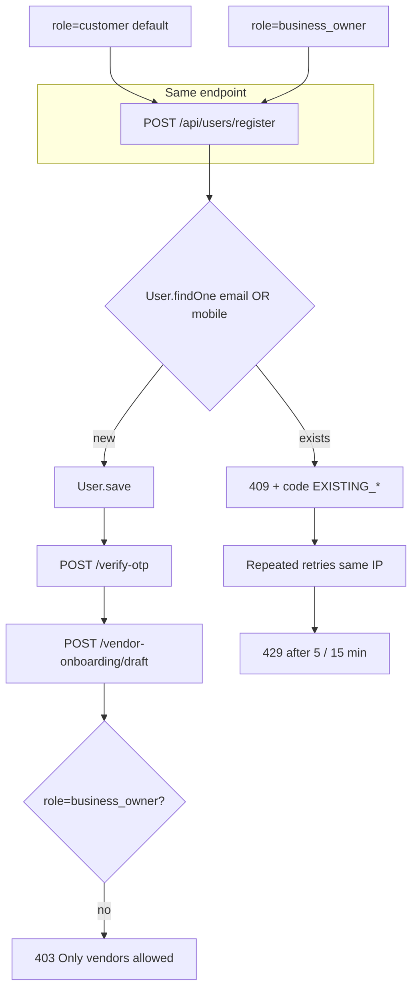

# Vendor Signup Duplicate Registration + Rate Limit Audit

**Branch:** `audit/vendor-signup-duplicate-rate-limit`  
**Recorded:** 2026-06-18  
**Context:** Launch smoke — customer signup succeeded; vendor signup with same email failed with duplicate message; repeated attempts hit rate limit.

No secrets in this document.

---

## Executive summary

**Root cause:** Customer and vendor account creation share a single endpoint (`POST /api/users/register`) and one `User` model with a **single role** field. There is **no customer → vendor upgrade path**. Re-registering with an email/phone already used by a customer returns a duplicate error; repeated retries exhaust the IP-based register rate limit (**5 requests / 15 minutes**).

This is **not** caused by partial `VendorOnboardingStage1` records blocking registration — onboarding rows are created only after authenticated `POST /api/vendor-onboarding/draft`.

**Fix applied (Fix A):** Structured duplicate responses with `code` fields (`EXISTING_CUSTOMER`, `EXISTING_VENDOR`, `USER_EXISTS`, `DUPLICATE_KEY`) and HTTP **409** instead of generic **400**.

**Not implemented (Fix B — separate approval):** Authenticated `customer` → `business_owner` role upgrade endpoint.

---

## Architecture

---

## Affected routes

| Flow | Route | Controller | Auth |
|------|-------|------------|------|
| Customer signup | `POST /api/users/register` | `registerUser` | Public + `registerLimiter` |
| Vendor account signup | **Same** (`role: business_owner`) | same | same |
| OTP verify | `POST /api/users/verify-otp` | `verifyOtp` | Public + `otpVerifyLimiter` |
| Vendor onboarding draft | `POST /api/vendor-onboarding/draft` | `saveDraft` | `authenticate` + `requireVerifiedVendor` |
| Google signup | `POST /api/auth/google/complete` | `completeGoogleProfile` | OAuth flow |

**Files:** [`routes/userRoutes.js`](../routes/userRoutes.js), [`controllers/userController.js`](../controllers/userController.js), [`routes/vendorOnboarding.routes.js`](../routes/vendorOnboarding.routes.js), [`middlewares/requireVerifiedVendor.js`](../middlewares/requireVerifiedVendor.js).

---

## Affected models and indexes

### User ([`models/User.js`](../models/User.js))

- **Shared** by customers and vendors
- **`role`:** enum `admin | customer | business_owner` — **single value, not multi-role**
- **Unique indexes:**
  - `{ email: 1 }`
  - `{ mobile: 1 }` (partial: non-empty string)
  - `{ provider: 1, providerId: 1 }` (OAuth)

Duplicate check at register: `User.findOne({ $or: [{ email }, { mobile }] })`.

### VendorOnboardingStage1 ([`models/VendorOnboardingStage1.js`](../models/VendorOnboardingStage1.js))

| Field | Constraint |
|-------|------------|
| `userId` | unique |
| `applicationId` | unique |
| Contact fields (`businessEmail`, `primaryPhone`, etc.) | **no unique indexes** |

Created on first authenticated `saveDraft`, **not** on failed register.

### Business / BusinessDraft

| Model | Relevant constraints |
|-------|---------------------|
| `Business` | `owner` indexed; `slug` unique |
| `BusinessDraft` | `businessName` unique; legacy checkout path |

Neither blocks `POST /register`.

---

## Partial records and retry blocking

| Scenario | User row created? | Blocks re-register? |
|----------|-------------------|---------------------|
| Duplicate email/mobile (pre-save check) | No | N/A |
| Successful register, OTP incomplete | Yes | Yes — duplicate on retry |
| Customer exists, vendor signup same email | Yes (`role=customer`) | Yes — no upgrade API |
| Race → Mongo E11000 | Possible | Was 500; now **409 DUPLICATE_KEY** |
| Abandoned onboarding draft | Onboarding row only | Does **not** block register |

---

## Rate limit configuration

[`routes/userRoutes.js`](../routes/userRoutes.js) — `buildAuthLimiter`:

| Route | max | window | Keying | Response |
|-------|-----|--------|--------|----------|
| `POST /register` | **5** | **15 min** | **IP** (default) | `{ success: false, message: 'Too many registration attempts...' }` |
| `POST /verify-otp` | 10 | 15 min | IP | separate message |
| `POST /resend-otp` | 5 | 15 min | IP | separate message |

- `standardHeaders: true` → `RateLimit-*` headers (RFC draft; no custom `Retry-After` body field)
- **All requests count** — duplicate **409** attempts still consume quota (no `skipFailedRequests`)
- **Vendor onboarding routes:** no rate limiters

See also [`docs/REQUEST_VALIDATION_RATE_LIMIT_AUDIT.md`](REQUEST_VALIDATION_RATE_LIMIT_AUDIT.md).

---

## Reproduction matrix (integration tests — not production)

| Case | Setup | Expected (after Fix A) |
|------|-------|------------------------|
| Fresh vendor email | No existing user | **201** |
| Existing customer + `role=business_owner` | User `role=customer` | **409** `EXISTING_CUSTOMER` |
| Existing vendor re-register | User `role=business_owner` | **409** `EXISTING_VENDOR` |
| Existing customer + `role=customer` | User `role=customer` | **409** `USER_EXISTS` |
| Mongo E11000 on save | Simulated race | **409** `DUPLICATE_KEY` |
| 6 register calls same IP | Live route test | 6th → **429** |

Tests: [`tests/auth/register-duplicate-vendor.test.js`](../tests/auth/register-duplicate-vendor.test.js).

---

## Error responses (after Fix A)

| Condition | HTTP | `code` | Message intent |
|-----------|------|--------|----------------|
| Customer exists, vendor signup | 409 | `EXISTING_CUSTOMER` | Log in to continue vendor setup |
| Vendor exists, re-register | 409 | `EXISTING_VENDOR` | Log in to continue onboarding |
| Other duplicate (e.g. admin) | 409 | `USER_EXISTS` | Generic duplicate |
| Mongo E11000 race | 409 | `DUPLICATE_KEY` | Generic duplicate |
| Rate limited | 429 | (none) | Too many registration attempts |
| Partial onboarding | N/A at register | — | Not checked at register |

---

## Frontend double-submit

**Cannot confirm from backend repo alone.** Each POST to `/register` passes through `registerLimiter` before the handler. Recommend frontend debounce/disable submit on `/signup?type=vendor` — verify in frontend repo.

---

## Recommended product behavior

| Question | Recommendation |
|----------|----------------|
| Should existing customer become vendor? | **Yes** — same person, one account |
| Should onboarding attach to existing user? | **Yes** — after `role=business_owner` + OTP verified |
| Should partial onboarding resume? | **Yes** — login + `GET /api/vendor-onboarding/draft` (requires vendor role today) |

**Gap:** No API to transition `customer` → `business_owner`. [`requireVerifiedVendor`](../middlewares/requireVerifiedVendor.js) rejects non-vendor roles.

**Fix B (future):** `POST /api/users/request-vendor-role` — authenticated, OTP-verified customer upgrades role. Not in this PR.

---

## Smoke-test guidance

1. **Vendor smoke token:** Provision a dedicated `business_owner` test account — do not reuse customer email ([#89](https://github.com/Techware-Hut/mosaic-backend/issues/89), [`docs/SMOKE_TEST_TOKENS.md`](SMOKE_TEST_TOKENS.md)).
2. **Fresh email:** Use a unique email for vendor-only signup if testing full registration flow.
3. **Rate limit cooldown:** After 5 failed register attempts from one IP, wait **15 minutes** before retrying.
4. **Do not delete production users** to unblock smoke.

---

## Remaining blockers

| Blocker | Owner | Action |
|---------|-------|--------|
| Vendor smoke token | Release owner | Provision `business_owner` account |
| Customer → vendor upgrade | Product + backend | Approve Fix B |
| Rate limit after retries | Smoke tester | Wait 15 min or use fresh IP |
| Frontend double-submit | Frontend team | Verify submit lock on vendor form |
| Sentry dashboard | Release owner | [#18](https://github.com/Techware-Hut/mosaic-backend/issues/18) |

---

## References

- [`docs/VENDOR_LIFECYCLE.md`](VENDOR_LIFECYCLE.md)
- [`docs/BACKEND_NEXT_LAUNCH_HARDENING_BATCH.md`](BACKEND_NEXT_LAUNCH_HARDENING_BATCH.md)
- [`docs/launch-readiness-report.md`](launch-readiness-report.md) — `/signup?type=vendor`
