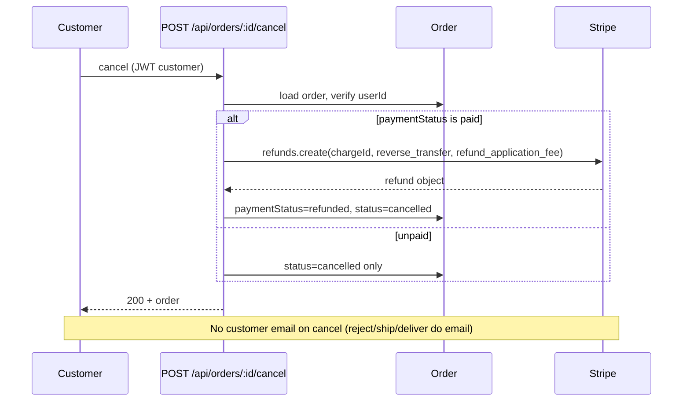
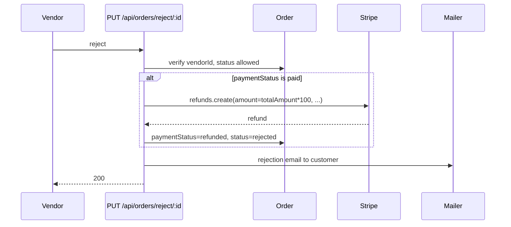
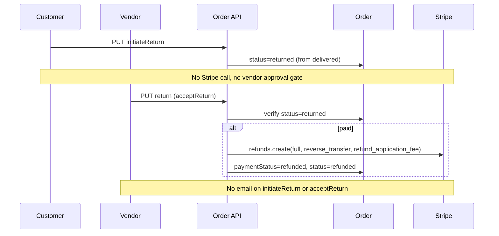
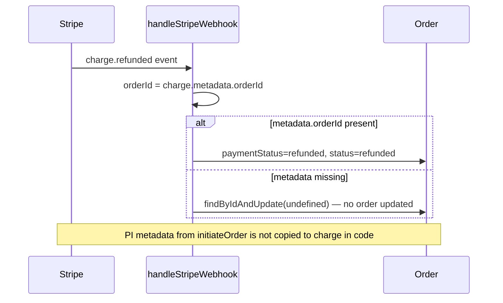

# Backend refund, return, and dispute — as-built audit

**Issue:** #168 (Wave 6) · **Parent:** #162  
**Branch:** `audit/backend-refund-dispute-as-built`  
**Scope:** Audit and documentation only — no changes to Stripe refund logic, transfer reversals, payment intents, application fees, Connect payouts, subscriptions, webhooks, or financial status transitions.

**Audit date:** 2026-06-21  
**Repository:** `Techware-Hut/mosaic-backend`

---

## Executive summary

Marketplace order refunds are implemented as **inline Stripe `refunds.create` calls** in three order-controller paths (vendor reject, customer cancel, vendor accept return). All three use **`reverse_transfer: true`** and **`refund_application_fee: true`**. There is **no partial/line-item refund**, **no admin refund/mediation API**, **no dispute webhook handling**, and **no use of the `Refund` Mongoose model** despite its schema existing.

Return flow is **status-only** on customer initiation (`delivered` → `returned`); Stripe is not touched until the vendor accepts the return.

**Highest-risk gaps:**

1. **`charge.refunded` webhook** looks up `charge.metadata.orderId`, but checkout metadata is set on the **PaymentIntent** only — charge metadata may be empty, so webhook-driven reconciliation may not update the order (confirmed in unit test).
2. **No duplicate-refund idempotency** — no stored Stripe refund IDs, no idempotency keys, no `Refund` documents.
3. **No automated integration tests** for cancel/reject/acceptReturn against Stripe test mode (audit tests are static/route-level only).

---

## As-built route and data inventory

### HTTP routes

| Method | Path | Auth middleware | Role | Handler | Stripe side effect |
|--------|------|-----------------|------|---------|-------------------|
| `POST` | `/api/orders/initiate` | `authenticate`, `isCustomer` | customer | `initiateOrder` | Creates PI with `metadata.orderId`, destination charge + app fee |
| `GET` | `/api/orders/retrieve-intent/:id` | `authenticate` | any | `retrievePaymentIntent` | Read PI status |
| `POST` | `/api/orders/:orderId/cancel` | `authenticate`, `isCustomer` | customer | `cancelOrderByUser` | Full refund if `paymentStatus === 'paid'` |
| `PUT` | `/api/orders/reject/:orderId` | `authenticate`, `isBusinessOwner` | vendor | `rejectOrder` | Full refund if paid |
| `PUT` | `/api/orders/initiateReturn/:orderId` | `authenticate`, `isCustomer` | customer | `initiateReturn` | **None** — sets `status: returned` |
| `PUT` | `/api/orders/return/:orderId` | `authenticate`, `isBusinessOwner` | vendor | `acceptReturn` | Full refund if paid |
| `PUT` | `/api/orders/ship/:orderId` | `authenticate`, `isBusinessOwner` | vendor | `shipOrder` | None |
| `PUT` | `/api/orders/deliver/:orderId` | `authenticate`, `isBusinessOwner` | vendor | `deliverOrder` | None |
| `GET` | `/api/orders/admin` | `authenticate`, `isAdmin` | admin | `getAllOrdersAdmin` | Read-only list |
| `GET` | `/admin/api/orders` | `authenticate`, `isAdmin` | admin | `getAllOrdersAdmin` | Read-only alias |

**Not present:** admin refund, admin dispute mediation, damaged/lost shipment endpoints, partial refund, return approval queue.

### Webhooks (order financial sync)

| Route | Handler | Events used for orders |
|-------|---------|------------------------|
| `POST /api/webhooks/stripe` | `handleStripeWebhook` | `payment_intent.succeeded`, `payment_intent.payment_failed`, `charge.refunded` |

Other Stripe webhooks (`/api/stripe/webhook`, payment webhook, subscription, vendor onboarding) do **not** implement order refund/dispute flows.

### Data models

#### `Order` (`models/Order.js`)

| Field | Relevance |
|-------|-----------|
| `status` | Includes `cancelled`, `returned`, `refunded`, `rejected`, lifecycle states |
| `paymentStatus` | `pending` \| `paid` \| `failed` \| `refunded` |
| `statusHistory` | Append-only audit trail on transitions |
| `items[].chargeId`, `transferId`, `applicationFeeId` | Populated post-payment (webhook / retrieve flow) — **not** updated on refund |
| `totalAmount` | Stored in **major currency units** (USD dollars); Stripe calls use `* 100` |

#### `Refund` (`models/Refund.js`)

Schema exists (PayPal-era fields: `refundStatus`, `paypalRefundId`, etc.) but **is never imported** in controllers or webhooks. Refunds are not persisted locally.

---

## Authorization matrix

| Capability | Who | Route | Controller guard | Notes |
|------------|-----|-------|------------------|-------|
| Cancel order | Customer | `POST /api/orders/:orderId/cancel` | `order.userId === req.user._id`; blocks if `shipped`/`delivered` | Refunds when paid |
| Initiate return | Customer | `PUT /api/orders/initiateReturn/:orderId` | Same user ownership; requires `status === 'delivered'` | Immediately sets `returned` |
| Accept return + refund | Vendor | `PUT /api/orders/return/:orderId` | `order.vendorId === req.user._id`; requires `status === 'returned'` | |
| Reject + refund | Vendor | `PUT /api/orders/reject/:orderId` | Vendor ownership | Allowed from early statuses (not shipped/delivered) |
| Ship / deliver | Vendor | `PUT .../ship`, `.../deliver` | Vendor ownership | No refund |
| List all orders | Admin | `GET /api/orders/admin`, `/admin/api/orders` | `isAdmin` | **No write/refund** |
| Stripe webhook | Stripe | `POST /api/webhooks/stripe` | Signature verification | No user JWT |

**Gap:** No admin role can force refund, mediate dispute, or override vendor/customer deadlock.

---

## Sequence diagrams

### Customer cancellation (paid order)



### Vendor reject (paid order)



### Return flow (two-step)



### Webhook `charge.refunded` (as-built)



---

## Gap matrix

Classification key:

- **Implemented and tested** — code path exists; automated test covers behavior
- **Implemented; runtime proof needed** — code exists; not verified in Stripe test mode or E2E
- **Confirmed bug** — code review / test shows incorrect behavior
- **Client policy decision needed** — product/legal choice before implementation
- **Future phase / change request** — intentionally out of scope
- **Absent** — no implementation

| Capability | Classification | Evidence |
|------------|----------------|----------|
| Customer cancellation | Implemented; runtime proof needed | `cancelOrderByUser` — no dedicated test; static audit confirms refund flags |
| Vendor rejection + refund | Implemented; runtime proof needed | `rejectOrder`; vendor email sent |
| Return request (customer) | Implemented; runtime proof needed | `initiateReturn` sets `returned` immediately — **policy**: no pending/approval state |
| Vendor accept return + full refund | Implemented; runtime proof needed | `acceptReturn` |
| Full refund (all paths) | Implemented; runtime proof needed | Always full order amount; cancel omits amount (= full charge) |
| Partial / line-item refund | **Absent** | No amount/line parameters; single `totalAmount` |
| Duplicate refund protection | **Confirmed bug** (risk) | Status guards help but no Stripe idempotency key, no refund ID storage, race possible |
| Damaged shipment | **Absent** | No route or status |
| Lost shipment | **Absent** | No route or status |
| Delivery dispute | **Absent** | No dispute object or workflow |
| Admin mediation / refund | **Absent** | Admin routes list only |
| Connected-account transfer reversal | Implemented; runtime proof needed | `reverse_transfer: true` on all refund creates |
| Application fee handling on refund | Implemented; runtime proof needed | `refund_application_fee: true` |
| Status synchronization (inline + webhook) | **Confirmed bug** (partial) | Inline updates work; `charge.refunded` depends on charge metadata |
| Notification on refund/cancel/return | **Client policy decision needed** | Reject/ship/deliver email; cancel/return paths silent |
| Reconciliation / audit trail | **Absent** (partial webhook) | No `Refund` records; item-level Stripe IDs not cleared on refund |
| Stripe dispute webhooks | **Absent** | No `charge.dispute.*` handlers |
| `Refund` model persistence | **Absent** | Orphan schema |
| Frontend contract documentation | **Future phase** | `BACKEND_FRONTEND_ROUTE_CONTRACT.md` documents initiate/admin list only — cancel/return/reject undocumented |

---

## Financial-risk notes

1. **Double refund:** If two requests pass status checks before either saves (or user retries after partial failure), duplicate `refunds.create` calls are possible. No idempotency keys or unique index on Stripe refund ID.

2. **Webhook desync:** Refunds initiated in-app set `paymentStatus` locally; Stripe may also emit `charge.refunded`. If webhook runs with missing `charge.metadata.orderId`, order state relies entirely on inline update — usually OK for happy path, but external/dashboard refunds may not sync.

3. **Amount consistency:** `rejectOrder` passes explicit `amount: Math.round(order.totalAmount * 100)`; `cancelOrderByUser` and `acceptReturn` omit amount (Stripe defaults to full charge). All should be equivalent for single-charge orders but behavior differs if partial charges existed (they do not today).

4. **Connect reversal:** Refunds use platform Stripe client with `reverse_transfer: true` — correct pattern for destination charges; **not proven** against live Connect test accounts in this audit.

5. **Application fee:** `refund_application_fee: true` — fee returned to platform on full refund; **not proven** in Stripe test mode here.

6. **Stock restoration:** `cancelOrderByUser` restores inventory only when prior status was `accepted`; reject/return paths do not consistently restore stock — **policy/reconciliation risk**.

7. **Unused vendor Stripe lookup:** `rejectOrder` loads `vendorStripeAccountId` but refund does not use it (platform refund with reversal is correct); dead code only.

8. **Payment failure webhook:** `payment_intent.payment_failed` sets order `cancelled` — distinct from refund flow.

---

## Policy decisions required (client)

| # | Question | Current behavior |
|---|----------|------------------|
| P1 | Should customer `initiateReturn` create a **pending** return vs immediately `returned`? | Immediate `returned`; vendor cannot reject return request |
| P2 | Should cancel/acceptReturn/initiateReturn send **email notifications**? | Only reject/ship/deliver notify |
| P3 | Are **partial refunds** (damaged item, shipping only) required? | Not supported |
| P4 | Who resolves **lost/damaged in transit** — vendor, platform, or insurer? | No workflow |
| P5 | Should **admin** override refunds or mediate disputes? | No admin actions |
| P6 | Should returns **restore inventory** on refund completion? | Only cancel-from-accepted restores stock |
| P7 | Persist **Refund** documents for finance/reporting? | Schema unused |
| P8 | Handle **Stripe chargebacks/disputes** automatically? | No handlers |

---

## Test matrix

| Area | Existing tests | Added in this audit | Stripe test mode |
|------|----------------|---------------------|------------------|
| `payment_intent.succeeded` / failed | `tests/stripe/order-webhook-handlers.test.js` | — | Not run |
| Post-payment charge/transfer IDs | Same | — | Not run |
| `charge.refunded` webhook | None | `tests/stripe/order-refund-webhook-handlers.test.js` | Mocked only |
| Route registration cancel/return/reject | None | `tests/audit/refund-return-dispute-routes.test.js` | N/A |
| Refund Stripe options (static) | None | Same audit file | N/A |
| `Refund` model unused | None | Same audit file | N/A |
| `rejectOrder` / `cancelOrderByUser` / `acceptReturn` HTTP | None | **Not added** (would require Stripe mock refactor) | Not run |
| Vendor reject E2E | None | — | Not run |
| Connect transfer reversal proof | None | — | **Not proven** |
| Application fee refund proof | None | — | **Not proven** |

**Commands run:**

```bash
npm test
npm run test:contract
```

---

## Recommended follow-up issues

| Priority | Title | Rationale |
|----------|-------|-----------|
| P0 | Fix `charge.refunded` order lookup (use PI or persist charge→order mapping) | Webhook reconciliation broken when charge metadata empty |
| P0 | Add refund idempotency (store `stripeRefundId`, guard `paymentStatus`) | Prevent double refund |
| P1 | Document cancel/return/reject in frontend route contract | Frontend integration gap |
| P1 | Stripe test-mode E2E: reject, cancel, acceptReturn with Connect account | Prove reversal + app fee |
| P2 | Wire or remove `Refund` model; persist refund records | Finance audit trail |
| P2 | Return workflow: pending → approved vs immediate `returned` | Product policy P1 |
| P2 | Email notifications for cancel/return/refund completion | Policy P2 |
| P3 | Admin refund/mediation API | Policy P5 |
| P3 | Dispute webhooks + admin queue | Chargeback handling |
| P3 | Partial/line-item refund design | Policy P3 |
| P3 | Lost/damaged shipment workflows | Policy P4 |

---

## Frontend API expectations (current)

Documented in `docs/BACKEND_FRONTEND_ROUTE_CONTRACT.md`:

- `POST /api/orders/initiate` — checkout
- `GET /api/orders/retrieve-intent/:id` — poll payment
- Admin list: `/api/orders/admin`, `/admin/api/orders`

**Undocumented but implemented** (frontend must discover from code or this audit):

- `POST /api/orders/:orderId/cancel`
- `PUT /api/orders/initiateReturn/:orderId`
- `PUT /api/orders/return/:orderId`
- `PUT /api/orders/reject/:orderId`
- Vendor: `ship`, `deliver`

---

## What was NOT proven in Stripe test mode

This audit did **not** execute live Stripe test-mode refunds. The following remain unverified at runtime:

- Actual **transfer reversal** on connected accounts after refund
- **`refund_application_fee`** crediting behavior on destination charges
- End-to-end **reject / cancel / acceptReturn** with real PaymentIntent + Charge IDs
- **`charge.refunded`** webhook delivery with production-like metadata
- **Duplicate refund** behavior under concurrent requests
- **Dashboard-initiated** refund syncing to MongoDB order state
- Any **dispute** lifecycle (not implemented)

Evidence for this audit is **static code review**, **existing unit tests**, and **new non-invasive audit tests** (route registration, refund option flags, mocked `charge.refunded` handler).

---

## Files touched by this audit (documentation + tests only)

- `docs/audit/BACKEND_REFUND_RETURN_DISPUTE_AS_BUILT_AUDIT.md` (this file)
- `tests/audit/refund-return-dispute-routes.test.js`
- `tests/stripe/order-refund-webhook-handlers.test.js`

No changes to payment controllers, webhook business logic, or Stripe API call parameters.
