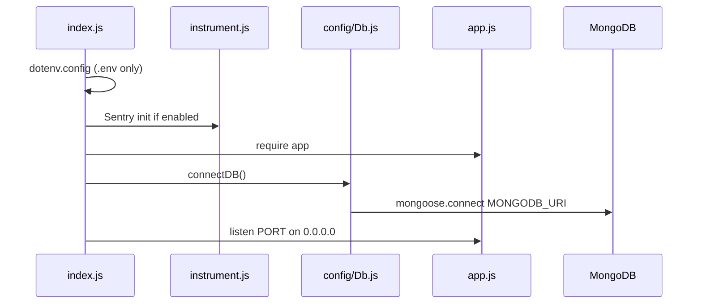

# Backend Architecture — As-Built

**Pack:** Launch readiness evidence · **Repo:** Techware-Hut/mosaic-backend  
**Evidence date:** 2026-06-19 · **Sources:** [`index.js`](../../index.js), [`app.js`](../../app.js), [`config/Db.js`](../../config/Db.js), [`instrument.js`](../../instrument.js)

---

## Executive summary

| Item | As-built value |
| --- | --- |
| Package | `mosaic-biz-hub` v1.0.0 |
| Purpose | REST API for Mosaic Biz Hub — minority-owned business marketplace |
| Stack | Node.js + Express 5 + MongoDB (Mongoose) |
| Language | JavaScript (CommonJS), no TypeScript build step |
| Entry | `index.js` → `app.js` |
| Default port | `3001` (`PORT`) |
| Production API | `https://api.mosaicbizhub.com` |
| Deploy | AWS Elastic Beanstalk (`us-east-1`), manual GHA from `main` |

**Not in this repo:** Supabase/Postgres, GraphQL, tRPC, hosted staging backend.

---

## Bootstrap sequence



1. Windows DNS workaround (8.8.8.8 / 1.1.1.1) for MongoDB SRV on Windows
2. `require('dotenv').config()` — loads **`.env` only** (not `.env.local`)
3. `require('./instrument')` — optional Sentry
4. `require('./app')` — Express app assembly
5. `connectDB()` — exits process if MongoDB unavailable
6. `app.listen(PORT || 3001, '0.0.0.0')`

---

## Layer pattern

```
HTTP → app.js (global middleware)
     → routes/*.js (per-route middleware)
     → controllers/*.js (business logic)
     → models/*.js | utils/*.js | services/*.js
     → MongoDB | Stripe | S3 | SMTP | Google APIs
```

| Layer | Count | Role |
| --- | --- | --- |
| Route files | 48 | URL namespaces; mount in `app.js` |
| Controllers | ~53 | Primary business logic |
| Models | 38 | Mongoose schemas (= DB layer) |
| Middlewares | 9 | Auth, roles, upload, Sentry |
| Services | 4 | Listing aggregation, reviews, invoice PDF |
| Utils | 33 | Mail, cookies, tax, shipping, onboarding sync |
| lib/listing | 4 | Public DTOs, search filters, ranking |

**Pattern:** Controller-centric monolith. No repository layer. No global auth middleware.

---

## Global middleware order (verified)

Order in [`app.js`](../../app.js):

| # | Middleware | Lines |
| --- | --- | --- |
| 1 | `trust proxy` (1) | 94 |
| 2 | `sentryHttpCapture` | 95 |
| 3 | `cors` (credentials, allowlist) | 96–107 |
| 4 | `cookieParser()` | 113 |
| 5 | Stripe webhooks with `express.raw()` **before** JSON | 120–128 |
| 6 | `express.json({ limit: '1mb' })` | 130 |
| 7 | `mongoSanitize` on body + params | 132–139 |
| 8 | `xss-clean` on body + params | 141–148 |
| 9 | Feature routers | 151–237 |
| 10 | `GET /` inline | 242–244 |
| 11 | Sentry error handler (if enabled) | 252–254 |

**Critical:** Stripe webhook routes must stay before `express.json()` or signature verification fails.

---

## Route mount registry

| Prefix | Route module | app.js line |
| --- | --- | --- |
| `/api/stripe` | `routes/stripeRoutes.js` | 120 |
| `/api/webhooks` | `routes/webhookRoutes.js` | 121 |
| `/api/vendor-onboarding/webhook/payment` | inline webhook handler | 122–125 |
| `/api/subscription/webhook` | inline webhook handler | 126–128 |
| `/api` | `routes/healthRoutes.js` | 151 |
| `/api/product` | `routes/productRoutes.js` | 154 |
| `/api` | `routes/publicListing.js` | 155 |
| `/api/private` | `routes/privateListing.js` | 156 |
| `/api/users` | `routes/userRoutes.js` | 157 |
| `/api/business` | `routes/businessRoutes.js` | 158 |
| `/api/vendor-onboarding` | `routes/vendorOnboarding.routes.js` | 159 |
| `/admin/vendor-onboard-verify-stage1` | same router (duplicate) | 160 |
| `/api/subscription-plans` | `routes/subscriptionPlanRoutes.js` | 161 |
| `/api/service` | `routes/serviceRoutes.js` | 162 |
| `/api/food` | `routes/foodRoutes.js` | 163 |
| `/api/minority-types` | `routes/minorityTypeRoutes.js` | 164 |
| `/api` | `routes/uploadImage.js` | 165 |
| `/api/subscriptions` | `routes/subscriptionRoutes.js` | 166 |
| `/api` | `routes/categoryRoutes.js`, `subcategoryRoutes.js` | 167–168 |
| `/api/cms`, `/cms` | `routes/admin/cmsRoutes.js` (duplicate) | 170, 175 |
| `/admin/users` | `routes/admin/userRoutes.js` | 179 |
| `/admin/faqs` | `routes/admin/faqRoutes.js` | 180 |
| `/api/admin/testimonials` | `routes/admin/testimonialRoutes.js` | 181 |
| `/admin/api/blogs` | `routes/admin/Blog/blogRoutes.js` | 182 |
| `/admin/api/business`, `/api/admin/business` | `routes/admin/businessRoutes.js` (duplicate) | 183–184 |
| `/admin/api/products` | `routes/admin/adminProductRoutes.js` | 185 |
| `/api/business-profile` | `routes/businessProfileRoutes.js` | 186 |
| `/api/admin/category/*` | admin category routers | 187–193 |
| `/admin/business-profile-verify` | `routes/admin/businessProfileVerifyRoutes.js` | 196 |
| `/api/discounts` | `routes/discounts.js` | 202 |
| `/api/wishlist` | `routes/customer/wishlistRoutes.js` | 206 |
| `/api/cart` | `routes/customer/cartRoutes.js` | 207 |
| `/api/payments` | `routes/paymentRoutes.js` | 212 |
| `/api/orders` | `routes/orderRoutes.js` | 213 |
| `/api/bookings` | `routes/bookingRoutes.js` | 214 |
| `/api/connect` | `routes/connectRoutes.js` | 215 |
| `/stripe` | `routes/stripe.routes.js` | 222 |
| `/api` | `routes/api.routes.js` (billing) | 228 |
| `/api/google-places` | `routes/googlePlace.js` | 233 |
| `/api` | `routes/featuredProductRoutes.js` | 234 |
| `/api/contact-inquiry` | `routes/contactInquiryRoutes.js` | 235 |
| `/api/auth` | `routes/authRoutes.js` | 236 |
| `/api/enquiries` | `routes/enquiryRoutes.js` | 237 |

**Unmounted (dead):** [`routes/cms/cmsRoutes.js`](../../routes/cms/cmsRoutes.js) — not registered in `app.js`.

---

## External integrations

| Service | Purpose | Key env var names |
| --- | --- | --- |
| MongoDB Atlas | Primary database | `MONGODB_URI` |
| Stripe | Orders, Connect, subscriptions, vendor verification | `STRIPE_SECRET_KEY`, 5× webhook secrets |
| AWS S3 | Product images, vendor documents | `AWS_REGION`, `AWS_ACCESS_KEY_ID`, `AWS_SECRET_ACCESS_KEY`, `AWS_S3_BUCKET` |
| SMTP email | Auth OTP provider-neutral SMTP + legacy transactional mail | `MAIL_USER`, `MAIL_PASSWORD`, optional `MAIL_HOST`, `MAIL_PORT`, `MAIL_SECURE`, `MAIL_FROM`, `ADMIN_EMAIL` |
| Google OAuth | Social login | `GOOGLE_CLIENT_ID`, `GOOGLE_CLIENT_SECRET`, `API_BASE_URL` |
| Google Geocoding | Address/geo | `GOOGLE_GEOCODING_API_KEY` |
| Cloudinary | Legacy image URLs | `CLOUDINARY_*` |
| Sentry | Error monitoring (optional) | `SENTRY_DSN`, `SENTRY_ENABLED` |
| Puppeteer | Invoice PDF | `PUPPETEER_EXECUTABLE_PATH` |

**Unused deps in package.json:** `passport`, `passport-facebook`, `passport-google-oauth20` (Google auth uses `google-auth-library` directly).

---

## Roles

| Role | Enum | Typical access |
| --- | --- | --- |
| Customer | `customer` | Cart, wishlist, orders, bookings, reviews |
| Vendor | `business_owner` | Business, listings, Connect, vendor orders |
| Admin | `admin` | Users, vendor review, CMS, categories |

---

## Related docs

- Full route inventory: [BACKEND_ROUTE_REGISTRATION.md](BACKEND_ROUTE_REGISTRATION.md)
- API contracts: [API_CONTRACT_AS_BUILT.md](API_CONTRACT_AS_BUILT.md)
- Canonical reference: [`../API_SURFACE.md`](../API_SURFACE.md)
