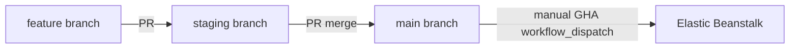

# Backend Deployment Runbook — Draft

**Status:** DRAFT — launch readiness evidence pack  
**Canonical ops doc:** [`../PRODUCTION_RUNBOOK.md`](../PRODUCTION_RUNBOOK.md)  
**Evidence date:** 2026-06-19

---

## Production URLs

| URL | Use |
| --- | --- |
| `https://api.mosaicbizhub.com` | **Supported production API** — smoke, webhooks, OAuth |
| `https://app.mosaicbizhub.com` | Typical frontend (CORS, redirects) |
| `http://mosaic-backend.us-east-1.elasticbeanstalk.com/` | EB raw HTTP health (optional) |

**Do not use** `https://mosaic-backend.us-east-1.elasticbeanstalk.com` for prod smoke — TLS CN mismatch.

---

## AWS Elastic Beanstalk (as-built)

| Item | Value |
| --- | --- |
| Region | `us-east-1` |
| Application | `mosaic-biz-hub-backend` |
| Environment | `mosaic-backend-env` |
| Process | `npm start` → `node index.js` |
| Port | `PORT` env (EB typically `8080`) |

---

## Branch and deploy flow

| Branch | Deploy target |
| --- | --- |
| `feature/*` | Local dev only |
| `staging` | **None** — integration gate only |
| `main` | EB production (manual deploy) |

**Note:** Push-to-main auto-deploy is **disabled** in [`.github/workflows/deploy-eb-production.yml`](../../.github/workflows/deploy-eb-production.yml). Deploy via manual `workflow_dispatch`.

---

## Pre-deploy checklist

1. PR merged to `main` with human approval
2. `npm ci && npm test` passes locally or in CI
3. EB env var names verified (see [BACKEND_ENVIRONMENT_VARIABLES_NAMES_ONLY.md](BACKEND_ENVIRONMENT_VARIABLES_NAMES_ONLY.md))
4. No open P0 blockers in [`../launch-readiness-report.md`](../launch-readiness-report.md)

---

## CI (automated)

Workflow: [`.github/workflows/ci.yml`](../../.github/workflows/ci.yml)

- Trigger: PR/push to `main`, `staging`
- Steps: `npm ci` → `npm test` (Node 18)

---

## Production deploy (manual)

Workflow: [`.github/workflows/deploy-eb-production.yml`](../../.github/workflows/deploy-eb-production.yml)

1. Trigger `workflow_dispatch` on `main`
2. `npm ci` + `npm test`
3. Zip source → deploy to EB
4. Post-deploy health/CORS probes against `PRODUCTION_API_URL`

**This documentation pack does not deploy.** No deploy was run for this branch.

---

## Post-deploy smoke

Use [`../production-smoke-checklist.md`](../production-smoke-checklist.md) tiers P0–P6:

| Tier | Examples |
| --- | --- |
| P0 | `GET /`, `GET /api/health`, `GET /api/ready`, `GET /api/build-info`, release identity on health/build-info |
| P1 | Auth check 401/200, CORS preflight |
| P4 | Stripe webhook negative tests (unsigned → 400) |
| P6 | Public search, featured products |

Wrapper: `npm run smoke:backend` → `scripts/smoke-backend.ps1` / `.sh`

---

## Rollback

See [`../../DEPLOYMENT.md`](../../DEPLOYMENT.md) — EB version rollback via AWS console or redeploy prior version label.

After rollback, realign release identity env vars (`RELEASE_COMMIT_SHA`, `RELEASE_ENVIRONMENT`, `DEPLOYMENT_VERSION_LABEL`, `SENTRY_RELEASE`) to the restored EB version label and verify `/api/health` → `release.deploymentVersion`. Details: [BACKEND_RELEASE_IDENTITY.md](BACKEND_RELEASE_IDENTITY.md).

---

## npm scripts (as-built)

| Command | Purpose |
| --- | --- |
| `npm start` | Production: `node index.js` |
| `npm run dev` | Dev: `nodemon index.js` |
| `npm test` | `node --test tests/**/*.test.js` |
| `npm run smoke:backend` | Post-deploy smoke wrapper |

No separate build step (plain JavaScript).

---

## Evidence needed

| Item | Owner |
| --- | --- |
| Current production deploy SHA / EB version label | Release owner |
| EB env var audit completion | AWS owner |
| Stripe webhook URLs pointing to prod API | Stripe admin |
| Go/No-Go sign-off record | [`../production-proof-pack-template.md`](../production-proof-pack-template.md) |

---

## Related docs

- [`../../DEPLOYMENT.md`](../../DEPLOYMENT.md)
- [`../PRODUCTION_RUNBOOK.md`](../PRODUCTION_RUNBOOK.md)
- [`../production-env-checklist.md`](../production-env-checklist.md)
- [`../stripe-webhook-registration.md`](../stripe-webhook-registration.md)
