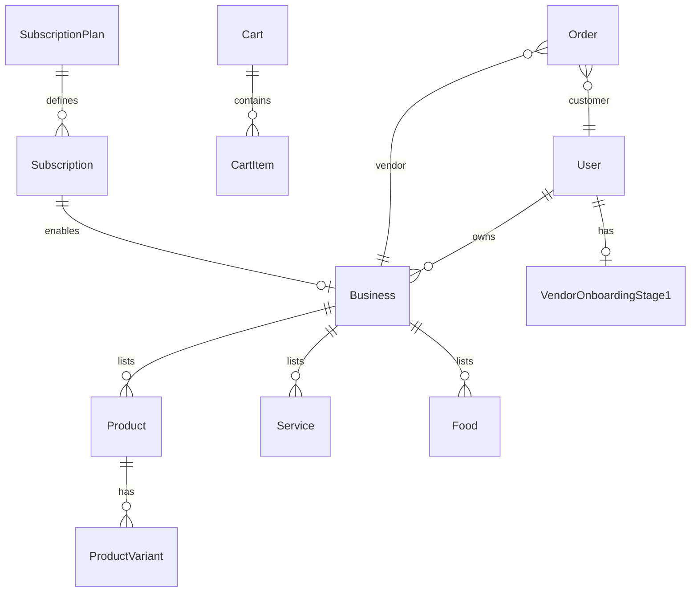

# Data Model Dictionary — As-Built

**Database:** MongoDB via Mongoose (38 models in [`models/`](../../models/))  
**Evidence date:** 2026-06-19  
**Access control:** Application-layer only (no RLS). Middleware + controller ownership checks.

---

## Core relationships

---

## Identity

### User (`users`)

| Field | Type | Notes |
| --- | --- | --- |
| `name`, `email`, `mobile` | String | Email unique index |
| `passwordHash` | String | bcrypt; local provider |
| `role` | enum | `admin`, `customer`, `business_owner` |
| `provider` | enum | `local`, `google`, `facebook` |
| `providerId` | String | OAuth |
| `otp`, `otpExpiry`, `isOtpVerified` | | Registration OTP |
| `resetPasswordOtp*`, `resetPasswordOtpAttempts` | | Password reset |
| `sessionVersion` | Number | JWT invalidation on reset |
| `isBlocked`, `isDeleted` | Boolean | Account state |
| `badge`, `gender`, `profileImage` | | Profile |

**Indexes:** unique `email`; partial unique `mobile`, `{ provider, providerId }`

### Address (`addresses`)

Shipping fields; ref → `User`.

---

## Business and onboarding

### Business (`businesses`)

| Field | Type | Notes |
| --- | --- | --- |
| `owner` | ObjectId → User | required |
| `businessName`, `slug` | String | auto slug |
| `listingType` | enum | `product`, `service`, `food` |
| `subscriptionId` | ObjectId → Subscription | required |
| `stripeConnectAccountId` | String | Connect Express |
| `chargesEnabled`, `payoutsEnabled`, `capabilities` | | Connect status |
| `onboardingStatus`, `onboardedAt` | | Connect lifecycle |
| `isActive`, `isApproved` | Boolean | Checkout gates |
| `taxSettings`, `shippingSettings` | Object | Vendor tax/shipping |
| `usage` | Object | Plan tier counters |
| `address`, `socialLinks`, `logo`, `coverImage` | | Profile |

**Indexes:** `owner`, `subscriptionId`, `2dsphere` location, `tags`, `{ isActive, isApproved }`

### VendorOnboardingStage1 (`vendoronboardingstage1s`)

| Field | Type | Notes |
| --- | --- | --- |
| `userId` | ObjectId → User | unique per user |
| `applicationId` | String | auto `MBH-APP-...` on save |
| `status` | enum | `draft`, `submitted`, `verified`, `rejected`, `payment_pending` |
| `verificationPayment` | Object | Stripe PI status |
| `businessProfile`, `documents`, `checklist` | | Stage-1 payload |
| `businessId` | ObjectId → Business | optional after finalize |

### BusinessDraft (`businessdrafts`)

Pre-checkout form; **TTL index** on `expiresAt` (15 min).

### BusinessProfile (`businessprofiles`)

Legacy step 3/4 verification; points, badge, verified questions.

### BusinessEnquiry (`businessenquiries`)

Unique `{ businessId, customerId, source }` — contact reveal tracking.

### MinorityType (`minoritytypes`)

`name`, `description`; referenced by Business, Food.

---

## Catalog

### Product (`products`)

| Field | Notes |
| --- | --- |
| `title`, `slug`, `description` | |
| `businessId`, `ownerId` | refs |
| `categoryId`, `subcategoryId` | taxonomy |
| `isPublished`, `isDeleted`, `isFeatured` | visibility |
| `taxSettings`, `attributes` | |

**Indexes:** featured/publish compounds (see model)

### ProductVariant (`productvariants`)

| Field | Notes |
| --- | --- |
| `productId`, `businessId`, `ownerId` | |
| `sku`, `stock`, `price`, `salePrice` | |
| `attributes` (color, size map) | |

### Service (`services`)

Nested `services[]`, booking fields, `categoryId`, ratings (post-save hook).

### Food (`foods`)

Menu, `location` (geo), table types, slots, minority type refs.

### Categories / Subcategories

`ProductCategory`, `ProductSubcategory`, `ServiceCategory`, `ServiceSubcategory`, `FoodCategory`, `FoodSubcategory` — name, slug, parent ref.

### CategoryRequest (`categoryrequests`)

Vendor-requested new categories; approval refs.

### Review (`reviews`)

Polymorphic: `{ userId, listingId, listingType }` unique — one review per user per listing.

### PendingImage (`pendingimages`)

Cloudinary URL cleanup queue.

---

## Commerce

### Cart / CartItem (`carts`, `cartitems`)

Per `userId` + `businessId`; items ref `Product`, `ProductVariant`.

### Wishlist (`wishlists`)

Unique `{ customerId, productVariantId }`.

### Order (`orders`)

| Field | Notes |
| --- | --- |
| `groupOrderId` | UUID grouping |
| `userId`, `vendorId`, `businessId` | refs |
| `items[]` | embedded line items with tax snapshot |
| `totalAmount`, `subtotalAmount`, `taxSummary` | |
| `shippingAddress`, `shipping` | delivery speed, tiers |
| `status`, `statusHistory` | lifecycle |
| `paymentStatus`, `paymentId`, `paymentMethod` | Stripe |
| `chargeId`, `transferId` on items | post-webhook |

**Indexes:** `{ userId, vendorId, status }`, `{ groupOrderId }`

### Refund (`refunds`)

Line-item refunds → Order, ProductVariant.

### Booking (`bookings`)

Service or food bookings; refs Service/Food, User, Business.

### Discounts (`discounts`)

Per-business coupons; unique `couponCode`.

### Offer / OfferRedemption / OfferAttempt

Platform offers + usage tracking.

---

## Subscriptions

### SubscriptionPlan (`subscriptionplans`)

Silver/Gold/Platinum tiers; Stripe product/price IDs; listing limits.

### Subscription (`subscriptions`)

Stripe subscription ref; dates; links User, Business, SubscriptionPlan.

---

## CMS and content

| Model | Purpose |
| --- | --- |
| CMS | Slug enum pages (privacy, terms); sections |
| Blog | Title, slug, content, featured/publish flags |
| FAQ | Q&A pairs |
| Testimonial | Name, role, content, image |
| ContactInquiry | Public contact form submissions |

---

## Schema hooks (as-built)

| Model | Hook | Behavior |
| --- | --- | --- |
| Product, Business, Service, Food, categories, Blog | `pre('save')` | Auto slug |
| VendorOnboardingStage1 | `pre('save')` | Generate `applicationId` |
| BusinessProfile | `pre('save')` | Recalculate verification points |
| BusinessDraft | TTL index | Auto-delete expired |
| User, Business, etc. | `pre('validate')` | Normalize Bronze badge → Silver |

Full index audit: [`../DATABASE_INDEX_AUDIT.md`](../DATABASE_INDEX_AUDIT.md)

---

## Evidence needed

- Production MongoDB collection counts and index build status (Atlas console)
- Whether all 38 models are actively used in live flows vs legacy (BusinessProfile vs VendorOnboardingStage1 overlap)
