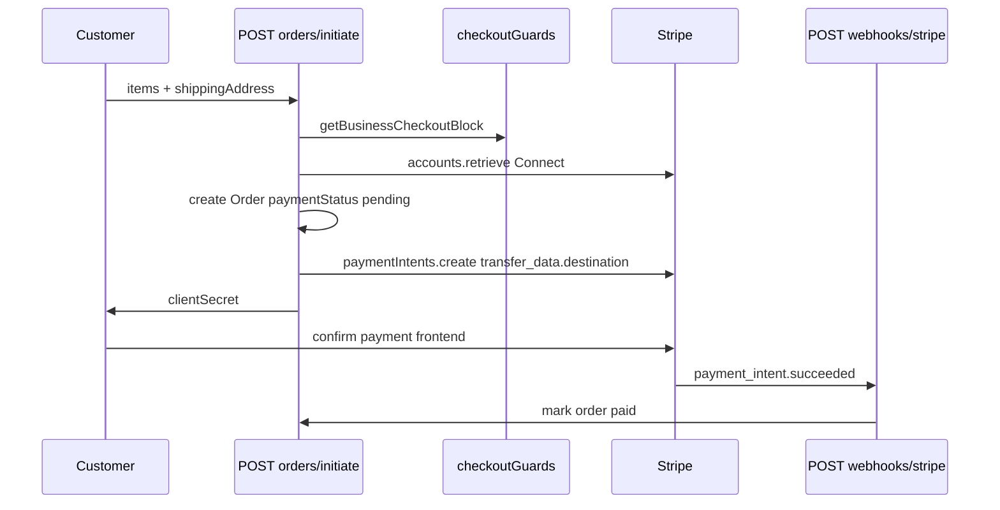

# Stripe, Payment, and Connect Audit — As-Built

**Evidence date:** 2026-06-19  
**Read-only audit** — no payment/webhook code modified.

**Sources:** [`app.js`](../../app.js), [`controllers/orderController.js`](../../controllers/orderController.js), [`controllers/webhookController.js`](../../controllers/webhookController.js), [`controllers/stripeController.js`](../../controllers/stripeController.js), [`controllers/stripePaymentController.js`](../../controllers/stripePaymentController.js), [`controllers/vendorOnboarding.controller.js`](../../controllers/vendorOnboarding.controller.js), [`controllers/connectController.js`](../../controllers/connectController.js), [`utils/checkoutGuards.js`](../../utils/checkoutGuards.js)

---

## Middleware order (verified)

```
trust proxy
→ sentryHttpCapture
→ cors + cookieParser
→ RAW BODY WEBHOOKS (before express.json)
→ express.json({ limit: '1mb' })
→ mongoSanitize + xss-clean (body/params)
→ feature routes
```

**Critical:** Moving webhooks after `express.json()` breaks Stripe signature verification.

Verified by automated test: `tests/stripe/stripe-webhook-routing-signature.test.js` — `app.js mounts Stripe webhook routes before express.json()`.

---

## Five webhook endpoints

Each uses `express.raw({ type: 'application/json' })` (order webhook uses `*/*` in router) + distinct signing secret env var.

| # | Route | Handler | Secret env var name | Updates |
| --- | --- | --- | --- | --- |
| 1 | `POST /api/webhooks/stripe` | `webhookController.handleStripeWebhook` | `STRIPE_ORDER_WEBHOOK_SECRET` | Order `paymentStatus` |
| 2 | `POST /api/stripe/webhook` | `stripeController.handleStripeWebhook` | `STRIPE_BUSINESS_DRAFT_WEBHOOK_SECRET` | Business draft, Subscription, Connect `account.updated` |
| 3 | `POST /api/stripe/payment/webhook` | `stripePaymentController.stripePaymentWebhook` | `STRIPE_ORDER_POST_PAYMENT_WEBHOOK_SECRET` | Order charge IDs + post-payment emails |
| 4 | `POST /api/subscription/webhook` | `webhookController.handleSubscriptionWebhook` | `STRIPE_SUBSCRIPTION_WEBHOOK_SECRET` | Subscription lifecycle |
| 5 | `POST /api/vendor-onboarding/webhook/payment` | `handleVendorPaymentWebhook` | `STRIPE_VENDOR_VERIFICATION_WEBHOOK_SECRET` | VendorOnboardingStage1 verification payment |

**Auth:** Stripe signature only — no JWT.

**Mount locations:**
- Routes 1–3: via `stripeRoutes` / `webhookRoutes` routers (mounted before JSON)
- Routes 4–5: inline in `app.js` L122–128 (before JSON)

---

## Order checkout (Connect destination charge)

### Flow



### POST `/api/orders/initiate`

| Item | Detail |
| --- | --- |
| Auth | `customer` |
| Guards | [`utils/checkoutGuards.js`](../../utils/checkoutGuards.js) — business `isApproved`, `isActive`, Connect ready |
| Stripe | PI with `transfer_data.destination` = `business.stripeConnectAccountId` |
| Platform fee | `PLATFORM_FEE_CENTS` env var name |
| Response | `clientSecret`, `orderId`, `groupOrderId`, `totals` — verified |

### GET `/api/orders/retrieve-intent/:id`

Sanitized PI/order shapes via [`utils/paymentIntentResponse.js`](../../utils/paymentIntentResponse.js).

### Legacy route

`POST /api/payments/create-payment-intent` — customer + rate limit; body `orderId`. **Evidence needed:** whether frontend still uses vs `orders/initiate`.

---

## Stripe Connect vendor onboarding

| Route | Purpose | Auth |
| --- | --- | --- |
| `POST /api/connect/:businessId/account-link` | Create/reuse Express account + AccountLink URL | `business_owner` (owner check) |
| `GET /api/connect/:businessId/status` | chargesEnabled, payoutsEnabled, capabilities | `business_owner` |
| `GET /api/connect/return` | OAuth return handler | Public |
| `GET /api/connect/refresh` | Refresh onboarding link | Public |

**Env var names for redirect URLs:**
- `FRONTEND_URL`, `CONNECT_RETURN_PATH`, `CONNECT_REFRESH_PATH`
- Optional overrides: `CONNECT_RETURN_URL`, `CONNECT_REFRESH_URL`

**Embedded dashboard** (`/stripe/*` routes): `account-session`, `express-login-link`, `account-balance`, `last-payout` — require `business_owner`.

---

## Subscription and billing

| Route | Purpose |
| --- | --- |
| `POST /api/stripe/create-checkout-session` | Business draft subscription checkout |
| `POST /api/billing-portal/session` | Stripe billing portal URL |
| `GET /api/subscriptions/current` | Current subscription for business |
| `POST /api/subscriptions/:id/cancel` | Cancel |
| `POST /api/subscriptions/:id/resume` | Resume |

Webhook: `POST /api/subscription/webhook` → `handleSubscriptionWebhook`.

---

## Vendor verification payment ($24.99)

| Route | Purpose |
| --- | --- |
| `POST /api/vendor-onboarding/stage1/create-payment` | Create verification PI |
| `GET /api/vendor-onboarding/stage1/payment-status` | Poll status |
| Webhook | `POST /api/vendor-onboarding/webhook/payment` |

---

## Payment success / failure

| Item | Status |
| --- | --- |
| Backend routes for payment success page | **Evidence Needed** — not in repo |
| Backend routes for payment failure page | **Evidence Needed** — not in repo |
| Payment completion | Client-side Stripe.js + webhooks |

Confirm frontend redirect URLs in Vercel env (e.g. `NEXT_PUBLIC_*` — not in this backend repo).

---

## Required Stripe env var names

| Name | Used for |
| --- | --- |
| `STRIPE_SECRET_KEY` | All Stripe API calls |
| `STRIPE_ORDER_WEBHOOK_SECRET` | Order status webhook |
| `STRIPE_BUSINESS_DRAFT_WEBHOOK_SECRET` | Business/subscription webhook |
| `STRIPE_SUBSCRIPTION_WEBHOOK_SECRET` | Subscription webhook |
| `STRIPE_VENDOR_VERIFICATION_WEBHOOK_SECRET` | Vendor verification webhook |
| `STRIPE_ORDER_POST_PAYMENT_WEBHOOK_SECRET` | Post-payment email webhook |
| `PLATFORM_FEE_CENTS` | Connect application fee on orders |
| `BILLING_PORTAL_RETURN_URL` | Billing portal return |

### Deprecated (do not use)

`STRIPE_ENDPOINT_SECRET`, `STRIPE_WEBHOOK_SECRET`, `STRIPE_WEBHOOK_SECRET_TWO`, `STRIPE_PUBLIC_KEY` (frontend only).

---

## Automated test coverage (repo)

| Area | Test path |
| --- | --- |
| Webhook mount order | `tests/stripe/stripe-webhook-routing-signature.test.js` |
| Order initiate Connect | `tests/stripe/order-initiate-connect.test.js` |
| Checkout guards | `tests/stripe/checkout-approval-paymentintent-safety.test.js` |
| Webhook handlers | `tests/stripe/order-webhook-handlers.test.js` |
| Post-payment email safety | `tests/stripe/order-email-safety.test.js` |

**212 tests pass** (2026-06-19 run) — mocked Stripe/MongoDB, not live charges.

---

## Evidence needed (external)

| Item | Owner |
| --- | --- |
| Stripe Dashboard webhook endpoint URLs registered for prod API | Stripe admin |
| Live webhook signing secrets match EB env var names | AWS EB |
| Whether legacy `/api/payments/create-payment-intent` is called by frontend | Frontend team |
| Payment success/failure redirect URLs | Vercel / frontend |
| Live Connect account states for test vendors | QA / Stripe Dashboard |

Deep dive: [`../STRIPE_WEBHOOKS.md`](../STRIPE_WEBHOOKS.md), [`../PAYMENT_FLOW.md`](../PAYMENT_FLOW.md)
